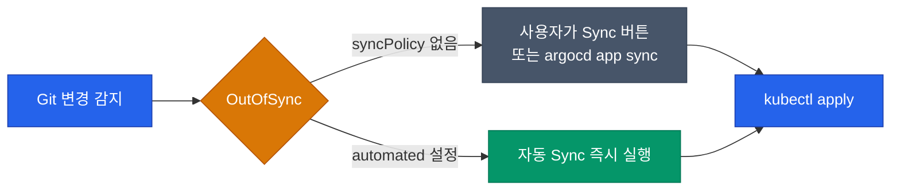
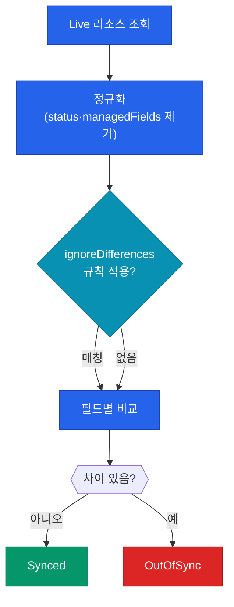

ArgoCD에서 "배포 단위"는 Deployment도 Helm release도 아닙니다. **Application이라는 CRD 하나**입니다. 이 리소스가 "어떤 Git 경로를 어떤 클러스터·네임스페이스에 어떻게 동기화할지"를 전부 담습니다. 2편에서 본 application-controller가 무한히 감시하는 대상도 결국 이 Application 오브젝트입니다

## Application 리소스 구조

가장 단순한 Application 매니페스트는 이렇게 생겼습니다

```yaml
apiVersion: argoproj.io/v1alpha1
kind: Application
metadata:
  name: my-service
  namespace: argocd
spec:
  project: default
  source:
    repoURL: https://github.com/org/infra-repo
    path: services/my-service
    targetRevision: main
  destination:
    server: https://kubernetes.default.svc
    namespace: prod
  syncPolicy:
    automated:
      prune: true
      selfHeal: true
```

핵심은 세 블록입니다

| 블록 | 역할 |
|---|---|
| `source` | Git 어디서 매니페스트를 가져올지 (repo·path·branch) |
| `destination` | 어느 클러스터의 어느 네임스페이스에 배포할지 |
| `syncPolicy` | 수동 Sync인지 자동인지, drift 감지 시 어떻게 할지 |

`source`는 Helm·Kustomize·plain YAML 무엇이든 올 수 있습니다. repo-server가 알아서 감지해서 렌더링합니다

## 동기화 모드: Manual vs Automated

Application을 생성하면 가장 먼저 결정해야 하는 건 "누가 Sync를 트리거하느냐"입니다



| 모드 | 동작 | 언제 쓰나 |
|---|---|---|
| **Manual** | OutOfSync 감지만 하고 사람이 Sync 버튼을 눌러야 실제 배포 | 프로덕션 초기, 승인 절차가 필요한 환경 |
| **Automated** | 차이 감지 즉시 자동 apply | Dev·Staging, 신뢰 가능한 PR 리뷰 체계가 있는 팀 |

Automated 모드에는 중요한 옵션 두 가지가 따라붙습니다

### prune: Git에서 삭제된 리소스를 클러스터에서도 지울지

`prune: false`면 Git 매니페스트에서 Deployment 하나를 삭제해도 클러스터에는 그대로 남습니다. 안전하지만 **zombie 리소스가 쌓입니다**. `prune: true`는 Git이 진짜 SSOT(Single Source of Truth)가 되게 강제하지만, 실수로 삭제한 파일 때문에 프로덕션 리소스가 날아갈 수 있습니다

### selfHeal: 클러스터에서 직접 바꾼 걸 원복할지

1편에서 소개한 **"타노스 리셋"** 옵션입니다. 누군가 `kubectl scale`로 replicas를 임의 변경하면 ArgoCD가 Git 상태로 강제 복구합니다. 운영 안정성을 위해 **프로덕션에서는 강하게 권장**되지만, 긴급 장애 대응 중에는 일시적으로 꺼두기도 합니다

## OutOfSync 판정 로직

"차이가 난다"를 어떻게 판정할지도 생각보다 복잡합니다. 컨트롤러는 `kubectl diff`와 유사한 로직을 쓰지만, 쿠버네티스 기본 필드들(예: `status`, `metadata.managedFields`)은 무시합니다



HPA가 replicas를 동적으로 조정하는 경우처럼 "차이가 나도 OutOfSync로 보고 싶지 않은" 필드는 `ignoreDifferences`로 제외합니다

```yaml
spec:
  ignoreDifferences:
  - group: apps
    kind: Deployment
    jsonPointers:
    - /spec/replicas
```

이런 예외가 쌓이면 매니페스트가 난잡해지므로, **Application 수준이 아니라 Project 수준**에서 정의해서 공통 규칙으로 관리하는 게 좋습니다

## Sync Wave: 리소스 배포 순서 제어

여러 리소스가 한 번에 apply될 때 순서가 중요한 경우가 있습니다. 예를 들어 `Namespace`가 먼저 생겨야 그 안의 Deployment가 배포될 수 있고, `ConfigMap`이 먼저 있어야 Pod가 마운트할 수 있습니다. ArgoCD는 **sync-wave annotation**으로 이 순서를 제어합니다

```yaml
metadata:
  annotations:
    argocd.argoproj.io/sync-wave: "-1"
```

- 숫자가 **작을수록 먼저** apply
- 같은 wave 내 리소스는 병렬 적용
- wave 내 모든 리소스가 Healthy 상태가 돼야 다음 wave로 진행

| Wave | 용도 예시 |
|---|---|
| `-2` | Namespace, PriorityClass |
| `-1` | CRD, ConfigMap, Secret |
| `0` (기본) | Deployment, StatefulSet, Service |
| `1` | HPA, PDB, ServiceMonitor |
| `2` | Ingress, ExternalDNS 레코드 |

## Sync Hook: 배포 전후 작업 실행

DB 마이그레이션처럼 "배포 **전에**" 실행돼야 하는 작업이 있습니다. 이럴 때는 일반 Job에 hook annotation을 붙입니다

```yaml
metadata:
  annotations:
    argocd.argoproj.io/hook: PreSync
    argocd.argoproj.io/hook-delete-policy: HookSucceeded
```

| Hook 타입 | 실행 시점 |
|---|---|
| `PreSync` | Sync 시작 전 (DB migration 등) |
| `Sync` | 본 Sync와 함께 (기본값) |
| `PostSync` | Sync 완료 후 (smoke test, 알림) |
| `SyncFail` | Sync 실패 시 (정리 작업) |

`hook-delete-policy`로 성공한 Hook 리소스를 자동 정리하면 네임스페이스가 Job 찌꺼기로 어지러워지지 않습니다

## 실전 조합 예시

프로덕션에서 자주 쓰는 조합입니다

```yaml
spec:
  syncPolicy:
    automated:
      prune: true
      selfHeal: true
    syncOptions:
    - CreateNamespace=true
    - PrunePropagationPolicy=foreground
    - ApplyOutOfSyncOnly=true
    retry:
      limit: 5
      backoff:
        duration: 10s
        factor: 2
        maxDuration: 3m
```

| 옵션 | 효과 |
|---|---|
| `CreateNamespace=true` | 대상 네임스페이스가 없으면 자동 생성 |
| `PrunePropagationPolicy=foreground` | 삭제 시 의존 리소스까지 기다려 정리 |
| `ApplyOutOfSyncOnly=true` | 전체 apply가 아니라 변경분만 apply (성능 개선) |
| `retry` | apply 실패 시 지수 백오프 재시도 |

## 정리

Application 리소스는 단순한 "배포 선언"이 아니라 **배포의 모든 정책을 담는 컨테이너**입니다. 특히 자동화 모드를 쓸지, self-heal을 켤지, prune을 허용할지는 팀의 **신뢰 수준과 장애 허용도**에 따라 단계적으로 조정해야 합니다

- Manual → Automated는 일방통행이 아닙니다. 환경별로 다르게 설정할 수 있습니다
- self-heal은 강력하지만 위험한 옵션 — drift 원인이 진짜 bug인지 임시 대응인지 구분하는 문화가 먼저입니다
- Sync Wave·Hook은 복잡한 배포 시나리오를 매니페스트 안에 캡슐화하는 도구입니다. 배포 스크립트를 외부에 둘 필요가 없습니다

다음 글에서는 Application 하나로는 부족한 대규모 환경, 즉 **멀티 클러스터·수백 개 Application**을 어떻게 선언적으로 관리하는지 ApplicationSet으로 풀어보겠습니다
