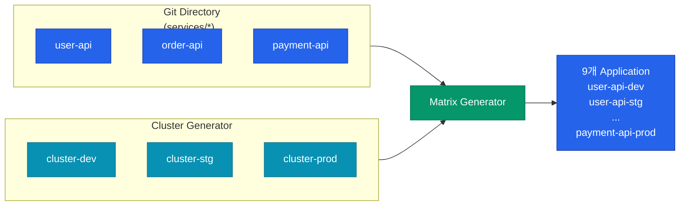
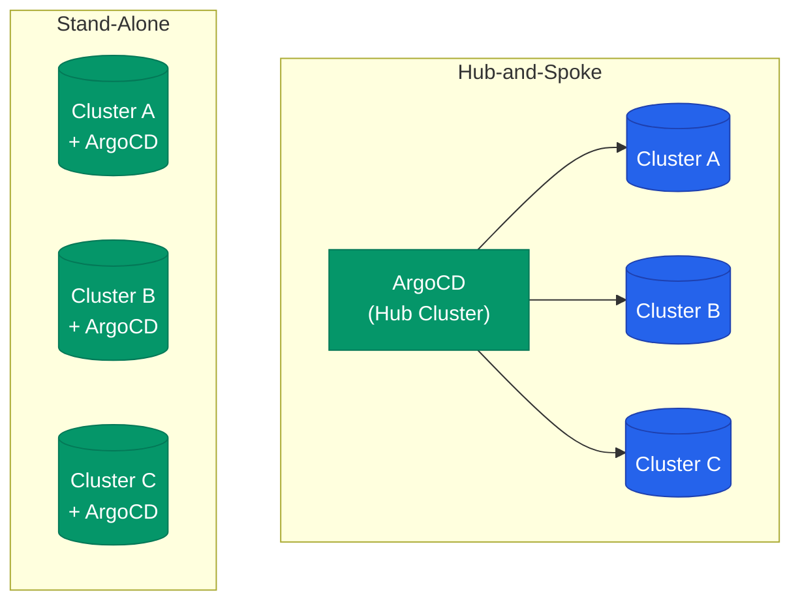

Application을 한두 개 쓸 때는 앞 글의 방식으로 충분합니다. 하지만 서비스가 수십 개로 늘어나고, dev·stg·prod 3벌씩 구성하면 금방 **100개가 넘는 Application 리소스**를 수작업으로 관리하게 됩니다. 여기서 등장하는 게 `ApplicationSet`입니다. "Application을 만드는 템플릿"을 선언적으로 정의하면 generator가 알아서 필요한 수만큼 찍어냅니다.

## 왜 ApplicationSet인가

간단한 비교입니다. 10개 서비스를 3개 환경에 배포하면 Application이 30개 필요한데, 이걸 YAML 30장으로 관리하면 변경이 생길 때마다 지옥입니다.

| 방식 | 리소스 개수 | 변경 전파 |
|---|---|---|
| Application 개별 작성 | 30개 파일 | 변경마다 30곳 수정 |
| **ApplicationSet 1개** | 1개 템플릿 + generator | 템플릿만 수정하면 자동 전파 |

## Generator: 어디서 목록을 가져올까

ApplicationSet의 심장은 **Generator**입니다. "몇 개의 Application을 어떤 파라미터로 만들지"를 결정하는 공급원입니다. 대표적인 타입만 추려봤습니다.

| Generator | 입력 | 전형적 용도 |
|---|---|---|
| **List** | 하드코딩된 리스트 | 소수의 명시적 환경 |
| **Cluster** | ArgoCD에 등록된 클러스터 | 동일 앱을 여러 클러스터에 배포 |
| **Git (Directory)** | Git 리포지토리의 디렉토리 구조 | 디렉토리 하나 = 서비스 하나 |
| **Git (File)** | Git의 설정 파일 목록 | 서비스 메타데이터를 YAML로 관리 |
| **Matrix** | 두 generator 조합 | "N 서비스 × M 클러스터" |
| **Pull Request** | GitHub·GitLab PR 목록 | PR마다 preview 환경 생성 |

### Git Directory Generator: 가장 많이 쓰는 패턴

리포지토리를 이렇게 구성했다고 하겠습니다.

```
infra-repo/
├── services/
│   ├── user-api/
│   │   ├── deployment.yaml
│   │   └── service.yaml
│   ├── order-api/
│   ├── payment-api/
│   └── ...
```

ApplicationSet 하나로 각 디렉토리를 자동 감지해서 Application을 생성합니다.

```yaml
apiVersion: argoproj.io/v1alpha1
kind: ApplicationSet
metadata:
  name: all-services
spec:
  generators:
  - git:
      repoURL: https://github.com/org/infra-repo
      revision: main
      directories:
      - path: services/*
  template:
    metadata:
      name: '{{path.basename}}'
    spec:
      source:
        repoURL: https://github.com/org/infra-repo
        path: '{{path}}'
      destination:
        server: https://kubernetes.default.svc
        namespace: '{{path.basename}}'
      syncPolicy:
        automated: { selfHeal: true }
```

새 서비스를 추가하려면 **디렉토리만 만들면** 됩니다. ApplicationSet controller가 감지해서 Application을 자동 생성합니다.

## Matrix Generator: 환경 × 서비스 조합

"서비스 × 클러스터" 조합을 전부 만들어야 할 때 Matrix가 유용합니다.



3개 서비스 × 3개 클러스터 = 9개 Application이 템플릿 하나로 생성됩니다. **서비스가 10개로 늘어도 템플릿은 그대로**입니다.

## 멀티 클러스터 등록

ApplicationSet이 여러 클러스터에 배포하려면 먼저 ArgoCD에 그 클러스터들이 등록돼 있어야 합니다. 클러스터는 **Secret으로 표현**됩니다.

```yaml
apiVersion: v1
kind: Secret
metadata:
  name: cluster-prod
  namespace: argocd
  labels:
    argocd.argoproj.io/secret-type: cluster
    env: prod
    region: ap-northeast-2
type: Opaque
stringData:
  name: cluster-prod
  server: https://prod.k8s.example.com
  config: |
    {"bearerToken": "..."}
```

라벨이 중요한 이유는 **Cluster Generator에서 필터링**에 쓰이기 때문입니다.

```yaml
generators:
- clusters:
    selector:
      matchLabels:
        env: prod
```

이렇게 하면 "prod 라벨이 붙은 클러스터들에만 배포"가 선언 한 줄로 해결됩니다.

## Hub-and-Spoke vs Stand-Alone

멀티 클러스터 환경에서 ArgoCD를 어떻게 배치할지는 두 가지 전략이 있습니다.



| 전략 | 장점 | 단점 |
|---|---|---|
| **Hub-and-Spoke** | 단일 UI·단일 RBAC, 관리 단순 | Hub 장애 시 전체 배포 마비, 네트워크 지연 |
| **Stand-Alone** | 각 클러스터 독립, 지역 격리 | UI·정책·업그레이드 N중 관리 |

실무에서는 **Hub-and-Spoke가 기본**이고, 보안·규제로 클러스터 간 통신이 막히거나 대륙이 다른 경우에만 Stand-Alone으로 쪼개게 됩니다.

## AppProject: 멀티 팀 RBAC

ApplicationSet으로 Application을 대량 생성하면 이제 **"누가 어떤 Application을 건드릴 수 있는가"**가 문제가 됩니다. 기본 `default` Project는 모든 권한이 열려있어서, 프로덕션 환경에서는 팀·환경별 Project를 반드시 만듭니다.

```yaml
apiVersion: argoproj.io/v1alpha1
kind: AppProject
metadata:
  name: team-payment
spec:
  sourceRepos:
  - https://github.com/org/payment-*
  destinations:
  - namespace: 'payment-*'
    server: '*'
  clusterResourceWhitelist:
  - group: ''
    kind: Namespace
  roles:
  - name: developer
    policies:
    - p, proj:team-payment:developer, applications, sync, team-payment/*, allow
    groups:
    - payment-team
```

| 필드 | 역할 |
|---|---|
| `sourceRepos` | 이 Project에서 허용되는 Git 리포 (다른 팀 리포로 spoof 방지) |
| `destinations` | 배포 가능한 네임스페이스·클러스터 |
| `clusterResourceWhitelist` | 클러스터 전역 리소스 생성 권한 (대부분 차단) |
| `roles` | 팀 그룹별 세분화된 RBAC |

## 운영 팁

대규모 환경에서 자주 부딪히는 이슈와 대응법입니다.

<div class="callout why">
  <div class="callout-title">Application 수 늘어나면 가장 먼저 터지는 건 repo-server 메모리</div>
  Application 500개 환경에서 Helm 차트를 주로 쓰면 repo-server가 OOMKilled로 반복 재시작되는 걸 자주 봅니다. `--parallelismLimit` 을 낮추고 repo-server replicas를 늘리거나, 아예 **Helm render 결과를 미리 Git에 커밋해두는 rendered-manifest 패턴**으로 전환하면 repo-server 부하를 극적으로 줄일 수 있습니다.
</div>

| 증상 | 원인 | 대응 |
|---|---|---|
| Sync가 전부 "Progressing"에 멈춤 | controller sharding 없이 Application 수 폭증 | `controller.sharding.replicas` 증가 |
| UI가 매우 느림 | Redis 단일 노드 부하 | Redis HA 모드 전환 |
| repo-server OOM | 대형 Helm 차트 병렬 렌더링 | replicas 증가 + `parallelismLimit` 조정 |
| Git fetch 타임아웃 빈발 | 사설 레포 미러 없음 | `webhook`으로 polling 주기 늘림 + on-demand fetch |

## 시리즈 마무리

4편에 걸쳐 GitOps 철학에서 시작해 ArgoCD 아키텍처, Application 단위의 동기화 전략, 그리고 ApplicationSet·멀티 클러스터 운영까지 다뤘습니다. 핵심 메시지를 한 줄로 요약하면 다음과 같습니다.

**"클러스터에 직접 명령하지 말고, Git에 쓰고 컨트롤러가 따라오게 하라."**

- 01: Push → Pull 모델 전환과 GitOps 4대 원칙
- 02: server·repo-server·controller·dex·redis 5개 컴포넌트 분리
- 03: Application 리소스와 sync policy·hook·wave
- 04: ApplicationSet과 Hub-and-Spoke 멀티 클러스터, AppProject RBAC

다음 시리즈에서는 ArgoCD가 배포하는 **컨테이너 자체를 어떻게 효율적으로 만들지** — Docker 이미지 설계부터 깊이 있게 파고들어 보겠습니다.
