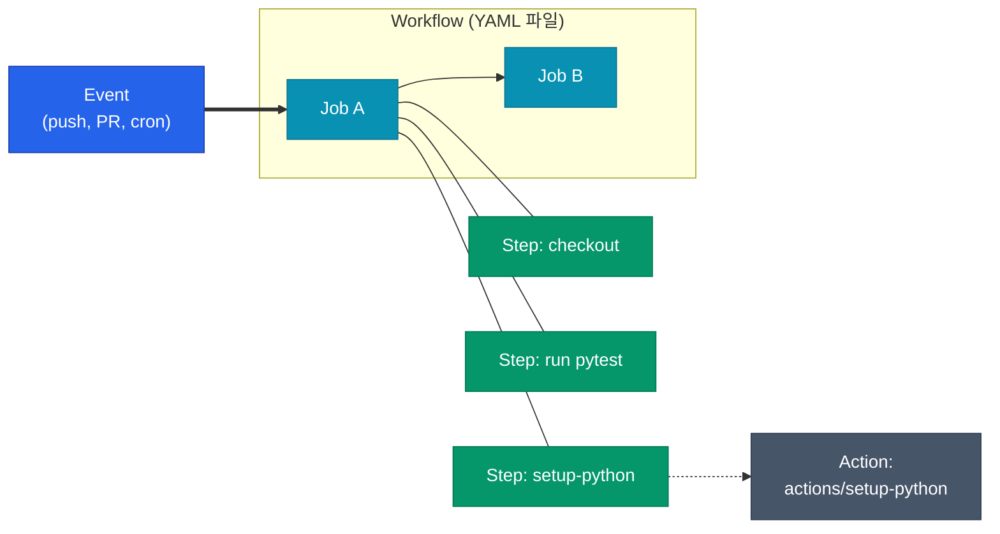



## GitHub Actions를 왜 쓰는가

저장소와 CI/CD가 한 플랫폼에 있어 세팅 비용이 거의 없습니다. Pull Request·이슈·릴리즈 같은 이벤트에 바로 훅을 걸 수 있고, 마켓플레이스 덕분에 대부분의 도구가 이미 빌딩 블록으로 존재합니다. 반면 복잡한 배포 오케스트레이션(Approval·Canary·Rollback)이 필요하면 Harness·ArgoCD 같은 전용 플랫폼이 더 적합합니다. GitHub Actions는 **빌드·테스트·간단한 배포까지가 스위트 스폿**입니다

## 4단계 계층 구조



- **Workflow**: `.github/workflows/` 하위의 YAML 파일 하나입니다. 이벤트로 트리거됩니다
- **Job**: 하나의 Runner(VM 또는 컨테이너)에서 실행되는 단위입니다. Job 간 의존은 `needs` 로 표현합니다
- **Step**: Job 안의 순차 단계입니다. Shell 명령이나 Action을 호출합니다
- **Action**: 재사용 가능한 작업 단위입니다. 마켓플레이스(`actions/checkout@v4`) 또는 커스텀 리포로 배포됩니다

## Workflow 기본 문법

```yaml
name: CI

on:
  push:
    branches: [main]
  pull_request:

jobs:
  test:
    runs-on: ubuntu-latest
    steps:
      - uses: actions/checkout@v4
      - name: Run tests
        run: echo "hello"
```

최소 구성은 **이벤트(`on`) → Job → Step** 세 블록입니다. 이 세 가지만 있으면 동작합니다

## 이벤트 트리거

| 이벤트 | 용도 | 비고 |
|--------|------|------|
| `push` | 브랜치에 커밋이 올라갔을 때 | 경로·브랜치 필터 가능 |
| `pull_request` | PR 오픈·업데이트 | `types` 로 세분화 |
| `workflow_dispatch` | 수동 실행 | UI 또는 API로 트리거 |
| `schedule` | cron 스케줄 | UTC 기준 |
| `release` | 릴리즈 생성 시 | 아티팩트 업로드에 자주 사용 |
| `workflow_call` | 다른 워크플로우에서 호출 | Reusable Workflow 용 |

```yaml
on:
  push:
    branches: [main]
    paths-ignore:
      - "docs/**"
  workflow_dispatch:
    inputs:
      environment:
        description: "Target environment"
        required: true
        default: staging
        type: choice
        options: [staging, production]
  schedule:
    - cron: "0 18 * * 1-5"  # 평일 UTC 18:00 (KST 03:00)
```

## Job과 Runner

Job은 독립된 Runner에서 실행됩니다. Runner는 Job 시작마다 깨끗한 상태로 준비됩니다

| 구분 | GitHub-hosted | Self-hosted |
|------|---------------|-------------|
| 관리 부담 | 없음 | 직접 운영 |
| 스펙 | 2코어 기본 | 원하는 대로 |
| 네트워크 | 퍼블릭만 | VPC 접근 가능 |
| 비용 | 무료 한도 + 분당 과금 | 인프라 비용 |

```yaml
jobs:
  test:
    runs-on: ubuntu-latest  # GitHub-hosted

  build:
    runs-on: [self-hosted, linux, gpu]  # 지정 라벨 Runner
    needs: test  # test Job이 성공해야 시작
```

`needs` 로 의존을 지정하지 않으면 Job들은 기본적으로 병렬 실행됩니다

## Step과 Action

Step은 두 가지 형태입니다

```yaml
steps:
  # 1) Action 호출
  - uses: actions/setup-python@v5
    with:
      python-version: "3.12"

  # 2) Shell 명령 실행
  - name: Install deps
    run: |
      pip install uv
      uv sync --frozen
    shell: bash
    working-directory: ./backend
```

<div class="callout why">
  <div class="callout-title">Action 버전 지정 방법</div>
  <code>@v4</code> 같은 태그는 재할당될 수 있습니다. 보안이 중요한 워크플로우라면 <code>@<commit-sha></code> 로 핀 고정하는 게 안전합니다. Dependabot이 주기적으로 업데이트 PR을 올려줍니다
</div>

## Context와 표현식

`${{ }}` 문법으로 런타임 값을 참조합니다. 자주 쓰는 Context는 다음과 같습니다

| 표현식 | 값 |
|--------|----|
| `github.sha` | 현재 커밋 SHA |
| `github.ref` | `refs/heads/main` 같은 ref |
| `github.event_name` | 트리거 이벤트 이름 |
| `github.actor` | 워크플로우를 시작한 사용자 |
| `runner.os` | `Linux`, `macOS`, `Windows` |
| `secrets.NAME` | Repository·Environment Secret |
| `vars.NAME` | 평문 변수 |
| `job.status` | 직전 Job 상태 |
| `steps.<id>.outputs.<name>` | 이전 Step의 출력 |

```yaml
- name: Build
  id: build
  run: |
    TAG=${{ github.sha }}
    echo "tag=$TAG" >> "$GITHUB_OUTPUT"

- name: Use tag
  run: echo "Built ${{ steps.build.outputs.tag }}"
  if: github.event_name == 'push'
```

## 최소 예시 워크플로우

Python 라이브러리 저장소에서 PR마다 테스트를 돌리는 워크플로우입니다

```yaml
name: test

on:
  pull_request:
  push:
    branches: [main]

jobs:
  test:
    runs-on: ubuntu-latest
    timeout-minutes: 10
    steps:
      - uses: actions/checkout@v4

      - uses: actions/setup-python@v5
        with:
          python-version: "3.12"

      - name: Install deps
        run: |
          pip install uv
          uv sync --frozen

      - name: Run tests
        run: uv run pytest tests/ --junit-xml=report.xml

      - name: Upload report
        if: always()
        uses: actions/upload-artifact@v4
        with:
          name: junit-report
          path: report.xml
```

- `timeout-minutes`: Job별 타임아웃입니다. Runner 무한 점유 방지용으로 항상 설정합니다
- `if: always()`: 앞 Step 실패해도 아티팩트는 업로드합니다

## 정리

| 요소 | 정의 |
|------|------|
| Workflow | `.github/workflows/` 의 YAML 한 개 |
| Job | Runner 한 대에서 실행되는 단위 |
| Step | Job 안의 순차 단계 (Action 호출 또는 Shell) |
| Action | 재사용 가능한 Step 빌딩 블록 |
| Context | `${{ github.*, secrets.*, steps.* }}` 런타임 값 |

다음 글에서는 이 구조를 실전에 써서 Build·Test·Deploy가 하나의 워크플로우에서 돌아가는 파이프라인을 설계합니다


