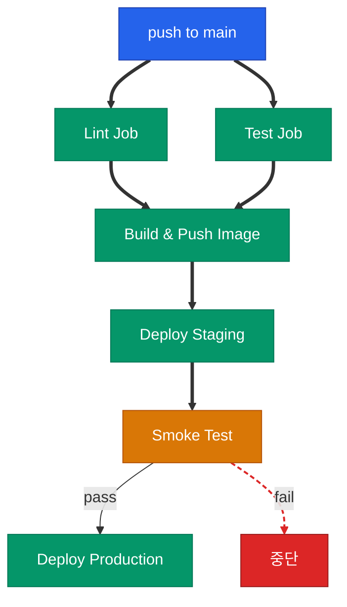



## 파이프라인 설계 원칙

GitHub Actions로 파이프라인을 만들 때 다음 세 가지를 지키면 복잡도가 급격히 낮아집니다

1. **관심사 분리**: 빌드·테스트·배포를 Job으로 분리하고 `needs` 로 묶습니다
2. **조건부 실행**: 같은 워크플로우에서 PR은 테스트만, push는 배포까지 가도록 `if` 로 분기합니다
3. **환경 격리**: Staging·Production은 GitHub Environment로 분리하고 Secret도 각각 저장합니다

## 파이프라인 흐름



## Lint·Test Job

Lint와 Test는 병렬로 돌립니다. `needs` 없이 선언하면 동시에 시작합니다

```yaml
jobs:
  lint:
    runs-on: ubuntu-latest
    timeout-minutes: 5
    steps:
      - uses: actions/checkout@v4
      - uses: actions/setup-python@v5
        with:
          python-version: "3.12"
      - run: pip install uv && uv sync --frozen
      - run: uv run ruff check .
      - run: uv run mypy src/

  test:
    runs-on: ubuntu-latest
    timeout-minutes: 10
    steps:
      - uses: actions/checkout@v4
      - uses: actions/setup-python@v5
        with:
          python-version: "3.12"
      - run: pip install uv && uv sync --frozen
      - run: uv run pytest tests/ --junit-xml=report.xml
      - if: always()
        uses: actions/upload-artifact@v4
        with:
          name: junit-report
          path: report.xml
```

## Build Job과 출력 전달

Build는 Lint·Test가 모두 성공해야 실행됩니다(`needs: [lint, test]`). 핵심 구성은 세 가지입니다

- `permissions.id-token: write` — OIDC로 GCP·AWS 인증
- `outputs.image` — 다음 Job이 참조할 이미지 경로 공유
- `steps.<id>.outputs` — `echo "key=val" >> "$GITHUB_OUTPUT"` 로 Step 간 값 전달

```yaml
build:
  needs: [lint, test]
  if: github.event_name == 'push'
  runs-on: ubuntu-latest
  outputs:
    image: ${{ steps.meta.outputs.image }}
  permissions: { contents: read, id-token: write }
  steps:
    - uses: actions/checkout@v4
    - uses: google-github-actions/auth@v2
      with:
        workload_identity_provider: ${{ vars.GCP_WIF_PROVIDER }}
        service_account: ${{ vars.GCP_DEPLOY_SA }}
    - id: meta
      run: echo "image=asia-northeast3-docker.pkg.dev/${{ vars.GCP_PROJECT }}/app/service:${{ github.sha }}" >> "$GITHUB_OUTPUT"
    - run: |
        gcloud auth configure-docker asia-northeast3-docker.pkg.dev -q
        docker build -t "${{ steps.meta.outputs.image }}" .
        docker push "${{ steps.meta.outputs.image }}"
```

## Environment 기반 배포 Job

GitHub Environment는 Secret·Variable·보호 규칙을 환경별로 묶는 단위입니다. Staging·Production을 분리해 관리합니다

배포 Job은 환경별로 `environment.name` 과 네임스페이스·timeout만 바뀌는 **구조가 동일한 Job 두 벌**입니다. 사이에 `smoke-test` 를 끼워 실패 시 Production 쪽이 자동으로 차단됩니다

```yaml
deploy-staging:
  needs: build
  runs-on: ubuntu-latest
  environment: { name: staging, url: https://staging.your-service.internal }
  steps:
    - uses: actions/checkout@v4
    - run: helm upgrade --install your-service ./chart --namespace staging --set image=${{ needs.build.outputs.image }} --wait --timeout 5m

smoke-test:
  needs: deploy-staging
  runs-on: ubuntu-latest
  steps:
    - uses: actions/checkout@v4
    - run: python -m scripts.smoke --base-url https://staging.your-service.internal

deploy-production:
  needs: smoke-test
  runs-on: ubuntu-latest
  environment: { name: production, url: https://your-service.com }
  steps:
    - uses: actions/checkout@v4
    - run: helm upgrade --install your-service ./chart --namespace production --set image=${{ needs.build.outputs.image }} --wait --timeout 10m
```

<div class="callout why">
  <div class="callout-title">Environment의 숨은 기능</div>
  Environment에는 Required Reviewers·Wait Timer·Deploy Branch 제한 같은 보호 규칙을 붙일 수 있습니다. Production Environment에 Required Reviewers를 걸면 Job이 대기 상태로 멈추고, 지정된 리뷰어가 승인해야 실행됩니다. 코드 추가 없이 승인 게이트를 만들 수 있습니다
</div>

## 조건부 실행 패턴

`if` 표현식으로 Job·Step의 실행 여부를 결정합니다. 자주 쓰는 패턴입니다

| 조건 | 표현식 |
|------|--------|
| main 브랜치 push일 때만 | `if: github.event_name == 'push' && github.ref == 'refs/heads/main'` |
| PR이 draft가 아닐 때만 | `if: github.event.pull_request.draft == false` |
| 특정 라벨이 붙었을 때 | `if: contains(github.event.pull_request.labels.*.name, 'deploy')` |
| 이전 Job 실패 시 후처리 | `if: failure()` |
| 성공·실패 상관없이 | `if: always()` |
| 취소만 제외 | `if: success() || failure()` |

## Failure 처리 전략

실패 알림용 Job은 `needs` 에 감시 대상 Job을 나열하고 `if: failure()` 로 분기합니다. 이 Job 자체는 가볍게 Slack Webhook 하나만 쏘면 충분합니다

```yaml
notify-on-fail:
  needs: [lint, test, build]
  if: failure()
  runs-on: ubuntu-latest
  steps:
    - run: |
        curl -X POST -H 'Content-type: application/json' \
          --data '{"text":"파이프라인 실패: ${{ github.workflow }}"}' \
          ${{ secrets.SLACK_WEBHOOK }}
```

Matrix·`continue-on-error` 는 다음 글(Matrix Strategy)에서 다루고, 여기서는 **실패를 탐지해 알리는 지점**만 챙기면 됩니다

## Concurrency 제어

같은 브랜치에서 연속으로 push가 들어오면 이전 실행을 취소하고 최신만 실행합니다

```yaml
concurrency:
  group: ${{ github.workflow }}-${{ github.ref }}
  cancel-in-progress: true
```

Production 배포에는 `cancel-in-progress: false` 로 바꿔 취소되지 않게 합니다 — 중간에 끊기면 인프라가 이상한 상태에 남을 수 있습니다

## 정리

| 주제 | 핵심 포인트 |
|------|-------------|
| Job 분리 | Lint·Test 병렬, Build·Deploy는 `needs` 로 직렬 |
| 출력 전달 | `outputs` + `needs.<job>.outputs.<key>` |
| 환경 분리 | Environment로 Secret·승인·URL 관리 |
| 조건 실행 | `if` + Context 표현식 |
| 실패 알림 | `if: failure()` Job으로 후처리 |
| Concurrency | 브랜치 기준 그룹핑, Production만 취소 금지 |

다음 글에서는 정적 키 없이 AWS·GCP에 배포하는 OIDC 인증 설정과 Secret 관리 원칙을 다룹니다


