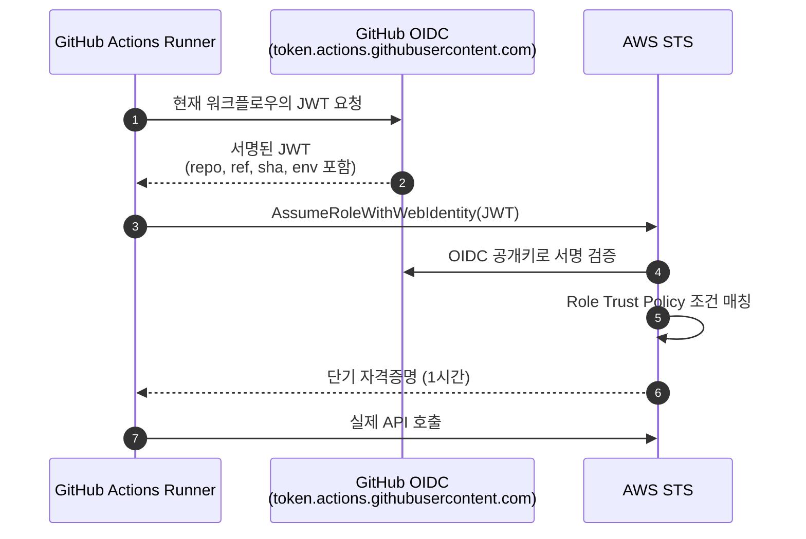



## 정적 키를 쓰지 않는 이유

`AWS_ACCESS_KEY_ID` 를 Secret에 저장하면 다음 위험이 구조적으로 남습니다

- 로그·환경 변수 덤프 실수로 유출될 가능성
- 키 회전이 수동이라 누락되기 쉬움
- 누가 언제 썼는지 감사(Audit) 추적이 어려움
- 유효기간이 길어 유출 시 피해 범위가 큼

OIDC는 워크플로우 실행마다 GitHub이 발급한 JWT를 클라우드 IdP가 검증해 **단기 토큰을 그 자리에서 발급**합니다. 키 저장이 필요 없습니다

## Secret 스코프

| 레벨 | 사용 범위 | 권장 용도 |
|------|-----------|-----------|
| Repository | 저장소 전체 | 저장소 전용 서드파티 토큰 |
| Environment | 특정 Environment Job | Production/Staging 분리 |
| Organization | 여러 저장소 공유 | 공통 도구 토큰 (Slack, Codecov) |

```yaml
jobs:
  deploy:
    environment: production
    steps:
      - run: echo "${{ secrets.PROD_API_KEY }}"  # Environment Secret
```

Environment에 `production` 을 지정하면 해당 Environment의 Secret이 `secrets.*` 로 노출됩니다. Repository Secret보다 우선됩니다

## OIDC 동작 흐름



핵심은 **Trust Policy의 조건**입니다. 특정 저장소·브랜치·Environment에서 발급된 JWT만 Role을 받을 수 있도록 제한합니다

## AWS 설정

### 1단계: OIDC Provider 등록

```bash
aws iam create-open-id-connect-provider \
  --url https://token.actions.githubusercontent.com \
  --client-id-list sts.amazonaws.com \
  --thumbprint-list 6938fd4d98bab03faadb97b34396831e3780aea1
```

### 2단계: IAM Role Trust Policy

```json
{
  "Version": "2012-10-17",
  "Statement": [{
    "Effect": "Allow",
    "Principal": {
      "Federated": "arn:aws:iam::123456789012:oidc-provider/token.actions.githubusercontent.com"
    },
    "Action": "sts:AssumeRoleWithWebIdentity",
    "Condition": {
      "StringEquals": {
        "token.actions.githubusercontent.com:aud": "sts.amazonaws.com"
      },
      "StringLike": {
        "token.actions.githubusercontent.com:sub": "repo:your-org/your-repo:environment:production"
      }
    }
  }]
}
```

`sub` 조건은 와일드카드가 가능합니다. 저장소 전체 허용은 `repo:your-org/your-repo:*`, 특정 브랜치는 `repo:your-org/your-repo:ref:refs/heads/main`

### 3단계: 워크플로우에서 사용

```yaml
permissions:
  id-token: write
  contents: read

jobs:
  deploy:
    runs-on: ubuntu-latest
    environment: production
    steps:
      - uses: aws-actions/configure-aws-credentials@v4
        with:
          role-to-assume: arn:aws:iam::123456789012:role/github-deploy
          aws-region: ap-northeast-2

      - run: aws s3 sync ./build s3://my-bucket/
```

`permissions.id-token: write` 가 없으면 JWT를 요청할 수 없습니다. 반드시 명시해야 합니다

## GCP Workload Identity 설정

### 1단계: Workload Identity Pool·Provider 생성

```bash
gcloud iam workload-identity-pools create github-pool \
  --location=global \
  --display-name="GitHub Actions"

gcloud iam workload-identity-pools providers create-oidc github-provider \
  --location=global \
  --workload-identity-pool=github-pool \
  --issuer-uri=https://token.actions.githubusercontent.com \
  --attribute-mapping="google.subject=assertion.sub,attribute.repository=assertion.repository,attribute.ref=assertion.ref" \
  --attribute-condition="assertion.repository_owner == 'your-org'"
```

`attribute-condition` 으로 조직 외부 저장소 차단합니다. 여기서 막으면 잘못 설정된 Role도 외부에서 assume할 수 없습니다

### 2단계: Service Account Impersonation 바인딩

```bash
gcloud iam service-accounts add-iam-policy-binding \
  deployer@your-project.iam.gserviceaccount.com \
  --role=roles/iam.workloadIdentityUser \
  --member="principalSet://iam.googleapis.com/projects/PROJECT_NUMBER/locations/global/workloadIdentityPools/github-pool/attribute.repository/your-org/your-repo"
```

### 3단계: 워크플로우

```yaml
permissions:
  id-token: write
  contents: read

jobs:
  deploy:
    runs-on: ubuntu-latest
    steps:
      - uses: google-github-actions/auth@v2
        with:
          workload_identity_provider: projects/123/locations/global/workloadIdentityPools/github-pool/providers/github-provider
          service_account: deployer@your-project.iam.gserviceaccount.com

      - run: gcloud run deploy your-service --image=...
```

## 정적 키 vs OIDC 비교

| 항목 | 정적 키 | OIDC |
|------|---------|------|
| 키 저장 | Secret에 평문 저장 | 저장 없음 |
| 유효기간 | 수동 회전까지 영구 | 1시간 이내 |
| 회전 부담 | 주기적 수동 | 자동 |
| 감사 추적 | API 로그만 | JWT claim + API 로그 |
| 스코프 제한 | IAM 정책만 | Trust Policy + IAM 조합 |
| 유출 시 피해 | 키 회전 전까지 전체 노출 | 해당 실행 1시간 |

## Action 핀 고정

서드파티 Action은 태그가 재할당될 수 있습니다. 보안이 중요한 워크플로우는 커밋 SHA로 핀을 고정합니다

```yaml
# 권장: SHA 핀 + 버전 주석
- uses: actions/checkout@b4ffde65f46336ab88eb53be808477a3936bae11  # v4.1.1

# 비권장: 태그만
- uses: actions/checkout@v4

# 절대 금지: 브랜치
- uses: actions/checkout@main
```

Dependabot이 `.github/dependabot.yml` 설정으로 핀 업데이트 PR을 자동 생성합니다

```yaml
version: 2
updates:
  - package-ecosystem: "github-actions"
    directory: "/"
    schedule:
      interval: "weekly"
```

## 위험한 패턴

### pull_request_target

`pull_request_target` 은 **포크의 PR 코드를 베이스 리포 컨텍스트에서 실행**합니다. Secret 접근이 가능한 위험한 이벤트입니다

```yaml
# 정말 필요할 때만 사용, 절대 PR 코드 체크아웃 하지 않기
on:
  pull_request_target:
    types: [labeled]

jobs:
  safe-label-only:
    if: github.event.label.name == 'safe-to-run'
    runs-on: ubuntu-latest
    steps:
      - run: echo "메타 작업만 — PR 코드 실행 금지"
```

정말 PR 코드를 실행해야 한다면 Secret 노출이 없는 Job에서만 하고, `actions/checkout` 시 `ref: ${{ github.event.pull_request.head.sha }}` 를 명시해 실제 PR 코드를 명시적으로 받습니다

### 로그 덤프

```yaml
# 금지
- run: env
- run: echo "${{ toJSON(secrets) }}"
```

Secret은 `***` 로 마스킹되지만 base64 인코딩 등을 거치면 우회됩니다. 덤프 습관 자체를 없앱니다

## 정리

| 주제 | 핵심 포인트 |
|------|-------------|
| Secret 스코프 | Environment > Repository > Organization 순 오버라이드 |
| OIDC | JWT로 AWS·GCP 단기 자격증명, 정적 키 제거 |
| Trust Policy | `sub` 조건으로 repo·branch·environment 제한 |
| Action 핀 | 태그 금지, SHA + 버전 주석 |
| 위험 패턴 | `pull_request_target` 금지, `env` 덤프 금지 |

다음 글에서는 워크플로우를 재사용·병렬·캐시로 최적화하고, Self-hosted Runner를 운영하는 패턴을 다룹니다


