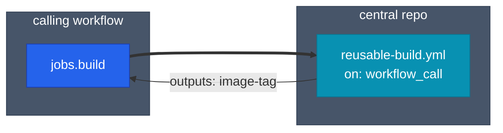



## 확장의 세 가지 축

여러 저장소·워크플로우가 생기면 중복이 폭발적으로 늘어납니다. GitHub Actions에서는 세 가지 축으로 확장성과 속도를 확보합니다.

1. **재사용**: Reusable Workflow·Composite Action으로 중복 제거.
2. **병렬**: Matrix Strategy로 여러 조합을 동시에 실행.
3. **캐시**: 의존성·빌드 산출물을 Run 간에 보존해 시간 절약.

## Reusable Workflow 구조



피호출 워크플로우는 `on: workflow_call` 트리거를 선언하고, 호출 측은 `uses:` 로 파일 경로를 참조합니다.

### 피호출 워크플로우

```yaml
# .github/workflows/reusable-build.yml
name: reusable-build

on:
  workflow_call:
    inputs:
      python-version:
        required: false
        type: string
        default: "3.12"
      environment:
        required: true
        type: string
    secrets:
      GAR_CREDENTIALS:
        required: true
    outputs:
      image-tag:
        description: "Built image tag"
        value: ${{ jobs.build.outputs.tag }}

jobs:
  build:
    runs-on: ubuntu-latest
    outputs:
      tag: ${{ steps.meta.outputs.tag }}
    steps:
      - uses: actions/checkout@v4
      - uses: actions/setup-python@v5
        with:
          python-version: ${{ inputs.python-version }}
      - id: meta
        run: echo "tag=${{ github.sha }}" >> "$GITHUB_OUTPUT"
```

### 호출 워크플로우

```yaml
# .github/workflows/deploy.yml
jobs:
  build:
    uses: your-org/shared-workflows/.github/workflows/reusable-build.yml@v1
    with:
      python-version: "3.12"
      environment: production
    secrets:
      GAR_CREDENTIALS: ${{ secrets.GAR_CREDENTIALS }}

  deploy:
    needs: build
    runs-on: ubuntu-latest
    steps:
      - run: echo "Image ${{ needs.build.outputs.image-tag }}"
```

중앙 저장소의 태그(`@v1`)를 고정해 호출 측이 영향받지 않도록 관리합니다.

## Reusable Workflow vs Composite Action

| 구분 | Reusable Workflow | Composite Action |
|------|-------------------|------------------|
| 단위 | Job 전체 | Step 묶음 |
| 파일 위치 | `.github/workflows/*.yml` | `action.yml` (별도 리포 가능) |
| Matrix 지원 | 가능 | 호출 측 Job에 의존 |
| Secret 전달 | 명시적 `secrets:` | 자동 상속 |
| 병렬 Job 정의 | 가능 | 불가 (Step만) |
| 테스트 용이성 | 독립 Job으로 실행 가능 | 호출 Job 필요 |

```yaml
# Composite Action 예시 (.github/actions/setup-python-app/action.yml)
name: setup-python-app
description: "Python + uv setup with cache"
inputs:
  python-version:
    required: false
    default: "3.12"
runs:
  using: composite
  steps:
    - uses: actions/setup-python@v5
      with:
        python-version: ${{ inputs.python-version }}
    - shell: bash
      run: pip install uv && uv sync --frozen
```

호출 측:

```yaml
- uses: ./.github/actions/setup-python-app
  with:
    python-version: "3.12"
```

Step 레벨에서 반복되는 동작은 Composite, 파이프라인 전체를 공유하려면 Reusable Workflow를 씁니다.

## Matrix Strategy

여러 버전·OS 조합을 한 선언으로 병렬 실행합니다.

```yaml
jobs:
  test:
    runs-on: ${{ matrix.os }}
    strategy:
      fail-fast: false
      matrix:
        os: [ubuntu-latest, macos-latest]
        python: ["3.11", "3.12"]
        include:
          - os: ubuntu-latest
            python: "3.13"
            experimental: true
        exclude:
          - os: macos-latest
            python: "3.11"
    continue-on-error: ${{ matrix.experimental == true }}
    steps:
      - uses: actions/checkout@v4
      - uses: actions/setup-python@v5
        with:
          python-version: ${{ matrix.python }}
      - run: pytest
```

| 옵션 | 동작 |
|------|------|
| `fail-fast: false` | 한 조합 실패해도 나머지 계속 실행 |
| `include` | 기존 조합에 추가 조합 주입 |
| `exclude` | 특정 조합 제거 |
| `continue-on-error` | 실험적 조합 실패를 전체 실패로 취급하지 않음 |
| `max-parallel` | 동시 실행 제한 (자원 절약) |

## Cache 전략

의존성 다운로드·빌드 산출물을 Run 간에 보존합니다. 키 설계가 성능을 좌우합니다.

```yaml
- uses: actions/cache@v4
  with:
    path: |
      ~/.cache/pip
      ~/.cache/uv
      node_modules
    key: deps-${{ runner.os }}-${{ hashFiles('**/uv.lock', '**/package-lock.json') }}
    restore-keys: |
      deps-${{ runner.os }}-
```

<div class="callout why">
  <div class="callout-title">key와 restore-keys의 역할 구분</div>
  <code>key</code> 가 정확히 일치하는 캐시가 있으면 그걸 복원하고, 없으면 새로 저장합니다. <code>restore-keys</code> 는 정확한 매치가 없을 때 prefix 매칭으로 이전 캐시를 복원하지만 **새로 저장하지는 않습니다**. 의존성 파일이 바뀌어도 가까운 이전 캐시를 부분 활용해 설치 시간을 줄이는 게 목적입니다.
</div>

### Docker 레이어 캐시

```yaml
- uses: docker/setup-buildx-action@v3
- uses: docker/build-push-action@v5
  with:
    context: .
    push: true
    tags: ${{ steps.meta.outputs.image }}
    cache-from: type=gha
    cache-to: type=gha,mode=max
```

`type=gha` 는 GitHub Actions 캐시 API를 레이어 저장소로 씁니다. 별도 Registry 없이 동작합니다.

### 캐시 제한

- 저장소당 총 10GB입니다. 초과분은 LRU로 자동 삭제됩니다.
- 7일간 미사용 캐시는 자동 삭제됩니다.
- 브랜치별로 격리됩니다 — PR은 base 브랜치 캐시를 읽을 수 있지만 PR에서 저장한 캐시는 base에서 못 읽습니다.

## Artifact 전달

Artifact는 Job 간·워크플로우 간 파일 전달용입니다. 캐시와 목적이 다릅니다.

| 구분 | Cache | Artifact |
|------|-------|----------|
| 용도 | 의존성·빌드 가속화 | 산출물 저장·공유 |
| 키 | 파일 해시 기반 | 이름 기반 |
| 보관 | 7일 (자동) | 기본 90일 |
| 브랜치 격리 | 있음 | 없음 |

```yaml
- uses: actions/upload-artifact@v4
  with:
    name: build-output
    path: dist/
    retention-days: 30

# 다른 Job에서
- uses: actions/download-artifact@v4
  with:
    name: build-output
    path: dist/
```

## Self-hosted Runner 운영

### 언제 도입하는가

- VPC 내부 리소스(사내 DB, 내부 API)에 접근해야 할 때
- GPU·대용량 메모리 같은 특수 스펙이 필요할 때
- 월 Actions 비용이 Self-hosted 인프라 비용을 초과할 때

### 설치와 라벨

```bash
# Runner 다운로드·등록
mkdir actions-runner && cd actions-runner
curl -O -L https://github.com/actions/runner/releases/download/v2.320.0/actions-runner-linux-x64-2.320.0.tar.gz
tar xzf actions-runner-linux-x64-2.320.0.tar.gz
./config.sh --url https://github.com/your-org/your-repo \
  --token <registration-token> \
  --labels linux,gpu,prod
./svc.sh install
./svc.sh start
```

라벨을 여러 개 붙이면 워크플로우에서 정밀하게 지정할 수 있습니다.

```yaml
jobs:
  gpu-train:
    runs-on: [self-hosted, linux, gpu]
```

### 보안 제약

<div class="callout why">
  <div class="callout-title">퍼블릭 리포에서는 금지</div>
  퍼블릭 저장소의 PR은 누구나 열 수 있습니다. Self-hosted Runner에서 PR의 코드를 그대로 실행하면 사내망 공격이 가능합니다. 반드시 **프라이빗 리포 전용**으로 두거나, 퍼블릭 리포라면 조직 멤버 PR만 실행되도록 조직 설정에서 제한합니다.
</div>

### Ephemeral Runner

매 Job마다 Runner를 새로 띄워 격리하는 방식입니다. actions-runner-controller(ARC)로 Kubernetes 위에서 운영하면 자동 스케일링과 자동 폐기가 동시에 됩니다.

```yaml
# ARC RunnerSet 예시
apiVersion: actions.summerwind.dev/v1alpha1
kind: RunnerSet
metadata:
  name: gha-runner
spec:
  ephemeral: true
  replicas: 3
  repository: your-org/your-repo
  labels: [linux, k8s]
```

## 운영 체크리스트

- [ ] Reusable Workflow는 전용 저장소(`shared-workflows`)로 분리하고 태그로 고정
- [ ] Matrix는 `fail-fast: false` 를 기본으로 — 장애 원인 파악에 유리
- [ ] 캐시 `key` 는 반드시 lock 파일 해시 포함, `restore-keys` 로 fallback
- [ ] Artifact `retention-days` 를 명시해 스토리지 낭비 방지
- [ ] Self-hosted Runner는 프라이빗 리포 또는 Ephemeral 방식으로만
- [ ] `GITHUB_TOKEN` 의 `permissions` 는 워크플로우별 최소 권한
- [ ] Action은 SHA 핀, Dependabot으로 주간 업데이트

## 정리

| 주제 | 핵심 포인트 |
|------|-------------|
| Reusable Workflow | Job 단위 재사용, `workflow_call` + `@v1` 태그 고정 |
| Composite Action | Step 묶음 재사용, Secret 자동 상속 |
| Matrix | `include` / `exclude` / `fail-fast: false` |
| Cache | lock 해시 기반 `key` + prefix `restore-keys` |
| Self-hosted | 프라이빗 리포 또는 Ephemeral(ARC) 필수 |

GitHub Actions 시리즈는 여기서 마무리합니다. 구조·파이프라인·보안·확장 네 축이 준비되면 대부분의 팀이 쓰는 CI/CD 요구를 커버할 수 있습니다.


