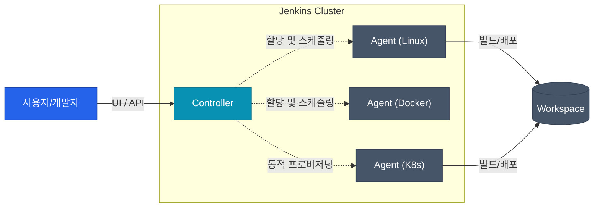
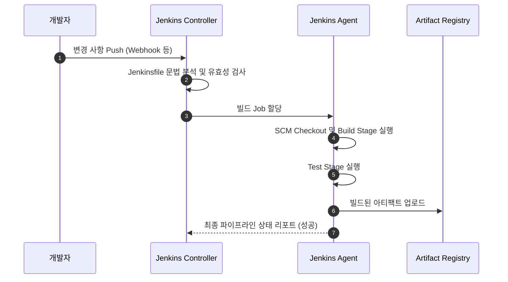

다양한 CI/CD 툴이 등장했지만, 여전히 가장 오랫동안 많은 기업에서 범용적으로 쓰이는 도구가 Jenkins입니다. 온프레미스부터 클라우드 네이티브까지 거대한 플러그인 생태계를 통해 어떤 환경이든 유연하게 대응할 수 있다는 점이 가장 큰 무기입니다. 이번 글에서는 Jenkins의 핵심 구조인 컨트롤러와 에이전트, 파이프라인 동작 방식을 살펴보겠습니다

## Controller와 Agent 구조

Jenkins는 오래 전부터 마스터-슬레이브 아키텍처로 불리던 Controller-Agent 구조를 채택해서 동작합니다 



Controller는 전반적인 설정 및 파이프라인의 메타데이터를 관리하고, 실제 빌드나 배포 작업의 부하는 여러 대의 Agent가 분산해서 감당합니다 

- **Controller**: Web UI 및 API를 제공하고 파이프라인의 실행 스케줄, 플러그인, 전체 상태를 관리합니다
- **Agent**: Controller로부터 지시를 받아 실제 스크립트 파이프라인을 실행하는 작업 노드입니다. 환경에 따라 Docker, 정적 VM, Kubernetes 파드 등 입맛에 맞게 다양한 형태로 붙일 수 있습니다

## Pipeline 기초 구성 요소

Jenkins 파이프라인은 코드로 CI/CD 과정을 선언합니다(Pipeline as Code). 주로 Groovy 문법 기반의 DSL로 작성됩니다 

| 요소 | 역할 | 비고 |
|------|------|------|
| `pipeline` | 파이프라인의 최상위 블록 | 모델 정의형(Declarative) 파이프라인의 시작점 |
| `agent` | 실행 환경(노드) 지정 | 전체 또는 Stage별로 격리해서 설정 가능 |
| `stages` | 전체 파이프라인 단계들을 묶는 그룹 | 하나 이상의 `stage`를 포함 |
| `stage` | 논리적인 작업 단계 (예: Build, Test) | UI상에서 진행 상태를 표시하는 기준점 |
| `steps` | 단계 안에서 실행할 실제 명령어 모음 | `sh`, `echo`, 파일 복사 등 |

## 간단한 파이프라인 동작 흐름

이러한 요소들이 어떤 순서로 맞물려 실행되는지 가장 기본적인 성공 파이프라인 흐름을 살펴보겠습니다



## Jenkinsfile 작성 맛보기

Jenkins에서 쓰이는 가장 기초적인 형태의 선언형 파이프라인 구조입니다 

```groovy
pipeline {
    agent any // 어떤 환경에서든 실행 허용

    stages {
        stage('Build') {
            steps {
                echo '애플리케이션 소스를 빌드해요.'
                sh 'make build'
            }
        }
        stage('Test') {
            steps {
                echo '필수 단위 테스트를 실행해요.'
                sh 'make test'
            }
        }
        stage('Publish') {
            steps {
                echo '원격 레지스트리로 아티팩트를 배포해요.'
                sh 'make push'
            }
        }
    }
}
```

<div class="callout why">
  <div class="callout-title">Freestyle 프로젝트 대신 Pipeline을 쓰는 이유</div>
  과거 구형 Jenkins 환경에서는 UI에서 직접 스크립트와 빌드 단계를 칸 채우기 방식으로 입력하는 Freestyle을 썼습니다. 하지만 설정 이력 관리가 안 되고 파트너간 공유가 불가능한 치명적 단점이 있습니다. 이제는 코드 형태로 <code>Jenkinsfile</code>에 정의해서 애플리케이션 코드와 같이 Git 형상 관리를 하는 것이 무조건적인 표준입니다
</div>

## 정리

| 컴포넌트 | 핵심 역할 |
|------|------|
| Controller (Master) | 환경 설정, 플러그인 관리, Agent 작업 할당 |
| Agent (Node) | 빌드·테스트·배포 등 실무 연산 수행 주체 |
| Jenkinsfile | CI/CD 파이프라인 전체 단계를 코드로 정의한 문서 |

다음 글에서는 이 Jenkinsfile의 기본 골격인 선언형(Declarative) 파이프라인의 추가 문법과 옵션을 조금 더 실무적으로 다룹니다
