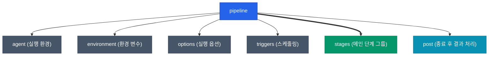

이전 글에서 살펴본 것처럼 Jenkins 파이프라인은 코드로 전체 흐름을 관리합니다. Jenkins는 자유도가 무한에 가까운 Scripted 문법과 이후에 나온 규격화된 Declarative 문법, 두 가지 방식을 지원하는데요. 구조가 직관적이고 제어가 쉬운 **Declarative Pipeline**이 현재 엔터프라이즈 환경에서의 확고한 원칙이 되었습니다. 실무에서 필수로 쓰이는 문법들을 짚어보겠습니다

## Scripted vs Declarative

두 문법은 작성 패러다임 자체가 다릅니다. Scripted가 날것의 프로그래밍이라면 Declarative는 블록 조립형 구성입니다

| 구분 | Scripted Pipeline | Declarative Pipeline |
|------|-------------------|----------------------|
| **기반 문법** | 거의 순수한 Groovy 언어 코드 | 사전에 정의된 엄격한 구조와 지시어 집합 |
| **유연성** | 고도의 반복문, 복잡한 커스텀 로직 작성 쾌적 | 로직 제약이 있지만 읽기 쉽고 구조 파악이 용이 |
| **에러 처리** | `try-catch-finally` 직접 타이핑 | `post` 블록에 속성만 선언하면 알아서 처리 |
| **최상위 위치** | `node { ... }` | `pipeline { ... }` |
| **사용 권장도** | 점차 도태되는 레거시 | **오늘날 파이프라인의 표준 (Standard)** |

## 파이프라인 최상위 구조: The Anatomy

Declarative 파이프라인은 가장 외곽을 `pipeline {}` 블록으로 반드시 감싸며, 그 안에 기능별 지시어(Directive)를 결합해서 살을 붙입니다. 빈번하게 활용하는 구조를 시각화하면 다음과 같습니다



## 필수 Section 및 Directive 역할

실무에서 매일같이 쓰이는 각 설정 블록이 어떤 역할을 하는지 빠르게 훑어보겠습니다

| 블록 | 설명 | 실무 활용 예시 |
|------|------|----------------|
| `agent` | 코드가 구동될 노드 및 플랫폼 지정 | K8s 파드 또는 `node:18-alpine` 처럼 도커 이미지 안에서 구동 |
| `environment` | 파이프라인 내의 전역/지역 변수와 암호 설정 | DB 계정 자격 증명 주입, 로그 덤프용 공통 접두사 관리 |
| `parameters` | 빌드 시작 시 사용자가 입력하는 동적 변수 지정 | 타겟 환경(`prod`/`dev`) 콤보박스 제공, 배포 태그 입력 |
| `options` | 타임아웃, 중복 빌드 방지, 콘솔 로그 색상 등 | `timeout(time: 1, unit: 'HOURS')` 와 같은 안전 장치 적용 |
| `when` | 특정 `stage`를 건너뛸지 말지 동적으로 결정 | 브랜치가 `main`일 때만 "Deploy to Prod" 스테이지를 실행 |
| `post` | 빌드 성공/실패/불안정 등 결괏값에 따른 후속 처리 | 배포 실패 시 즉시 Slack 알림 발송, 성공 시 아티팩트 보관 |

## 실무 파이프라인 템플릿 보기

위에서 소개한 지시어들을 논리적으로 조합하면 실제 라이브 환경에서 쓰이는 강력한 배포 템플릿이 나옵니다

```groovy
pipeline {
    agent { docker { image 'node:18-alpine' } }
    options { timeout(time: 30, unit: 'MINUTES') }

    stages {
        stage('Quality Gate') {
            parallel { // 병렬로 속도 단축
                stage('Test') { steps { sh 'npm run test' } }
                stage('Lint') { steps { sh 'npm run lint' } }
            }
        }
        stage('Deploy') {
            when { branch 'main' } // 조건 제어부
            steps { sh './deploy.sh' }
        }
    }

    post {
        always { cleanWs() }
        success { echo '슬랙 알림 모듈 호출...' }
    }
}
```

<div class="callout why">
  <div class="callout-title">Options 블록의 timeout은 선택이 아닌 필수</div>
  파이프라인이 중간 사용자 입력(Input)에서 무한 대기하거나, 외부 통신 API 장애로 무한 루프 늪에 빠지면 Jenkins 스레드가 막혀 다른 중요 빌드들까지 큐잉되는 대참사가 발생합니다. <code>timeout</code> 세팅은 무를 수 없는 프로덕션 필수 원칙입니다
</div>

## 정리

| 특징 | 요약 내용 |
|------|-----------|
| **표준 문법** | 가독성을 위협하는 Scripted 문법을 피하고 **명확하고 엄격한 구조의 Declarative** 문법을 애용합니다. |
| **비즈니스 조건 제어** | 스크립트 덩어리의 지저분한 `if/else` 대신 `when` 블록을 사용해서 흐름을 매끄럽게 통제합니다. |
| **후행 액션 정리** | 복잡한 `try-catch` 예외 처리 대신 깔끔한 `post` 블록으로 노티피케이션과 리소스 초기화를 해결합니다. |

다음 글에서는 이렇게 정교하게 작성된 파이프라인 템플릿이 사내의 수백 개 프로젝트에 복사붙여넣기 쓰일 때 발생하는 끔찍한 중복 문제를 어떻게 우아하게 제거하는지, 핵심 기법인 **Shared Libraries** 생태계를 살펴보겠습니다
