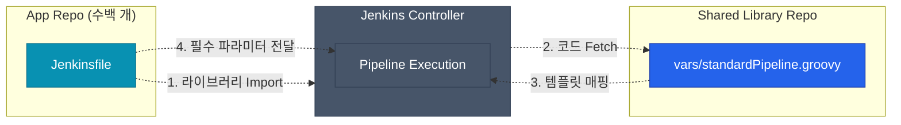

회사의 서비스가 하나일 때는 `Jenkinsfile` 단 하나면 충분했습니다. 하지만 마이크로서비스 아키텍처(MSA)가 도입되면서 팀마다 관리해야 할 레포지토리가 수십, 수백 개로 늘어나면 어떨까요? 모든 프로젝트마다 100줄이 넘어가는 동일한 `Jenkinsfile`을 복사 & 붙여넣기 해야 하는 유지보수 악몽이 시작됩니다. 이런 중복의 고리를 끊고 **파이프라인을 일관된 공통 모듈로 묶어 중앙 통제**할 수 있게 해주는 기능이 바로 **Jenkins Shared Library**입니다

## 왜 Shared Library가 필요한가?

파이프라인이 각 레포지토리에 분산되어 있을 때 생기는 문제를 실무 관점에서 구체화해보겠습니다

| 문제점 | Shared Library 적용 전 (파편화) | Shared Library 적용 후 (중앙화) |
|--------|---------------------------------|---------------------------------|
| **보안/정책 변경** | 수백 개의 레포지토리를 돌며 `Jenkinsfile` 일일이 수정 | `Shared Library` 브랜치 소스 하나만 수정하면 일괄 전파 |
| **개발자 부담** | 앱 개발팀이 복잡한 Groovy 파이프라인 구조를 이해해야 함 | 앱 개발팀은 파라미터(이름, 프레임워크) 몇 개만 넘기면 끝남 |
| **코드 품질** | 템플릿 복붙으로 인한 오타, 누락, 설정 불일치 발생 빈번 | 중앙 플랫폼 엔지니어링 팀이 표준화되고 검증된 배포 스크립트 관리 |

## 물리적 디렉터리 아키텍처

Shared Library는 애플리케이션 레포지토리와는 별개의 독립된 Git 레포지토리로 분리해서 생성합니다. Jenkins가 이를 읽으려면 약속된 폴더 구조를 철저히 따라야 합니다

```text
(Shared-Library Repository)
├── src/           # 복잡한 객체 지향 로직 및 클래스용 (src/org/foo/...)
├── vars/          # 파이프라인에서 직접 호출될 커스텀 함수(전역 변수) 모음
│   ├── standardPipeline.groovy
│   └── notifySlack.groovy
└── resources/     # 외부 템플릿 파일, json, yaml 등 일반 정적 파일
```

이 중 실무 파이프라인 공통화 작업에서 90% 이상 활용되는 핵심 폴더는 쉽게 함수를 꺼내 쓰는 `vars/` 폴더입니다

## 로직 공통화 구현 흐름

애플리케이션 쪽 빌드 파이프라인에 있던 복잡한 설정 코드 덩어리를 뜯어내서, Shared Library 레포지토리의 커스텀 함수로 밀어넣는 흐름을 시각화해보겠습니다



## 실전 작성 예시: 글로벌 알림 함수 분리하기

배포 성공 여부를 확인해 슬랙 알림을 보내는 코드를 공통 라이브러리로 분리해보겠습니다. 라이브러리 레포지토리 쪽 `vars/notifySlack.groovy` 파일을 다음과 같이 만듭니다

```groovy
// Shared Library Repo: vars/notifySlack.groovy 위치
def call(String status) {
    if (status == 'SUCCESS') {
        slackSend(color: 'good', message: "빌드 성공: ${env.JOB_NAME}")
    } else {
        slackSend(color: 'danger', message: "빌드 실패: ${env.JOB_NAME}")
    }
}
```

이제 실제 애플리케이션의 `Jenkinsfile`에서는 다음처럼 한 줄로 깔끔하게 호출만 하면 끝납니다. 핵심은 최상단의 `@Library` 어노테이션입니다

```groovy
// App Repo: 프로젝트 최상단 Jenkinsfile
@Library('my-company-library@main') _ 

pipeline {
    agent any
    stages {
        stage('Deploy') { steps { echo '배포 중...' } }
    }
    post {
        always { notifySlack(currentBuild.currentResult) }
    }
}
```

<div class="callout why">
  <div class="callout-title">최상위 어노테이션의 끝문자 `_` (언더스코어)의 비밀</div>
  <code>@Library('이름') _</code> 끝에 붙는 언더스코어 문자는 사실 단순한 오타나 장황한 여백 기호가 아닙니다. Groovy 컴파일러 문법상 어노테이션 뒤에는 문맥적으로 반드시 '가리킬 대상 클래스나 메서드' 본체가 와야 하는데, Declarative Script 환경상 그 시작점에 둘 코드가 애매하므로 문법 에러를 방지하기 위해 더미 문자 <code>_</code> 를 집어넣는 약속된 우회 트릭이랍니다
</div>

## 한 걸음 더: 파이프라인 전체를 통째로 모듈화하기

알림 같은 특정 단위 액션뿐만 아니라, 앞선 포스트에서 본 것 같은 거대한 `pipeline` 골격 전체를 아예 `vars/standardPipeline.groovy` 템플릿으로 박아버릴 수도 있습니다 

이 방식을 쓰면 **애플리케이션 개발팀의 `Jenkinsfile`은 궁극적으로 다음 단어 몇 줄로 극도로 단순해집니다.**

```groovy
@Library('my-company-library') _

// 중앙에서 정의해 둔 파이프라인 명세 함수 호출
standardPipeline {
    appName = "user-service"
    framework = "spring-boot"
    nodeVersion = "17"    
    deployTarget = "k8s-prod"
}
```

이제 일선 개발팀은 Docker 실행 환경 셋업, 타임아웃 방어로직, 예외 처리 트러블슈팅을 전혀 몰라도 됩니다! 중앙에서 통제하는 템플릿의 명세서 양식만 채우면 가장 안전한 베스트 프랙티스로 자동 배포할 수 있습니다

## 정리

| 역할 | 핵심 요약 |
|------|-----------|
| **목적** | 전체 조직의 파이프라인 로직 파편화 방지 및 보안/규격 정책의 중앙 일괄 제어 |
| **원리** | `@Library` 어노테이션을 통해 별도의 관리를 받는 Git 레포지토리 로직을 동적으로 파이프라인에 Import |
| **이점** | 애플리케이션 팀의 복잡한 Groovy 코드를 대거 소거하여 러닝커브와 부담을 줄이고 비즈니스 코드 개발 생산성 증대 기여 |

다음 글에서는 공통화라는 강력하고 편리한 무기까지 쥐어본 우리가 엔터프라이즈 환경에서 필수적으로 부딪히게 될 거대한 트래픽 한계 벽, 인프라 운영 측면에서의 **대규모 분산 환경 Jenkins 스케일링 전략**을 시리즈의 마지막으로 정리해 보겠습니다
