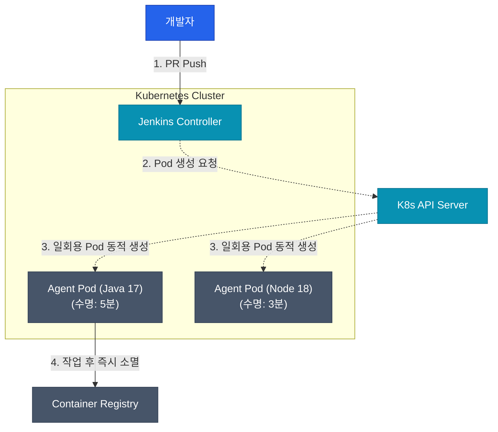

Jenkins는 역사적으로 중앙의 Controller 1대가 전체 스케줄링과 메타데이터, 상태 관리를 도맡는 태생적 구조를 가집니다. 회사 규모가 커지고 빌드가 수천 개 단위로 늘어나면 이 Controller 1대는 엄청난 병목(Bottleneck)이자 전체 서비스의 단일 장애점(SPOF)이 되어버립니다. 시리즈의 마지막인 이번 글에서는 이러한 한계를 어떻게 극복하고 모던 인프라에 맞게 파이프라인을 스케일링하는지 정리해보겠습니다

## 기존 정적 로컬 스케일링의 한계점

가장 쉽게 떠올릴 수 있는 접근은 빌드 부하를 견디기 위해 단순히 온프레미스 연산 노드(Agent VM)를 여러 대 고정으로 띄워두고 분산 처리하는 방식이었습니다. 하지만 이는 곧 한계를 맞이합니다

| 문제 현상 | 왜 발생하는가? | 비즈니스 영향 |
|--------|----------------|------|
| **좀비 프로세스와 의존성 꼬임** | 똑같은 VM에서 빌드를 계속 돌리므로 캐시나 임시 파일이 누적되고 충돌함 | 분명 내 컴퓨터에선 되는데, Jenkins에선 알 수 없는 로컬 에러로 인해 실패함 |
| **비용 낭비의 극대화** | 트래픽 최고점(낮 시간)에 맞춰 최고 사양의 고가 장비들을 24시간 켜놔야 함 | 밤이나 주말에는 아무도 안 써서 막대한 인프라 비용이 버려짐 |
| **글로벌 환경 충돌** | 한 VM에 여러 버전의 Java, Node.js 등을 전역으로 우겨넣기 시작함 | 팀별로 필요한 프레임워크 버전이 다르면 잦은 장애와 의존성 지옥 발생 |

이런 처참한 문제들을 완벽히 단련시켜주는 핵심 해독제가 바로 **컨테이너 기반 동적 에이전트(Dynamic Agent)** 환경이며, 오늘날에는 자연스레 Kubernetes 생태계와 융합됩니다

## Kubernetes 기반 동적 프로비저닝 

Kubernetes 위에서 Jenkins 파이프라인을 구동하면, Controller는 더 이상 정적 VM에 작업을 떠먹여주지 않습니다. 대신 빌드 요청이 큐에 떨어질 때마다 Kubernetes API를 호출해 **1회용 Pod(컨테이너)를 띄워 빌드만 딱 실행한 뒤 리소스를 즉시 완전히 파기**합니다



이 동적 아키텍처는 앞선 정적 구조의 단점들을 허무하리만치 쉽게 격파합니다
- **완전한 격리 (Isolation):** 팀 A는 Java 11 버전을, 팀 B는 Node 버전을 원한다면 그냥 도커 베이스 이미지만 다르게 명시해주면 됩니다. 잦은 버전 충돌이 사라집니다
- **드라마틱한 비용 절감:** 트래픽이 평소엔 없다가 낮에 100개가 몰리면, 일회용 K8s Pod 100개가 탄력적으로 순간 스케일아웃 되었다가 빌드가 끝나자마자 증발하므로 완벽한 오토 스케일링이 됩니다
- **항상 새것 같은 환경:** 매번 완전히 초기화된 새 컨테이너에서 빌드하므로, 구시대의 좀비 캐시 찌꺼기 문제가 원천 차단됩니다

## 스케일링을 위한 일회용 파이프라인 문법

Declarative Pipeline에서 Kubernetes 일회용 Pod을 에이전트로 쓰는 문법은 상당히 직관적입니다. `agent { kubernetes { ... } }` 지시어를 씁니다

```groovy
pipeline {
    // 1. 1회용 빌드 컨테이너 명세서(YAML) 선언
    agent {
        kubernetes {
            yaml '''
            apiVersion: v1
            kind: Pod
            spec:
              containers:
              - name: maven
                image: maven:3.8.1-jdk-11
                command: ['cat']
                tty: true
            '''
        }
    }
    stages {
        stage('Build') {
            steps {
                // 2. 동적으로 불려진 일회용 컨테이너 내부 환경으로 진입해 작업 실행
                container('maven') {
                    sh 'mvn clean package'
                    echo '이 빌드 스테이지 구문이 끝나면 이 Pod 컨테이너 공간은 완전히 소멸해요!'
                }
            }
        }
    }
}
```

<div class="callout why">
  <div class="callout-title">컨트롤러 자체의 단일 장애점(SPOF) 한계 극복</div>
  작업을 수행하는 에이전트(Agent)가 아무리 무한히 확장되어도, 정작 스케줄링 머신을 담당하는 **유일한 Controller 1대가 알 수 없는 패닉으로 죽으면 전체 전사 CI/CD가 마비**됩니다. 아쉽게도 Jenkins 오픈소스 버전은 DB를 공유하는 완벽한 동적 이중화(Active-Active HA) 구조가 불가능합니다. <br><br>따라서 엔터프라이즈 레벨에서는 아예 거대한 하나의 Controller를 버리고, 프로젝트나 도메인 그룹별로 Controller 자체를 여러 개로 잘게 쪼개는 **Multi-Controller 아키텍처**로 나누어 격리하거나, 컨트롤 플레인 자체를 클라우드로 일임하는 매니지드 솔루션으로의 부분 마이그레이션을 섞어 사용하는 것이 일반적입니다
</div>

## 정리

| 스케일링 전략 | 핵심 인사이트 |
|-----------|---------------|
| **정적 Agent의 종말** | 고정해두고 재활용하는 빌드 머신 패러다임은 한계에 다다랐으며, 모던 클라우드 네이티브 아키텍처에서는 지양되고 폐기되는 수순을 밟고 있습니다. |
| **K8s 기반 동적 체계** | 파이프라인이 호출될 때마다 일회용 Pod로 뜨고 계산 후 폭파되는 방식을 통해, 완벽한 환경 격리와 리소스 최적화를 달성합니다. |
| **SPOF 인지 및 분할** | 오픈소스 에디션에서 단일 Controller 자체의 완벽한 Active-Active 이중화는 사실상 불가하므로, 도메인 단위로 Jenkins 컨트롤러를 다중으로 쪼개서 운영하여 리스크 반경을 좁혀야 합니다. |

이렇게 해서 4편에 걸친 Jenkins 핵심 아키텍처와 활용 전략 시리즈를 마칩니다. 비록 UI가 투박하고 설정이 무거운 '할아버지 도구'라 불리기도 하지만, 역설적으로 아직까지도 가장 파워풀하게 코어를 책임질 정도로 고도화된 생태계를 지닌 훌륭하지만 무거운 시스템입니다
