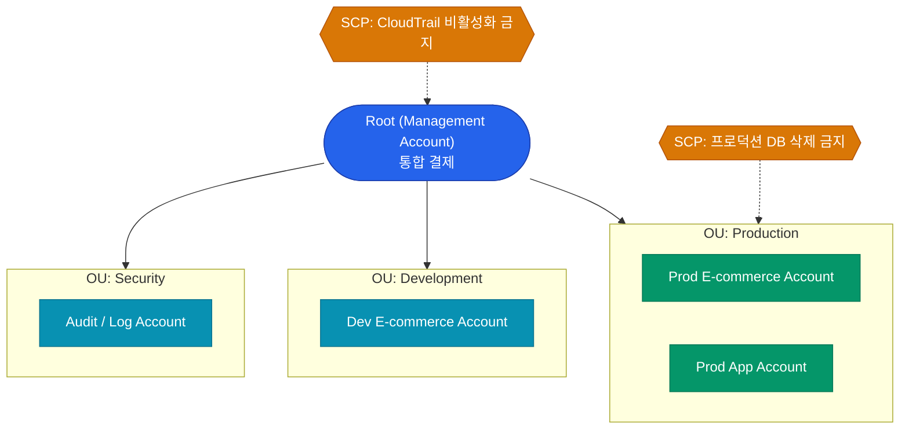
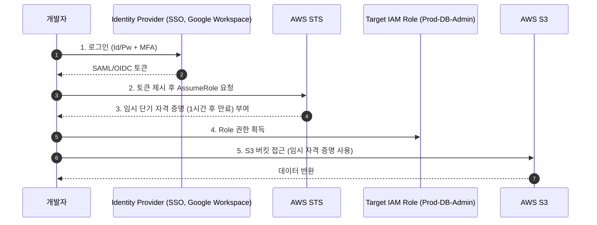


스타트업 초기에는 개발자 몇 명이 하나의 AWS 계정을 나눠 사용합니다. 그러다 실수로 상용 DB를 삭제하거나(격리 실패), 청구서가 어디서 많이 나오는지 알 수 없는 상황(청구 혼재)을 맞이하게 됩니다. 이를 해결하기 위해 엔터프라이즈 환경에서는 반드시 **멀티 계정(Multi-Account) 전략**을 채택합니다

## 멀티 계정이 필요한 이유

AWS 계정(Account)은 단순한 로그인 단위가 아니라 **가장 강력한 격리(Isolation) 경계**입니다

- **완벽한 격리**: 개발 계정의 실수나 보안 침해가 상용 계정으로 넘어오기 어렵습니다
- **명확한 청구(Billing)**: 서비스별, 팀별로 계정을 분리하면 비용 추적이 매우 쉬워집니다
- **API Limits 분산**: AWS의 API 호출 제한(Rate Limit)은 계정 단위로 적용되므로, 여러 계정으로 분산하면 병목을 피할 수 있습니다

## Organizations와 SCP를 통한 중앙 통제

계정이 수십 개로 늘어나면 관리 비용이 폭증합니다. 이를 해결하는 것이 바로 **AWS Organizations**입니다

- **OU (Organizational Unit)**: 비슷한 목적을 가진 계정들을 묶어주는 폴더 개념입니다
- **SCP (Service Control Policy)**: OU 단위로 적용하는 강력한 **최상위 차단 정책**입니다. SCP에서 특정 작업을 "Deny"하면, 해당 계정 안의 관리자(Administrator)조차도 그 작업을 수행할 수 없습니다

## IAM User vs IAM Role

IAM(Identity and Access Management)에서 가장 흔한 오해는 "팀원별로 IAM User를 만들고 Access Key를 공유한다"는 안티패턴입니다

| 구분 | IAM User | IAM Role |
|---|---|---|
| **자격 증명** | 영구적인 ID / Password, Access Key | **임시 자격 증명 (STS)** |
| **적합한 용도** | 외부 파트너, 어쩔 수 없는 레거시 시스템 | **개발자, 애플리케이션(EC2, Lambda), CI/CD** |
| **보안 위험** | 탈취 시 영구적인 위험 (키 교체 의무화 필요) | 단기 세션 만료로 보안 안전성 높음 |

현대적인 AWS 환경에서는 **IAM User를 생성하지 않습니다**. 모두 단일 로그인(SSO)을 통해 접근하고 필요한 권한을 가진 **IAM Role을 Assume(임시 획득)**하여 사용합니다

## AssumeRole을 통한 권한 획득 흐름

임시로 권한 모자를 쓴다(Assume)고 생각하면 쉽습니다

이렇게 하면 개발자의 노트북이 해킹당하더라도, 길어야 몇 시간 뒤면 토큰이 자동 만료되어 피해를 최소화할 수 있습니다

  
최소 권한의 원칙 (PoLP)

  S3에 파일을 올려야 하는 EC2 인스턴스가 있다면, `AmazonS3FullAccess`를 주면 안 됩니다. 오직 **해당 버킷(리소스)**에 대해 **PutObject(액션)**만 허용하는 인라인 정책을 Role에 매핑하는 것이 원칙입니다. `*` 와일드카드 사용은 배제해야 합니다

## 정리

- AWS 환경은 **단일 계정에서 Organizations 기반의 멀티 계정으로** 전환해야 합니다
- 최상위 방어선으로 **SCP(Service Control Policy)**를 설정하여 관리자의 일탈이나 실수를 방지합니다
- 영구적인 패스워드와 키를 가진 **IAM User 생성을 중단하고**, 자동 만료되는 **IAM Role의 AssumeRole** 원칙을 따르십시오

클라우드의 가장 바깥인 Identity 방어선을 구축했습니다. 다음 글에서는 그 안에서 가상의 네트워크 공간을 조각내는 **VPC와 네트워킹(Subnet, NAT Gateway 등)** 구조를 다루겠습니다

