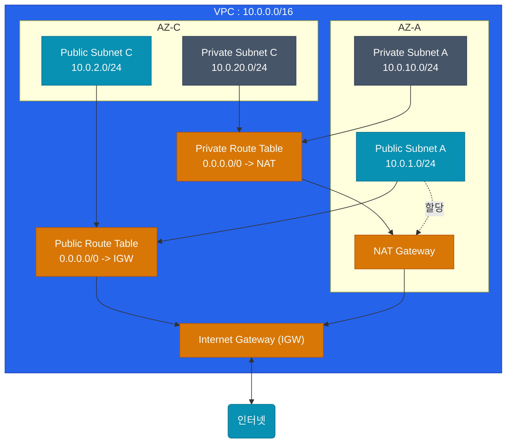

AWS를 처음 시작할 때 만나는 가장 큰 장벽은 네트워킹입니다. 클릭 몇 번에 EC2 인스턴스가 만들어지지만, 그 인스턴스가 어떤 네트워크에, 누구와 통신할 수 있게 떠 있는지는 전부 **VPC(Virtual Private Cloud)** 설정이 결정합니다 

퍼블릭 클라우드 안에서 나만의 프라이빗한 가상 데이터센터를 짓는 VPC의 뼈대를 살펴보겠습니다

## VPC와 서브넷(Subnet) 구성

VPC는 리전(Region, 예: 서울 `ap-northeast-2`)에 귀속되는 거대한 네트워크망(예: `10.0.0.0/16`)입니다. 이 거대한 땅을 용도와 가용 영역(Availability Zone, AZ)별로 쪼갠 것이 **서브넷(Subnet)**입니다

고가용성을 위해 서브넷은 보통 2개 이상의 AZ에 분산 배치합니다

### Public vs Private 서브넷의 기준

어떤 서브넷이 Public인지 Private인지를 가르는 유일한 기준은 **"Route Table이 Internet Gateway(IGW)로 트래픽을 보내는가?"** 입니다

| 구분 | 아웃바운드 라우팅 기준 | 들어갈 리소스 예시 |
|---|---|---|
| **Public Subnet** | `0.0.0.0/0`(모든 트래픽) 👉 **Internet Gateway** | ALB(Load Balancer), NAT Gateway, Bastion Host |
| **Private Subnet** | `0.0.0.0/0` 👉 **NAT Gateway** | EC2, EKS Node, RDS, ElastiCache |

보안을 위해 **모든 작업용 EC2나 DB는 무조건 Private 서브넷**에 두어야 합니다. Private 서브넷의 리소스는 외부(인터넷)에서 직접 접근할 수 없습니다. 하지만 인터넷으로 나가서 패키지를 다운로드받아야 할 땐 어떻게 할까요? 퍼블릭 서브넷에 위치한 **NAT Gateway**를 거쳐서 나가면 됩니다

  
가용성(Availability) 설계의 흔한 실수

  가용성을 확보한다고 EC2를 두 개의 AZ에 나눴는데, 장애 발생 시 인프라가 멈췄다면 **NAT Gateway가 1개뿐인지** 의심해 보십시오. NAT Gateway는 특정 AZ 존에 묶여 있기 때문에, AZ-A가 죽으면 AZ-C에 있는 서버들도 인터넷 통신이 끊깁니다. 프로덕션 환경에선 AZ마다 하나씩 독립된 NAT Gateway를 배치(단가 주의!)하는 것이 정석입니다

## 복잡한 연결: Transit Gateway와 PrivateLink

하나의 VPC 안에서는 이 정도면 끝이지만, 계정이 많아지고 파트너와 연동이 필요해지면 VPC 간 통신이 필요해집니다

1. **VPC Peering**: 두 VPC를 1:1로 직접 잇는 방법입니다. 수량이 적을 때 적합하며, 거미줄처럼 이어야 한다면 관리가 불가능해집니다
2. **Transit Gateway (TGW)**: 회사의 거대한 허브(라우터)를 하나 두고 모든 VPC를 방사형(Hub-and-Spoke)으로 묶습니다. 멀티 계정 네트워크의 필수 코어입니다
3. **PrivateLink (VPC Endpoint)**: S3 같은 AWS 관리형 서비스나 타사의 프라이빗 API를 호출할 때, 트래픽을 외부 인터넷으로 내보내지 않고 오직 **AWS 내부 백본망(AWS Network)**을 타게 만드는 강력한 보안 장치입니다

## 정리

- 클라우드 네트워킹의 기본은 **가용 영역(AZ) 간 분산과 Public/Private 서브넷 역할 격리**입니다
- **Route Table** 설정 하나가 그 네트워크의 외부 노출 여부를 결정합니다
- 업무용 서버는 외부 격리를 위해 **Private 서브넷 + NAT Gateway 조합**을 적용하십시오
- 멀티 계정 환경에서 VPC 확장이 필요하다면 **Transit Gateway**를 통해 허브 아키텍처를 설계하십시오

안전한 프라이빗 네트워크 공간을 마련했다면, 이제 그 위에 어떤 종류의 컴퓨팅 자원을 띄울지 결정해야 합니다. 다음 글에서는 **EC2, ECS, EKS, Serverless 간의 선택 기준**을 알아보겠습니다
