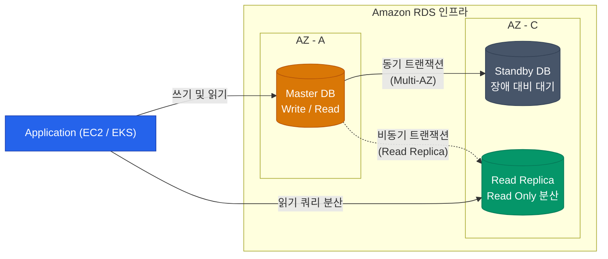

컴퓨트 자원은 삭제되었다가 다시 생성해도 무방하지만(Stateless), 사진, 로그, 사용자 정보가 저장된 스토리지와 데이터베이스는 한 번 파괴되면 복구하기 어렵습니다. 이 영구적인 데이터를 안전하고 효율적으로 관리하는 AWS의 두 핵심 서비스인 S3와 RDS에 대해 알아보겠습니다

## S3 (Simple Storage Service): 객체 스토리지의 모든 것

무제한 확장이 가능한 인터넷 스토리지 S3는 AWS 환경에서 중심 데이터 레이크 역할을 수행합니다. S3를 사용할 때 비용을 절감하고 보안을 강화하려면 다음 두 가지 개념을 숙지해야 합니다

### 1. 스토리지 클래스 (수명 주기 관리를 통한 비용 최적화)

모든 데이터가 1년 내내 활발하게 조회되지는 않습니다. 한 달만 지나도 거의 조회되지 않는 로그 데이터는 저렴한 **스토리지 클래스**로 이동시켜 보관 비용을 획기적으로 낮출 수 있습니다

| 스토리지 클래스 | 비용 (보관 / 검색) | 검색 시간 | 용도 |
|---|---|---|---|
| **S3 Standard** | 보관: 높음 / 검색: 무료 | 즉시 | 자주 사용하는 일반 데이터 (썸네일, 자바스크립트 등) |
| **S3 Infrequent Access (IA)** | 보관: 낮음 / 검색: 과금 | 즉시 | 한 달에 1~2회 정도 접근하는 백업, 오래된 영상 |
| **S3 Glacier Flexible / Deep Archive** | 보관: 매우 저렴 / 검색: 비쌈 | 수 시간 소요 | 규제 준수를 위한 장기 보관, 최후의 백업 |

이 과정은 수동으로 진행할 필요 없이, **S3 Lifecycle Policy(수명 주기 규칙)**를 통해 "30일이 지나면 IA로 이동하고, 1년 뒤에는 Glacier로 전송하며, 5년 뒤에는 삭제"하도록 자동화할 수 있습니다

### 2. 버저닝(Versioning)과 잠금

사용자의 실수나 랜섬웨어 공격으로 인해 S3 파일이 덮어씌워지거나 삭제될 위험이 있습니다. 버저닝 옵션을 활성화하면 동일한 이름의 파일이 덮어씌워지더라도, 숨김 형태로 `버전 ID`가 기록되어 이전 상태로 복원할 수 있습니다

## RDS (Relational Database Service) 선택 가이드

서버에 직접 MySQL을 설치해 본 경험이 있다면 백업, OS 패치, 이중화 구성이 얼마나 까다로운 작업인지 이해하실 것입니다. RDS는 이러한 관리 포인트를 AWS가 대행해 주는 관리형 관계형 DB 서비스입니다

### 상용 환경의 RDS 필수 구성 원칙

1. **Multi-AZ (다중 가용 영역 배포)**
   - 마스터 DB가 위치한 가용 영역(AZ)에 장애가 발생하면, 동기식으로 복제되고 있던 Standby DB로 즉각적인 페일오버(Failover)를 수행하여 서비스를 유지합니다
   - 평상시에는 Standby DB에 쿼리를 전송할 수 없습니다. 이는 순수하게 장애 대비를 위한 정책입니다
2. **Read Replica (읽기 복제본)**
   - 데이터베이스 부하의 상당 부분은 `SELECT` 쿼리에서 발생합니다. 부하 분산을 위해 읽기 전용 DB를 복제하여 성능 한계를 극복할 수 있습니다. 비동기 방식으로 복제되므로 미세한 데이터 지연이 존재할 수 있습니다
3. **Automated Backup (자동 스냅샷)**
   - 일 단위로 스냅샷을 생성하고 트랜잭션 로그를 저장합니다. 장애 발생 시 특정 시점(Point-in-time)으로 데이터베이스를 복원할 수 있습니다

  
Aurora vs 일반 RDS 오픈소스 엔진

  AWS는 MySQL/PostgreSQL 엔진을 클라우드 환경에 최적화하여 재설계한 **Amazon Aurora**를 제공합니다. 일반 RDS보다 스토리지 계층의 복제 방식이 빠르고 가용성이 높아서 I/O 성능이 월등히 뛰어납니다. 과금 체계는 다르지만, 트래픽이 많고 핵심적인 서비스라면 Aurora 도입이 비용 대비 더 유리할 수 있습니다

## 정리

- 스토리지 아키텍처의 핵심은 **S3 스토리지 클래스와 라이프사이클 정책**을 통해 비용 효율성을 확보하는 것입니다
- 보안 사고나 운영 실수를 방지하기 위해 중요한 버킷의 S3 **Versioning**은 반드시 활성화하십시오
- **RDS**는 관리형 서비스이지만, 고가용성을 위해 **Multi-AZ** 옵션 활성화는 필수입니다
- 읽기 부하가 높다면 직접 인스턴스를 추가하기보다 **Read Replica** 증설을 우선적으로 고려하십시오

안정적인 상태(State) 저장을 위한 인프라 지식을 살펴보았습니다. 이러한 서버 중심 인프라도 중요하지만, 최신 백엔드 아키텍처는 점차 서버 관리 부담을 줄이는 방향으로 진화하고 있습니다. 마지막으로 **AWS Lambda를 활용한 서버리스 패턴**에 대해 알아보겠습니다
