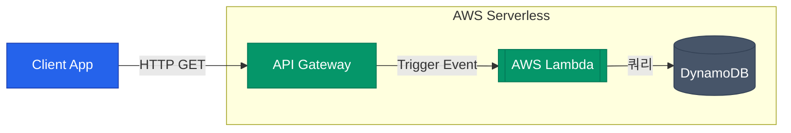

서버리스(Serverless)는 말 그대로 "서버가 없다"는 뜻이 아니라, "개발자가 관리하고 패치해야 할 가상머신(서버) 계층이 사라졌다"는 의미입니다. 개발자는 오직 자신의 비즈니스 코드에만 집중하고, 그 코드 단위가 호출(Event)될 때만 밀리초(ms) 단위로 과금하는 아키텍처입니다 

그 중심에 바로 **AWS Lambda**가 있습니다

## Lambda 실행 모델과 Cold Start

EC2가 24시간 내내 구동되며 요청을 기다리는 식당 종업원이라면, Lambda는 호출 벨을 누를 때마다 대기하던 직원이 등장하여 1회성 작업을 수행하고 사라지는 방식입니다

| 특징 | Lambda 함수의 특성 |
|---|---|
| **트리거 (Trigger)** | API 호출, S3 파일 업로드, 메시지 큐 등 이벤트에 의해 100% 호출(Invoke) |
| **스케일링 (Scaling)** | 트래픽이 없으면 리소스 소모 0, 트래픽이 많아지면 즉시 병렬로 컨테이너 생성 |
| **무상태 (Stateless)** | 함수가 종료되면 메모리 상태가 폐기됨. 지속 보관할 데이터는 S3나 DynamoDB에 저장해야 함 |

하지만 Lambda에는 **Cold Start**라는 고질적인 문제가 있습니다. Lambda 컨테이너가 처음 초기화되고 코드를 다운로드하여 구동하는 수 초의 지연 시간을 의미합니다. 한 번 실행되면 웜(Warm) 상태가 되어 응답이 빠르지만, 오랫동안 호출되지 않으면 다시 초기화가 필요합니다. 이를 해결하기 위해 함수 경량화, 런타임 최적화(Go, Rust 선호) 등의 튜닝을 하거나, `Provisioned Concurrency`(미리 활성화해 두는 설정) 옵션을 사용하기도 합니다

## 대표적인 서버리스 연동 패턴

Lambda 단독으로는 단순히 하나의 함수일 뿐입니다. 강력한 AWS 관리형 서비스들과 유기적으로 결합될 때 진정한 위력을 발휘합니다

### 1. API 패턴 (API Gateway + Lambda)

가장 보편적인 웹 백엔드 구축 패턴입니다. HTTP 요청을 받아 라우팅, 인증, 스로틀링을 `API Gateway`가 먼저 처리하고, 순수 비즈니스 로직(조회, 저장 등)만 `Lambda`에 트리거합니다

### 2. 비동기 이벤트 처리 패턴 (EventBridge / SQS / SNS)

"사용자가 회원 가입을 하면, 5분 뒤에 웰컴 이메일을 보내고 DB에 통계 레코드를 기록하라"와 같은 지연 작업이나 여러 관심사에 대한 동시 작업 모델에 적합합니다

- **EventBridge**: 클라우드 전반에 발생하는 다양한 이벤트를 라우팅하는 거대한 이벤트 버스입니다. (예: 매일 특정 시간에 실행)
- **SQS (Queue)**와 **SNS (Pub/Sub)**: 갑작스러운 대규모 트래픽 스파이크를 메시지 큐에 보관하고, Lambda가 처리할 수 있는 속도만큼 폴링(polling)하여 데이터베이스 부하를 방지합니다

### 3. 복잡한 워크플로우 오케스트레이션 (Step Functions)

이벤트가 복잡하게 얽히다 보면, 조건에 따른 상태 제어가 필요해집니다. 이를 각 Lambda 코드 내에서 직접 연결하면 유지보수가 매우 어려워집니다

이럴 때는 시각적인 워크플로우 엔진인 **AWS Step Functions**를 이용해 전체 흐름을 제어하고, 각 단계의 작은 로직만 Lambda가 수행하도록 구성하는 것이 정석입니다

  
서버리스 개발의 한계

  관리할 인프라가 없다는 장점 이면에는 치명적인 단점도 존재합니다. 특정 클라우드 벤더(AWS)에 완전히 **종속(Lock-in)**될 수 있으며, 디버깅을 로컬 환경에서 재현하기가 복잡합니다. 또한, 긴 실행 시간(15분 이상)이 필요한 무거운 작업의 경우 실행 자체가 불가능하므로 EC2나 ECS 기반의 설계를 고려해야 합니다

## 정리

- **Lambda**는 이벤트 트리거에 응답하여 일회성 컨테이너를 구동하는 함수 단위 컴퓨팅입니다. 비용 효율성과 자동 확장이 최대 장점입니다
- **API Gateway**와 결합하여 강력한 REST/HTTP API를 손쉽게 구축할 수 있습니다
- 갑작스러운 부하 분산과 에러 전파 방지를 위해 **SQS/SNS**를 활용하여 비동기로 처리하십시오
- 여러 Lambda가 연계된 복잡한 로직은 개별 코드에서 흐름을 제어하지 말고 **Step Functions**에 중앙 통제 권한을 위임하는 것이 좋습니다

지금까지 5편에 걸쳐 계정 권한(IAM)부터 네트워크, 컴퓨트, 스토리지, 서버리스에 이르기까지 핵심적인 **AWS Cloud Infrastructure** 블록을 설계하는 원리를 살펴보았습니다
