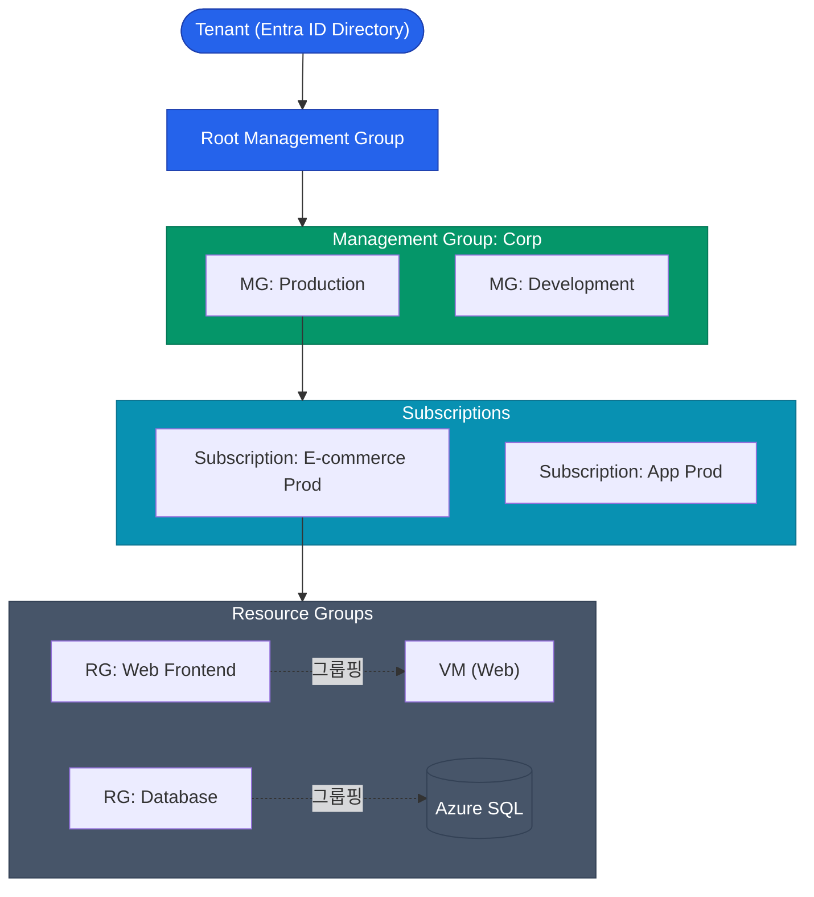

마이크로소프트의 클라우드인 Azure(애저)는 윈도우 환경에 친숙한 기업들에게 사실상 유일한 대안으로 꼽힙니다. Azure가 강력한 이유는 이미 대부분의 대기업이 사용 중인 사내 Active Directory(AD)를 클라우드 권한 모델로 부드럽게 확장할 수 있다는 점입니다

이번 글에서는 Azure의 계층형 자원 관리 모델과 Entra ID(구 Azure AD)를 기반으로 하는 RBAC 구조를 살펴보겠습니다

## Azure의 논리적 계층 구조

GCP와 비슷하게 Azure도 자원을 트리(Tree) 형태로 매핑하여 거버넌스를 위에서 아래로 상속(Inherit)시킵니다

1. **Management Group (관리 그룹)**: 여러 구독(Subscription)을 하나로 묶어 정책이나 권한을 일괄 통제하는 폴더입니다
2. **Subscription (구독)**: 청구(Billing) 및 권한 확장의 기본 단위입니다. AWS의 Account와 유사하며, 보통 프로덕션과 개발 환경별로 분리하여 운영합니다
3. **Resource Group (리소스 그룹)**: Azure만의 독특한 개념입니다. 애플리케이션에서 사용되는 `VM`, `Load Balancer`, `DB` 등 라이프사이클이 동일한 자원들을 논리적으로 묶어주는 바구니 역할을 합니다. 리소스 그룹을 삭제하면 그 안에 포함된 모든 자원이 함께 삭제됩니다

## Azure RBAC (역할 기반 액세스 제어)

Azure의 권한 관리는 **Entra ID(Azure AD)**가 인증(Authentication)을 담당하고, **Azure RBAC** 체계가 인가(Authorization)를 결정하는 구조입니다 

권한을 부여할 때는 다음 세 가지 요소의 조합이 필요합니다
**`Security Principal(누구에게)` + `Role Definition(어떤 역할을)` + `Scope(어느 범위에)`**

| 구성 요소 | 설명 |
|---|---|
| **Security Principal** | User, Group, Service Principal(앱), Managed Identity(자원) |
| **Role Definition** | Built-in Role(Owner, Contributor, Reader 등) 또는 Custom Role |
| **Scope** | Management Group 수준부터 가장 작은 하나의 VM 수준까지 설정 가능 (상위 권한은 하위로 상속됨) |

실무에서는 개별 사용자에게 직접 권한을 부여하기보다, **Entra ID의 그룹(Group)**에 인원을 배정하고, 해당 그룹에 **Resource Group 범위의 Contributor(기여자) 역할**을 부여하는 방식을 주로 사용합니다

## 조건부 액세스 (Conditional Access)

회사 네트워크가 아니거나 보안이 취약한 환경에서 로그인이 시도될 경우, Entra ID P1 이상의 라이선스를 통해 세밀한 제어(Zero Trust)가 가능합니다 

이것이 바로 **Conditional Access**입니다

- **조건**: "특정 국가 이외의 지역에서", "관리자 계정으로 로그인을 시도할 때"
- **조치**: "반드시 지정된 기기(Intune)를 사용해야 하며, MFA 인증을 통과해야 함"

  
Managed Identity (GCP Workload Identity와 유사)

  Azure VM에서 구동되는 애플리케이션이 Key Vault에서 비밀번호를 가져와야 할 때, 코드 내에 패스워드를 하드코딩해서는 안 됩니다. 이럴 때는 VM 자체에 **Managed Identity**를 부여하고, Key Vault가 해당 Identity를 가진 VM의 접근만 허용하도록 RBAC 설정을 하는 것이 현대적인 클라우드 보안의 정석입니다

## 정리

- 최상위 조직 정책은 **Management Group** 단위로 적용하고, 청구는 **Subscription**, 자원의 배포 및 삭제 라이프사이클은 **Resource Group** 단위로 관리하십시오
- 개별 사용자 대신 **Entra ID 그룹**을 생성하여 **Built-in Role**(예: Contributor)을 매핑하는 것을 원칙으로 합니다
- 단순한 비밀번호 인증을 넘어 **Conditional Access** 기반의 Zero Trust 체계를 구축하십시오
- 애플리케이션에는 접속용 비밀번호 대신 **Managed Identity**를 부여하십시오

Azure의 권한과 계층 모델을 살펴보았습니다. 다음 편에서는 쿠버네티스 시장 점유율에서 강력한 입지를 자랑하는 **AKS(Azure Kubernetes Service)의 네트워킹 구조**를 심도 있게 다뤄보겠습니다
