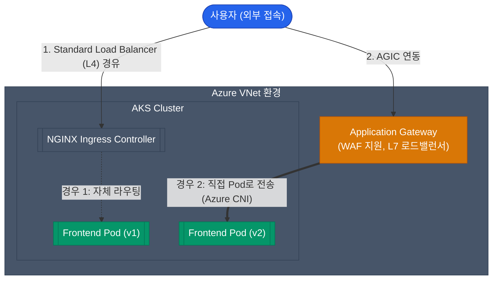

EKS, GKE와 함께 세계 3대 K8s 매니지드 서비스로 꼽히는 **AKS(Azure Kubernetes Service)**는 Azure 생태계와의 강력한 통합(Active Directory, Policy, Monitor 등)을 무기로 엔터프라이즈 환경에서 맹활약 중입니다.

AKS를 프로덕션에 올릴 때 가장 먼저 맞닥뜨리는 고민거리이자 핵심 설계 요소인 **네트워크 모델과 Ingress 구성**을 살펴보겠습니다.

## AKS의 심장, 두 가지 CNI 모델

쿠버네티스의 노드들이 속한 전통적인 VNet(VPC)과, 그 위에 있는 논리적인 컨테이너(Pod)의 네트워크를 어떻게 연결할 것인가? AKS 클러스터 생성 시 아래 두 가지 중 하나를 택해야 합니다. (생성 후 변경 불가)

| 비교 항목 | Kubenet (기본 네트워크) | Azure CNI (고급 네트워크) |
|---|---|---|
| **Pod IP 할당 방식** | 노드 내부의 논리적 브릿지 범위에서 할당됨 | **VNet의 실제 사설 IP**를 직접 할당받음 |
| **IP 주소 소비량** | 낮음 (Node 개수 수준의 IP만 필요) | **매우 높음** (모든 Pod마다 서브넷 IP를 하나씩 소진) |
| **VNet 외부와의 통신** | 노드 IP로 매핑(NAT)되어 나감 | **Pod IP 그대로 나감** (라우팅이 직관적임) |
| **추천 환경** | IP 대역이 부족한 하이브리드 클라우드 환경 | 대규모 트래픽, 높은 성능, 온프레미스와의 전용선 연결 모델 |

"VNet IP 대역(CIDR)이 `10.0.0.0/16`처럼 넓어서 수백 개의 Pod에 IP를 충분히 할당해도 부담이 없다"면 성능이 우월한 **Azure CNI**를 선택하는 것이 좋습니다. 반면 IP 고갈 위험이 있다면 Kubenet이 강제됩니다.

  
Azure CNI Overlay의 등장

  기존 Azure CNI의 치명적인 단점인 'IP 고갈 문제'를 해결하기 위해 **Azure CNI Overlay** 모드가 추가되었습니다. 이는 노드에만 VNet IP를 할당하고 Pod에는 별도의 Overlay IP를 부여하되, Azure CNI 수준의 고성능 트래픽 흐름을 제공합니다. 최근 신규 구축 시 가장 권장되는 모델입니다.

## 클러스터로 사용자를 모시는 방법: Ingress

수십 개의 Pod에 트래픽을 분산해 주는 Ingress Controller를 무엇으로 결정할지도 중요한 사항입니다.

### 선택지 1: 오픈소스 NGINX Ingress
가장 보편적으로 사용되는 패턴입니다. AKS 앞에 위치한 Azure Load Balancer(L4)가 트래픽을 수신하고, 클러스터 내부의 NGINX 파드가 L7 라우팅(URI 분기 등)을 전담합니다. 

### 선택지 2: Application Gateway Ingress Controller (AGIC)
Azure의 관리형 L7 로드밸런서인 Application Gateway를 사용하는 방법입니다. AGIC를 쿠버네티스에 설정하면, `Ingress` 설정 파일을 읽어 Application Gateway의 라우팅 규칙을 자동으로 업데이트합니다.
- 장점: 복잡한 L7 라우팅 부하와 WAF(웹 방화벽) 처리를 쿠버네티스 클러스터 외부(App Gateway)에서 수행하므로 노드 자원을 절약할 수 있습니다. 특히 Azure CNI를 사용 중이라면 파드 IP로 직접 트래픽이 전달되어 대기 시간이 단축됩니다.
- 단점: NGINX에 비해 설정 변경 사항이 반영되는 속도가 다소 느릴 수 있으며, Application Gateway의 기본 비용이 발생합니다.

## 정리

- AKS 네트워크 설계 시, VNet 통신이 빈번하고 IP 자원이 넉넉하다면 **Azure CNI (또는 Overlay)**를 채택하십시오.
- IP가 부족한 상황이라면 **Kubenet** 모델을 사용하여 노드 뒤로 파드를 배치하십시오.
- WAF 통합과 파드 직결형 라우팅 성능이 중요하다면 **AGIC(Application Gateway)** 모델을 활용하고, 유연성과 비용 효율성을 중시한다면 **NGINX Ingress**를 사용하십시오.
- 애플리케이션의 Azure 리소스 제어 권한은 반드시 **Managed Identity** (Workload Identity)를 쿠버네티스 Service Account와 결합하여 관리해야 합니다.

AKS를 통해 현대적인 애플리케이션의 기반을 마련했습니다. 다음 글에서는 쿠버네티스 없이도 손쉬운 배포를 지원하는 **Azure의 다양한 PaaS 서비스 라인업(App Service, Functions, Cosmos DB 등)**을 살펴보겠습니다.
