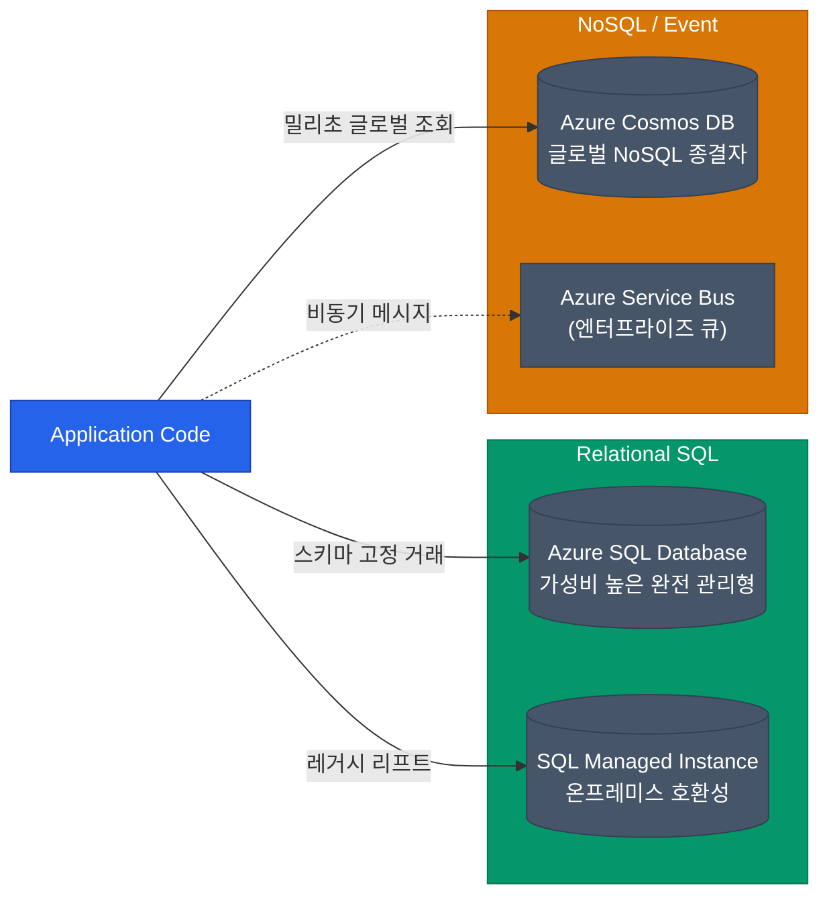

엔터프라이즈 환경에서 모든 서비스를 쿠버네티스(AKS)로 구축하는 것이 항상 정답은 아닙니다. 오히려 소규모 웹 서비스, 내부 어드민 도구, 혹은 강력한 글로벌 NoSQL 기능이 필요할 때는 이미 준비된 클라우드 고유의 관리형 리소스(PaaS)를 선택하는 것이 훨씬 효율적입니다

Azure의 대표적인 컴퓨트 서비스와 데이터베이스들의 용도를 구분하여 살펴보겠습니다

## 컴퓨트 서비스 비교: VM vs App Service vs Functions

서버를 구축해야 할 때, 구현하고자 하는 로직의 특성에 따라 다음과 같은 기준으로 서비스를 선택해 보십시오

| 로직 성격 | 추천하는 컴퓨트 서비스 | 상세 특징 |
|---|---|---|
| **OS 커스텀 & 레거시 포팅** | **Virtual Machines (IaaS)** | 기존 온프레미스의 환경을 그대로 이전(Lift and Shift)해야 할 때 사용합니다. 운영체제 패치 및 확장 관리의 책임은 사용자에게 있습니다. |
| **일반적인 웹 / API 서버** | **App Service (PaaS)** | 소스 코드나 배포 파일을 제공하면 Azure가 런타임 구성 및 자동 확장을 담당합니다. (AWS Elastic Beanstalk와 유사) |
| **이벤트 기반 단발성 코드** | **Azure Functions** | 특정 이벤트에 반응하여 짧은 시간 동안만 실행되고 종료되는 진정한 서버리스 시스템입니다. |

만약 소스 코드 수준이 아니라 컨테이너 기반의 배포가 필요하다면 **Azure Container Apps**가 훌륭한 대안이 될 수 있습니다. 쿠버네티스 기반이지만 복잡성을 배제한 서버리스 컨테이너 서비스로, AWS Fargate와 유사한 포지션입니다

## 데이터베이스 서비스 매트릭스

최신 클라우드 아키텍처는 데이터의 성격에 맞는 최적의 저장소를 활용하는 **Polyglot Persistence**를 지향합니다

### 1. Azure SQL Database (RDBMS)
가장 일반적인 선택입니다. SQL Server 엔진을 클라우드 환경에 최적화하여 재설계하였으며, 자동 확장 및 백업 관리를 지원합니다. 만약 기존 온프레미스 SQL Server와의 완벽한 호환성이 필요하다면 **SQL Managed Instance**를 선택하는 것이 좋습니다

### 2. Azure Cosmos DB (NoSQL)
Azure의 기술력이 집약된 강력한 데이터베이스입니다. 전 세계 어디서나 낮은 지연 시간으로 데이터를 조회할 수 있는 글로벌 분산형 인프라를 제공합니다. MongoDB, Key-Value, Graph 등 다양한 API 형태를 지원하며 성능 면에서 매우 뛰어납니다

### 3. Azure Service Bus (비동기 큐)
엔터프라이즈 아키텍처에서 서비스 간의 결합도를 낮추기 위해 사용하는 메시지 브로커입니다. 데이터를 큐(Queue)에 전달하여 비동기로 처리함으로써 시스템의 안정성을 높입니다. 순서 보장(FIFO) 및 지연 발송 등 복잡한 워크로드를 안전하게 보호합니다

  
PaaS 서비스들의 가상 네트워크 통합

  과거의 PaaS 서비스들은 공인 IP를 통해 접근해야 했으나, 최근에는 **Private Endpoint (Azure Private Link)**를 활용하여 App Service나 Cosmos DB 같은 자원을 프라이빗 네트워크(VNet) 내부에 배치할 수 있습니다. 이는 트래픽이 인터넷을 거치지 않게 하므로 보안상 매우 중요한 작업입니다

## 정리

- IaaS 기반의 관리 부담에서 벗어나, 웹앱은 **App Service**, 컨테이너는 **Container Apps**, 짧은 실행 코드는 **Functions**를 활용하십시오
- 트랜잭션 처리는 **Azure SQL DB**, 글로벌 확장성이 필요한 경우에는 **Cosmos DB**를 우선적으로 검토하십시오
- 시스템 간의 안정적인 통신을 위해 **Service Bus**와 같은 메시지 큐를 도입하십시오
- 모든 통신 보안을 강화하기 위해 **Private Link**를 통한 프라이빗 네트워크 통합을 적용하십시오

Azure의 RBAC 모델부터 AKS, 그리고 다양한 PaaS 자원들까지 핵심 구조를 모두 살펴보았습니다
