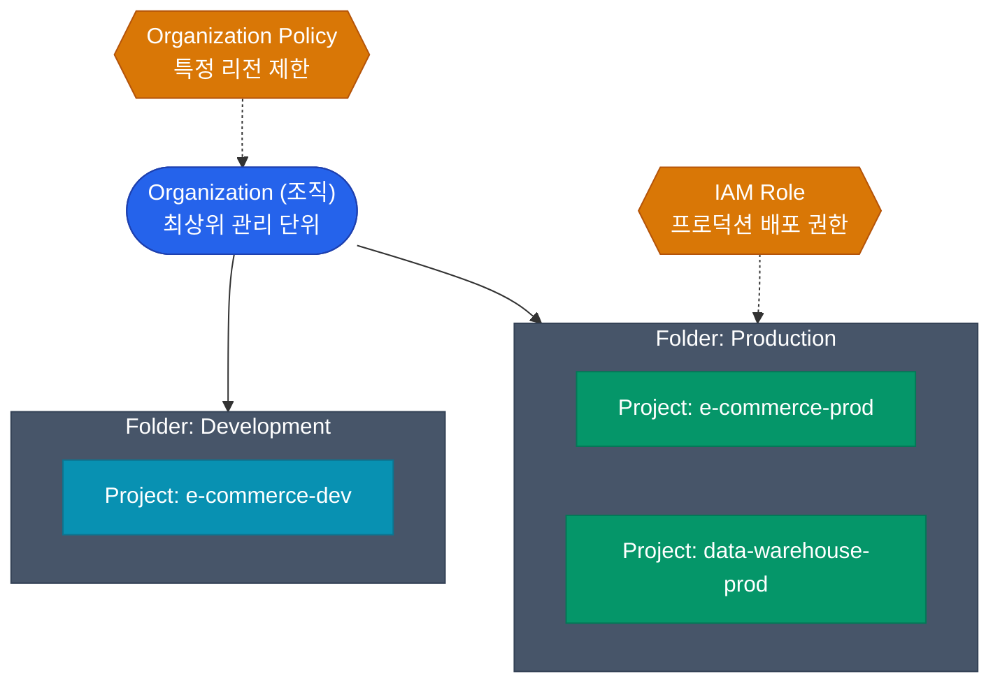


클라우드를 배울 때 대개 AWS를 먼저 접하기 때문에, GCP(Google Cloud Platform)를 처음 접하면 계정 구조와 권한 관리가 매우 이질적으로 느껴질 수 있습니다. 이러한 차이는 구글이 제공하는 **강력한 계층형 리소스 모델**에서 기인합니다

과거 "계정(Account)" 단위로 분리해야 했던 구조를 GCP는 어떻게 설계했는지 AWS와 비교하여 알아보겠습니다

## Resource Hierarchy: 클라우드 자원의 뼈대

GCP의 인프라 구조는 우리가 흔히 사용하는 **파일 시스템의 디렉토리 구조**와 매우 유사합니다. 리소스(VM, DB 등)는 반드시 최하위의 `Project`에 속해야 하며, 권한과 정책은 상위에서 하위로 상속(Inherit)됩니다

- **Organization**: 기업(Domain)을 대표하는 최상위 개념입니다
- **Folder**: 부서나 환경(Prod/Dev)을 나타내는 논리적 그룹입니다
- **Project**: AWS의 'Account'와 유사한 역할을 하는 기본 단위입니다. 청구, API 활성화, 리소스 할당이 모두 Project 단위로 수행됩니다

최상위(Organization) 수준에서 "특정 리전에만 리소스를 생성할 수 있다"는 정책을 부여하면 하위의 모든 폴더와 프로젝트에 자동으로 적용되어 일관된 보안 수준을 유지할 수 있습니다

## GCP IAM Role 모델

GCP의 권한은 "누구(Member)에게 어떤 역할(Role)을 어느 리소스(Resource)에 부여할 것인가"로 정의됩니다. 여기서 **역할(Role)**은 다음 세 가지로 구분됩니다

| Role 유형 | 설명 | AWS 개념 비교 |
|---|---|---|
| **Basic (기본)** | Owner, Editor, Viewer. 권한 범위가 너무 넓으므로 **사용을 지양**해야 함 | AWS의 `AdministratorAccess` 등과 유사하나 리소스 중심적임 |
| **Predefined (사전 정의)** | GCP에서 제공하는 세밀한 권한 모음. (예: `roles/compute.instanceAdmin`) | AWS의 `Managed Policy` |
| **Custom (맞춤)** | 특정 보안 요구사항에 맞춰 필요한 API 권한들을 직접 조합한 모음 | AWS의 `Customer Managed Policy` |

실무에서는 **최소 권한의 원칙**을 준수하기 위해 Predefined Role 사용을 우선하며, 필요한 경우에만 Custom Role을 생성합니다

## Service Account: 시스템 간의 신분증

사용자가 구글 콘솔에 로그인할 때 계정을 사용하듯, VM이나 컨테이너(GKE Pod)가 구글 API를 호출하기 위해 필요한 신분증이 바로 **Service Account (SA)** 입니다

1. `gcp-storage-reader@my-project.iam.gserviceaccount.com`과 같은 SA를 생성합니다
2. 이 SA에 `roles/storage.objectViewer` 역할을 부여합니다
3. Compute Engine(VM) 인스턴스를 생성할 때 해당 SA를 연결합니다
4. 이제 해당 VM에서 실행되는 애플리케이션은 별도의 인증 키 없이도 Cloud Storage의 파일을 읽을 수 있습니다

  
GCP IAM과 AWS IAM의 결정적 차이

  AWS는 정책(Policy)을 리소스나 아이덴티티에 연결(Attach)할 수 있습니다. 반면 GCP IAM은 철저하게 **"리소스 계층에서 멤버를 바인딩"**하는 개념으로 동작합니다. "특정 리소스에 대해 특정 멤버에게 특정 역할을 부여하라"는 형식(IAM Policy Binding)으로 권한이 관리됩니다

## 정리

- 구글 클라우드는 조직의 구조를 **Organization > Folder > Project**의 계층 구조로 관리합니다
- 권한 설정 시 범위가 넓은 Basic 역할 대신, 용도에 특화된 **Predefined Role**을 사용하십시오
- 애플리케이션의 인증과 권한 관리는 영구적인 키 파일 대신 **Service Account** 연결 방식을 활용하는 것이 보안상 가장 안전합니다

AWS에 비해 직관적인 프로젝트 및 권한 체계를 살펴보았습니다. 다음 글에서는 이러한 IAM 구조를 기반으로 구글의 기술력이 집약된 **Kubernetes(GKE) 운영 구조**를 알아보겠습니다

