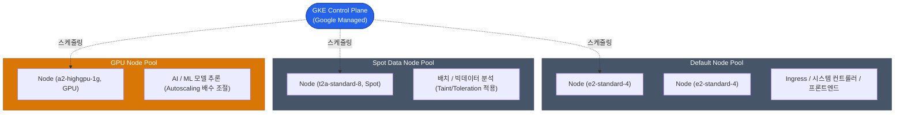

Kubernetes를 탄생시킨 구글의 플랫폼답게, **Google Kubernetes Engine(GKE)**은 퍼블릭 클라우드 관리형 K8s 생태계에서 가장 앞선 사용성과 자동화를 자랑합니다. EKS나 AKS와 비교해 보더라도 클러스터 관리자의 운영 부담이 현저히 낮습니다

GCP에서 GKE를 도입할 때 가장 먼저 결정해야 하는 운영 모드와 핵심 연동 기술을 살펴보겠습니다

## 두 가지 운영 모드: Standard vs Autopilot

GKE는 인프라를 사용자가 어느 수준까지 직접 제어할지에 따라 두 가지 모드를 제공합니다

| 비교 항목 | Standard 모드 | Autopilot 모드 |
|---|---|---|
| **과금 방식** | 실행 중인 **Node (VM)** 기준 과금 | 실행 중인 **Pod (CPU/Memory)** 기준 과금 |
| **Node(VM) 노출 여부** | OS 레벨 접속 가능, 관리자 권한 보장 | 완전 숨김 (No SSH, 시스템 자동 관리) |
| **스케일링 주체** | 사용자가 Node Pool Auto-scaler 직접 조율 | 구글이 컨테이너 크기에 맞춰 자동으로 서버 증설 |
| **운영 유연성** | 특수 하드웨어 장착 및 관리자 권한 도구(DaemonSet) 무제한 사용 가능 | 보안 규칙이 강제되어 권한 상승을 요하는 도구 사용 제한 |

**Autopilot** 모드는 AWS의 Fargate와 유사한 철학을 공유하지만, 쿠버네티스 생태계 내에서 더욱 매끄럽게 동작합니다. 서버 용량에 대한 고민을 클러스터 외부로 분리하고, "이 Pod를 구동하는 데 2코어 4GB가 필요하다"고 선언만 하면 GKE가 비용 효율적으로 자원을 할당합니다

다만, 특수한 서비스 요건으로 인해 CNI 플러그인을 교체하거나 노드의 커널 튜닝이 필요한 경우에는 여전히 **Standard** 버전을 선택해야 합니다

## 노드풀(Node Pool) 아키텍처

Standard 모드를 사용한다면 노드들의 그룹인 Node Pool을 용도에 맞게 구성해야 합니다. 모든 Pod가 동일한 컴퓨팅 자원을 공유하는 방식은 권장되지 않습니다

노드풀을 분리하는 주요 기준은 다음과 같습니다
- **Spot 인스턴스 전용 풀**: 작업이 중단되어도 무방한 워커나 배치 Pod를 실행하여 비용을 대폭 절감합니다
- **GPU 풀**: 머신러닝 모델 구동을 위한 고성능 하드웨어 풀입니다. 사용하지 않을 때는 인스턴스 개수를 0으로 조절하여 비용 발생을 방지합니다

## Workload Identity (보안 연동의 핵심)

GKE에서 실행되는 Pod가 Cloud Storage의 데이터를 읽거나 Cloud SQL에 연결하기 위해 권한을 증명해야 할 때, 과거에는 비공개 키가 포함된 JSON 파일을 사용했으나 이는 보안 위험이 큽니다

이를 효과적으로 해결하는 방식이 바로 **Workload Identity**입니다

1. **Kubernetes Service Account (KSA)** 생성: `my-app-ksa`
2. **GCP IAM Service Account (GSA)** 생성: `my-app-gsa@my-project...`
3. 두 계정 간 바인딩: GSA에 필요한 권한을 부여하고, 해당 GSA의 권한을 행사할 수 있는 주체를 KSA로 지정합니다
4. Pod는 단기 유효 토큰을 기반으로 별도의 키 파일 없이 안전하게 권한을 사용합니다

  
자동 업그레이드의 이점과 그 대가

  쿠버네티스 버전 업그레이드는 플랫폼 엔지니어의 주요 관리 포인트 중 하나입니다. GKE는 **Release Channel**을 통해 노드부터 컨트롤 플레인까지 클릭 몇 번만으로 무중단 롤링 업데이트를 제공합니다. 다만, 업데이트 주기가 빠르기 때문에 Deprecated API를 사용하는 애플리케이션이 포함되어 있을 경우 서비스 중단이 발생할 수 있으므로 주의가 필요합니다

## 정리

- 서버 관리 부담을 최소화하고 싶다면 **Autopilot** 모드 도입을 권장합니다
- **Standard** 모드에서는 워크로드 특성에 따라 Spot, GPU 등 **다양한 종류의 Node Pool**을 분리하여 운영하십시오
- 애플리케이션의 GCP 자원 접근은 키 파일 방식이 아닌, **Workload Identity**를 구축하여 해결하십시오

GKE는 GCP의 핵심 서비스이자 클라우드 네이티브 환경의 근간입니다. 다음으로는 이러한 애플리케이션들이 전 세계 사용자에게 어떻게 서비스되는지 **GCP의 네트워크, 글로벌 VPC 및 Load Balancer** 체계를 살펴보겠습니다
