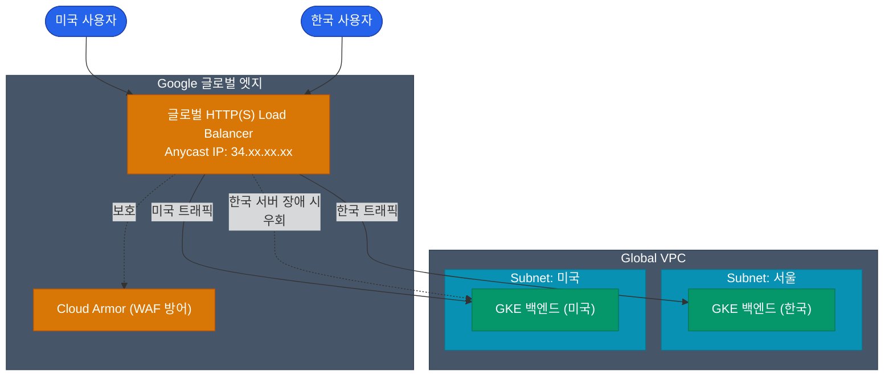

Google Cloud Platform의 네트워크 철학은 타 클라우드 서비스와 근본적으로 다릅니다. 이는 구글이 오랜 기간 검색과 유튜브 서비스를 운영하며 구축해 온 **자체 해저 케이블과 글로벌 백본망**을 기반으로 클라우드 서비스를 제공하기 때문입니다 

이러한 인프라 덕분에 복잡한 글로벌 서비스 아키텍처를 매우 효율적이고 단순하게 설계할 수 있습니다

## VPC: Region이 아니라 Global

가장 큰 차이점은 VPC의 범위입니다. AWS의 VPC가 특정 리전(예: 서울)에 국한되는 것과 달리, **GCP의 VPC는 전 세계(Global)를 아우르는 단일 네트워크망**입니다

| 기준 | AWS VPC 구성 | GCP VPC 구성 |
|---|---|---|
| **VPC 위치** | 특정 Region (서울) | **Global (전 세계)** |
| **Subnet 위치** | 특정 AZ (서울 a존) | **특정 Region (서울 전체)** |
| **타 리전 통신** | Peering 또는 Transit Gateway 필수 | 동일 VPC 내에 존재하므로 **내부 IP 통신 가능** |

하나의 `prod-vpc` 내에서 서울 리전에 속한 서브넷과 미국 리전에 속한 서브넷을 동시에 생성할 수 있습니다. 이 서브넷 내의 VM들은 복잡한 설정 없이도 프라이빗 IP를 사용하여 안전한 내부 백본망을 통해 통신합니다

## 글로벌 Load Balancer의 활용

위에서 설명한 글로벌 범위의 특성은 GCP의 로드 밸런서(LB)와 결합되었을 때 더욱 강력한 성능을 발휘합니다

GCP의 대표적인 HTTP(S) 로드 밸런서는 특정 리전에 종속되지 않고 **구글 엣지 네트워크(PoP)**에 위치합니다. 단일 Anycast IP를 전 세계에 노출하며, 사용자가 가장 인접한 구글 네트워크 지점으로 진입하면 최적의 경로를 통해 백엔드(VM/GKE)까지 트래픽을 전달하는 방식입니다

이러한 구조 덕분에 특정 리전의 서버에 장애가 발생하거나 과부하가 걸리는 경우, 글로벌 로드 밸런서가 이를 판단하여 가용 자원이 있는 가장 가까운 타 리전 서버로 트래픽을 자동으로 전환합니다. 사용자는 약간의 지연을 경험할 수 있으나 서비스 중단은 방지할 수 있습니다

## 프리미엄 티어 vs 스탠더드 티어

구글은 이러한 고성능 글로벌 백본망 사용 권한을 등급별로 제공하며, 이를 **Network Service Tiers**라고 합니다

- **프리미엄 티어(Premium)**: 트래픽이 최대한 빨리 구글 사설망으로 진입하여 서버까지 전송됩니다. 높은 성능을 보장하며 기본 설정값입니다
- **스탠더드 티어(Standard)**: 타 클라우드 서비스와 유사한 방식으로, 트래픽이 퍼블릭 인터넷 망을 통해 이동하다가 데이터 센터 인근에서 구글망으로 진입합니다. 비용은 저렴하지만 성능 면에서 차이가 있을 수 있습니다

## Cloud Armor (네트워크 보안)

글로벌 LB와 긴밀하게 연동되는 GCP의 WAF(웹 방화벽) 솔루션입니다 

글로벌 규모의 DDoS 공격이나 SQL 인젝션 시도를 서버 앞단이 아닌 전 세계 구글 엣지 지점에서 차단합니다. 특정 국가의 IP 차단이나 악의적인 봇 차단 규칙을 손쉽게 적용할 수 있어 보안 운영의 필수 요소입니다

  
서브넷의 리전 단위 범위

  AWS의 서브넷이 하나의 가용 영역(AZ)에 종속되는 것과 달리, **GCP의 Subnet은 기본 단위가 리전(Region)**입니다. 따라서 하나의 서브넷(`10.0.1.0/24`)을 구성하더라도 GKE가 노드를 할당할 때 여러 가용 영역(a존, c존 등)에 나누어 배치할 수 있습니다. 이는 IP 관리 및 구조 설계의 복잡도를 낮추는 큰 장점입니다

## 정리

- AWS와 다르게 GCP의 **VPC는 글로벌 범위**, **서브넷은 리전 단위**로 설계되어 있어 확장이 매우 용이합니다
- 멀티 리전 아키텍처에서도 **글로벌 HTTP(S) LB**의 단일 IP를 통해 전 세계 사용자에게 유연한 서비스를 제공할 수 있습니다
- **Cloud Armor**를 활용하면 글로벌 엣지 수준에서 대규모 공격을 효과적으로 방어할 수 있습니다

인프라의 근간이 되는 컴퓨트와 네트워크를 살펴보았습니다. 다음으로는 GCP를 데이터 플랫폼 시장의 강자로 만든 핵심 서비스인 **서버리스 데이터 웨어하우스 BigQuery**에 대해 정리해 보겠습니다
