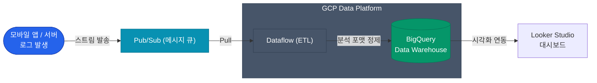

머신러닝이나 데이터 분석 조직에서 GCP를 선호한다는 이야기를 자주 접하게 됩니다. 그 중심에는 구글이 제공하는 압도적인 성능의 데이터 웨어하우스(DW)인 **BigQuery(빅쿼리)**가 자리 잡고 있습니다

데이터 파이프라인의 종착지인 BigQuery와 이를 둘러싼 실시간 처리 시스템의 유기적인 결합에 대해 소개하겠습니다

## 명불허전 BigQuery: 노옵스(NoOps)의 정점

전통적인 DW(Hadoop이나 AWS Redshift 등)는 클러스터 규모나 스토리지 용량 등 인프라를 사전에 계획(Provisioning)해야 했습니다. 그러나 BigQuery는 **완전한 서버리스(Serverless)** 환경을 제공합니다. 별도의 노드 확장이나 패치 작업 없이도 페타바이트급 데이터에 대해 즉시 SQL 쿼리를 실행할 수 있습니다

### 컬럼 지향 스토리지와 과금 모델

| 기술적 특징 | 의미 |
|---|---|
| **컬럼(Column) 기반 저장** | 데이터를 행 단위가 아닌 컬럼별로 저장하여, 수많은 컬럼 중 분석에 필요한 특정 컬럼만 초고속으로 스캔할 수 있습니다. |
| **분산 처리 엔진 (Dremel)** | 쿼리 실행 시 구글 내부의 수천 대 서버가 작업을 분할하여 처리하고, 몇 초 만에 집계 결과를 반환합니다. |
| **과금 방식 (Pay-as-you-go)** | 스캔한 데이터 양에 따라 비용이 발생합니다. 1TB 스캔당 약 $5 정도의 비용이 발생하므로, 무분별한 `SELECT *` 사용은 지양해야 합니다. |

  
파티셔닝(Partitioning)의 중요성

  BigQuery에서 쿼리 비용을 절감하기 위해서는 **날짜(Date) 기반 파티셔닝**이 필수적입니다. 데이터를 날짜별로 물리적으로 분리하여 저장하므로, `WHERE date > '2026-04-01'`과 같은 조건을 사용하면 불필요한 스캔을 방지하여 성능과 비용 효율성을 모두 확보할 수 있습니다

## 전형적인 실시간 데이터 파이프라인

로그 데이터나 실시간 스트리밍 데이터를 어떻게 BigQuery까지 안정적으로 전달할 수 있을까요? 구글 클라우드에서 권장하는 Pub/Sub과 Dataflow의 조합을 살펴보겠습니다

1. **Pub/Sub (버퍼링)**: 유입되는 대규모 트래픽을 일시적으로 수용하는 확장성이 뛰어난 파이프(Queue)입니다. 완전 관리형 서비스로서 데이터 유실 없이 안정적으로 메시지를 전달합니다
2. **Dataflow (데이터 가공)**: Apache Beam 엔진을 기반으로 하는 ETL 시스템입니다. 데이터를 분석에 적합한 형태로 정제하거나 변환하여 BigQuery로 전송하는 서버리스 파이프라인의 핵심 구성 요소입니다

## Looker Studio: 시각화와 대시보드

BigQuery에 축적된 방대한 데이터를 기반으로 인사이트를 도출할 차례입니다. 이를 위해 GCP와 연동되는 **Looker Studio**를 활용하면 효과적인 시각화가 가능합니다

BigQuery를 데이터 소스로 연결하면, 비개발자도 직관적인 인터페이스를 통해 다양한 트렌드 차트와 대시보드를 손쉽게 생성할 수 있습니다

## 정리

- 구글 클라우드 도입의 가장 강력한 요인은 **서버리스 데이터 웨어하우스인 BigQuery**입니다
- 효율적인 데이터 처리와 비용 절감을 위해 쿼리 작성 시 **파티셔닝** 조건과 필요한 컬럼만 참조하는 습관이 중요합니다
- **Pub/Sub → Dataflow → BigQuery → Looker Studio**로 연결되는 아키텍처는 실시간 데이터 분석 파이프라인의 표준적인 패턴입니다

지금까지 4편에 걸쳐 GCP의 핵심 인프라를 살펴보았습니다. 조직 구조에 최적화된 IAM 모델, 쿠버네티스 운영의 정석인 GKE, 고성능 글로벌 네트워크와 BigQuery까지, GCP의 차별화된 가치를 활용하여 현대적인 아키텍처를 성공적으로 구축하시길 바랍니다
