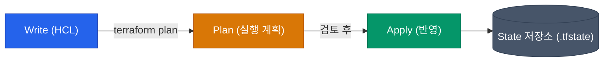

인프라를 AWS/GCP 콘솔에서 수작업으로 클릭하며 구축하던 시대는 끝났습니다. Infrastructure as Code(IaC)는 인프라 생성을 문서나 기억이 아닌, **"제어 가능한 코드"**로 관리하자는 철학입니다. 그중에서도 HashiCorp의 Terraform은 특정 클라우드에 종속되지 않는 사실상의 업계 표준이 되었습니다.

## Terraform vs 다른 IaC 도구들

IaC 도구는 크게 세 가지 진영으로 나눌 수 있습니다.

| 도구 | 특징 | 언어 | 적합한 환경 |
|---|---|---|---|
| **Terraform** | 가장 범용적, 거대한 생태계, 선언적 | HCL (HashiCorp Configuration Language) | 다중 클라우드, 일반적인 인프라 표준화 |
| **CloudFormation** | AWS 전용, 콘솔과 깊은 통합 | JSON / YAML | 오직 AWS만 심도 있게 사용할 때 |
| **Pulumi / CDK** | 프로그래밍 언어로 제어 | TypeScript, Python 등 | 개발자 중심 조직, 복잡한 인프라 로직 필요 |

Terraform은 "선언적"인 특성과 "직관적인 HCL 문법" 덕분에 인프라 엔지니어가 가장 선호하는 균형 잡힌 도구입니다.

## HCL 문법의 4가지 핵심 요소

Terraform 코드를 이해하려면 다음 4가지 기본 블록을 파악하면 됩니다.

```hcl
# 1. Provider: 어떤 클라우드나 서비스와 통신할지 정의
provider "aws" {
  region = "ap-northeast-2"
}

# 2. Variable (Input): 외부에서 주입받을 변수
variable "instance_type" {
  type    = string
  default = "t3.micro"
}

# 3. Resource: 실제로 생성할 인프라 객체
resource "aws_instance" "web" {
  ami           = "ami-12345678"
  instance_type = var.instance_type
  
  tags = {
    Name = "MyWebServer"
  }
}

# 4. Data / Output
# Data: 이미 존재하는 리소스의 정보를 가져옴
data "aws_vpc" "default" {
  default = true
}

# Output: 생성 후 결과물을 반환
output "instance_ip" {
  value = aws_instance.web.public_ip
}
```

- **Provider**: AWS, GCP, GitHub 등 통신 대상의 API 구조를 추상화해 주는 플러그인입니다.
- **Resource**: 인프라 구성의 핵심 요소입니다. EC2 인스턴스, S3 버킷, IAM 역할 등을 생성합니다.
- **Data Source**: 기존에 존재하는 외부 인프라(예: 이미 생성된 VPC) 정보를 안전하게 조회하기 위해 사용합니다.

## 선언적 사고와 워크플로우

스크립트로 서버를 구축할 때는 "네트워크 생성 → 포트 개방 → 서버 실행"과 같은 순서(명령형)를 지정합니다. 반면 Terraform은 **"서버 1대와 네트워크 1개가 구성된 상태"**를 선언합니다.



1. **Write**: HCL로 **원하는 최종 상태(Desired State)**를 작성합니다.
2. **Plan**: 가장 중요한 단계입니다. 작성한 코드를 현재 인프라 상태와 비교하여 **무엇이 생성되고( `+` ), 무엇이 파괴되며( `-` ), 무엇이 변경되는지( `~` )**를 미리 보여줍니다.
3. **Apply**: 플랜 결과를 최종 확인하고 실제 인프라스트럭처에 반영합니다.

<div class="callout why">
  <div class="callout-title">안전장치로서의 Plan</div>
  선언적 인프라의 큰 장점은 Dry-run이 가능하다는 점입니다. AWS 콘솔에서의 실수는 즉시 장애로 이어질 수 있지만, Terraform은 `plan` 명령어를 통해 **DB 삭제 위험**과 같은 상황을 적용 전에 확실히 경고해 줍니다.
</div>

## 본질은 의존성 그래프 기반 운영

작성한 HCL 코드의 순서는 실행에 영향을 주지 않습니다. 내부적으로 리소스 간의 참조 관계를 바탕으로 **의존성 그래프(Dependency Graph)**를 파악한 뒤, 의존성이 없는 리소스들을 **병렬로 동시 생성**하여 처리 속도를 높입니다.

## 정리

- **HCL**은 간결하고 선언적인 인프라 표현에 최적화되어 있습니다.
- **Provider, Resource, Variable, Data**의 조합으로 클라우드 자원을 제어합니다.
- `Write -> Plan -> Apply`라는 예측 가능한 워크플로우를 제공합니다.

코드 한 블록으로 서버를 생성하는 것은 간단합니다. 그러나 실무에서는 수많은 환경과 컴포넌트를 코드로 체계적으로 관리해야 합니다. 다음 글에서는 재사용성을 높이고 중복 코드를 제거하는 **Terraform 모듈(Module)** 구조를 살펴보겠습니다.
