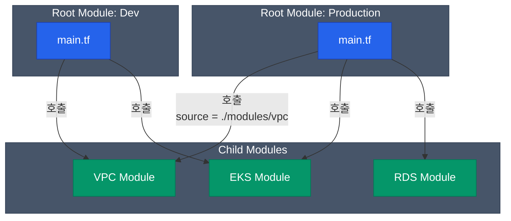

개발을 할 때 중복되는 코드를 함수나 클래스로 빼내는 것처럼, Terraform에서도 반복적으로 생성되는 인프라 패턴을 재사용 가능한 블록으로 묶어낼 수 있습니다. 이것이 바로 **Terraform 모듈(Module)**입니다

## 모듈의 정의

한 폴더 안에 모여 있는 `.tf` 파일들의 집합이 바로 모듈입니다. 사실 우리가 작성하는 모든 Terraform 코드는 `Root Module`(최상위 모듈)입니다. 다른 폴더에서 작성한 코드는 `Child Module`(하위 모듈)로서 가져다 쓸 수 있습니다



이렇게 모듈을 분리하면, 개발 환경과 운영 환경이 **정확히 동일한 구조(모듈)**를 사용하되 Input 값(인스턴스 크기, 서브넷 등)만 다르게 유지할 수 있습니다 

## Input과 Output 설계

Child Module은 하나의 '블랙박스 함수'처럼 동작해야 합니다

| 요소 | 일반 프로그래밍 | Terraform Module |
|---|---|---|
| **입력값** | 함수 파라미터 (Parameters) | `variable` |
| **반환값** | 리턴값 (Return) | `output` |
| **지역 변수** | 스코프 내 변수 (Local vars) | `locals` |

**예시: VPC 모듈을 호출하는 Root Module**

```hcl
module "my_vpc" {
  source = "./modules/vpc"              # 모듈의 위치
  
  vpc_name = "prod-vpc"                 # Input (Variables)
  cidr     = "10.0.0.0/16" 
}

# 모듈이 만들어낸 결과물을 다른 리소스에서 참조
resource "aws_instance" "web" {
  subnet_id = module.my_vpc.private_subnet_id  # Output 사용
  # ...
}
```

## 모듈 작성 원칙

품질 좋은 모듈을 만들기 위해 실무에서 지켜야 하는 원칙들입니다

### 1. 적절한 파편화 유지

단순히 `aws_instance` 하나를 감싸기 위해 모듈을 만드는 것은 의미가 없습니다(오히려 변수 매핑 오버헤드만 생깁니다). 반대로 전체 인프라를 하나의 거대 모듈에 다 담으면 모듈의 존재 이유가 사라집니다
**"의미 있는 아키텍처 패턴 단위"**(예: `VPC 네트워크 일체`, `EKS 클러스터 + 워커노드 그룹`, `S3 정적 호스팅 설정`)로 묶어야 합니다

### 2. 하드코딩 피하기

모듈 내부에 `ap-northeast-2` 같은 리전 정보나, 특정 프로젝트의 태그 이름이 박혀 있으면 재사용이 불가능해집니다. 변경될 가능성이 조금이라도 있는 값은 모두 `variable`로 열어두어야 합니다

### 3. Public vs Private 모듈

모듈의 소스(`source`)는 로컬 폴더뿐만 아니라 원격 저장소도 지원합니다
- **Public Module**: Terraform Registry에 오픈 소스로 등록된 검증된 모듈 (`source = "terraform-aws-modules/vpc/aws"`)
- **Private Module**: 사내 Git 저장소 등을 통해 팀 내부 규칙이 가득 들어간 모듈 (`source = "git::https://github.com/company/terraform-modules.git//vpc?ref=v1.2.0"`)

안정적인 인프라 운영을 위해서는 원격 모듈을 호출할 때 **항상 버전 태그(`ref=v1.2.0`)를 고정**해야 합니다. 메인 브랜치를 직접 바라보면 모듈 작성자가 코드를 수정할 때 갑자기 인프라가 깨질 위험이 있습니다

<div class="callout why">
  <div class="callout-title">폴더 구조 패턴 가이드</div>
  하나의 거대한 State 파일보다는, 영향 범위를 줄이기 위해 보통 **환경별/컴포넌트별로 폴더를 쪼개어 구성**합니다. (예: `env/prod/network`, `env/prod/database`). 이 구조에서 컴포넌트끼리의 데이터 전달은 `terraform_remote_state` 나 클라우드의 파라미터 스토어를 활용하는 편이 좋습니다
</div>

## 정리

- **모듈**은 반복 가능한 인프라 아키텍처를 패키징하는 수단입니다
- `variable`로 값을 주입받고, `output`으로 결과를 내뱉는 **블랙박스 구조**로 설계하십시오
- 원격 저장소를 이용해 사내 표준화를 이룰 수 있으며, **버전 관리**는 필수적입니다

모듈화를 통해 HCL 코드를 깔끔하게 정리했습니다. 하지만 여전히 중대한 문제가 하나 남았습니다. 팀원 두 명이 동시에 동일한 인프라를 수정한다면 무슨 일이 벌어질까요? 다음 글에서는 협업을 가능하게 하는 **State 파일 원격 관리와 Locking**에 대해 알아보겠습니다
