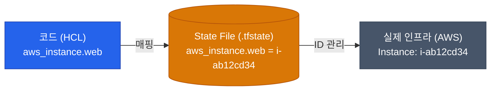

Terraform을 사용하다 보면 가장 혼란스러운 순간이 바로 `.tfstate` 파일의 정체를 알게 되었을 때입니다. 단순히 HCL 코드가 AWS를 직접 찌르는 것이라면 좋겠지만, 그 중간에는 인프라의 "현재 상태"를 추적하는 **State(상태)**라는 강력하고 위험한 파일이 자리 잡고 있습니다

## State(상태)의 개념

Terraform은 이전에 자기가 무엇을 만들었는지 기억해야 합니다. HCL 코드에 `aws_instance`가 정의되어 있을 때, AWS에 똑같이 생긴 서버가 이미 있으면 놔둘지, 아니면 하나를 더 만들지 어떻게 알까요?

`terraform.tfstate`라는 JSON 파일은 **"HCL 코드 블록과 실제 클라우드 리소스 ID(예: i-12345678) 간의 연결 고리"**를 기록한 장부입니다 



이 장부 덕분에 Terraform은 생성, 수정, 삭제만 정교하게 수행하는 `plan`을 연산할 수 있습니다. 반대로 말하면 **이 장부를 잃어버리면 기존 인프라에 대한 통제력을 상실**하게 됩니다

## 팀 협업을 위한 Remote Backend

혼자 사용할 때는 내 컴퓨터 로컬 폴더에 둬도 괜찮지만, 팀이 함께 작업한다면 `tfstate` 파일을 공유해야 합니다. 이를 가장 안전하게 공유하는 방법이 **원격 백엔드(Remote Backend)** 입니다. Git에 State 파일을 올리면 안 되는 극히 중요한 이유가 있습니다. DB 비밀번호 같은 **민감 정보(Secrets)가 State 파일에 평문으로 저장**되기 때문입니다

| 공유 방식 | 단점 및 위험요소 | 권장 여부 |
|---|---|---|
| **Git에 커밋 (`.tfstate`)** | 평문으로 시크릿 노출, 충돌 발생 시 인프라 꼬임 | 절대 금지 ❌ |
| **공용 S3 Bucket** | 안전하게 암호화 보관 가능 | 표준 (AWS 환경) ✅ |
| **Terraform Cloud** | HashiCorp 제공 턴키 솔루션, 협업 기능 포함 | 권장됨 ✅ |

AWS를 사용한다면 보통 S3 버킷을 생성하여 백엔드로 선언합니다

```hcl
terraform {
  backend "s3" {
    bucket = "my-company-terraform-states"
    key    = "prod/network/terraform.tfstate"
    region = "ap-northeast-2"
  }
}
```

## 안전장치: State Locking

원격 백엔드로 S3를 사용하게 되었다면 또 다른 문제가 발생합니다. **개발자 A와 B가 동시에 `terraform apply`를 누르면 어떻게 될까요?** S3 파일이 동시에 덮어씌워지면서 인프라 최상위 상태가 박살 나게 됩니다

이를 방지하는 것이 **State Locking(상태 잠금)**입니다 

AWS의 경우 DynamoDB 테이블을 자물쇠로 삼습니다
1. 개발자 A가 `plan`이나 `apply`를 시작하면 DynamoDB에 "A가 작업 중"이라고 Lock을 겁니다
2. 0.1초 뒤에 개발자 B가 명령을 날리면 "현재 A가 Lock을 쥐고 있음. 대기하라"며 작업이 거부됩니다
3. A의 작업이 끝나면 Lock이 풀립니다

## State 장애 복구 명령

문제가 생겼을 때 HCL 코드나 클라우드 UI를 건드리면 State와의 정합성이 깨집니다. 이럴 때 유용한 긴급 도구들입니다

- `terraform import`: 콘솔을 통해 수동으로 만든 리소스를 HCL 코드에 끼워 넣고 State에 등록합니다
- `terraform state rm`: Terraform의 관리에서 제외하고 싶을 때(실제 인프라를 지우지 않고 장부에서만 삭제) 사용합니다
- `terraform state mv`: 리소스의 이름이나 모듈 경로가 변경되었을 때, 파괴 후 재설정을 피하기 위해 연결을 매핑해 줍니다

<div class="callout why">
  <div class="callout-title">ClickOps 금지</div>
  Terraform을 도입한 이상 **수동 설정 변경(ClickOps)은 철저히 금지**해야 합니다. 긴급해서 AWS 콘솔로 직접 고치면, 다음번 `terraform plan` 때 선언된 코드가 실제 상태와 맞지 않아 오류(Drift)를 내뿜게 됩니다. 모든 변경은 코드를 통해서만 이루어져야 합니다
</div>

## 정리

- **State 파일**은 코드와 실제 인프라 사이를 연결하는 핵심 장부입니다
- 민감 정보가 포함되므로 Git 대신 **원격 백엔드 (S3 등)**에 저장하여 암호화해야 합니다
- 동시 작업을 방지하기 위해 **DynamoDB를 통한 State Locking**을 필수적으로 구성하십시오
- 비상시 복구는 `import`와 `state` 명령어를 통해 정합성을 맞춥니다

팀을 위한 협업 기반은 갖췄습니다. 마지막으로, 개발자가 로컬에서 `terraform apply`를 치게 두는 것은 실수의 원인이 됩니다. 다음 글에서는 CI/CD 파이프라인 안으로 인프라 코드를 통합하는 **Terraform CI와 파이프라인 자동화**에 대해 살펴보겠습니다
