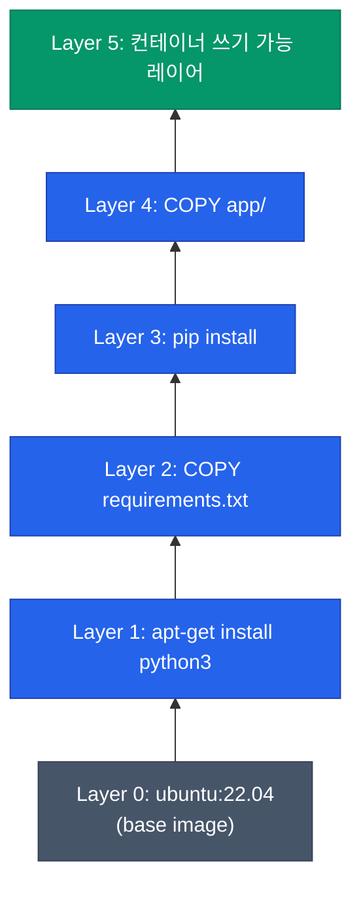
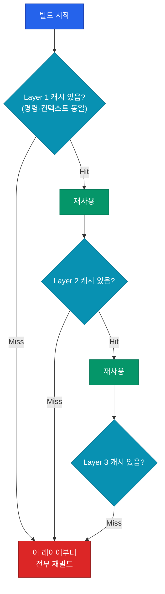
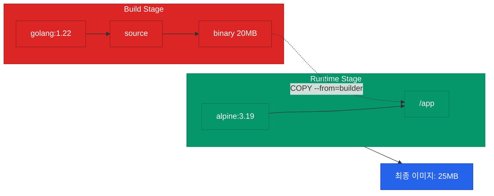

컨테이너를 다루다 보면 "왜 내 이미지는 1GB가 넘어가지?"라는 의문이 생기곤 합니다. 답은 Dockerfile이 어떻게 **레이어**로 변환되는지 이해하는 데서 시작합니다. 이 글에서는 이미지가 만들어지는 원리부터 캐시 활용, 최종 이미지 크기를 줄이는 구조적 접근까지 다룹니다.

## 이미지 = 읽기 전용 레이어의 스택

Docker 이미지는 단일 파일이 아닙니다. **레이어**(layer)라 부르는 파일시스템 스냅샷들이 쌓여 있는 구조입니다. 각 레이어는 이전 레이어 위에 추가된 파일의 차분(diff)만 담고 있고, 컨테이너 실행 시 UnionFS(OverlayFS)로 하나의 파일시스템처럼 보입니다.



| 특성 | 의미 |
|---|---|
| 불변성 | 한 번 생성된 레이어는 수정 불가 — 변경이 필요하면 새 레이어 추가 |
| 공유 | 같은 해시의 레이어는 여러 이미지가 공유하여 디스크 절약 |
| 캐시 가능 | 변경되지 않은 레이어는 재빌드 시 재사용 |

## Dockerfile 명령과 레이어 매핑

Dockerfile의 모든 명령이 레이어가 되지는 않습니다. **파일시스템**을 변경하는 명령만 레이어를 생성합니다.

| 명령 | 레이어 생성? | 비고 |
|---|---|---|
| `FROM` | 베이스 레이어 참조 | 새 레이어 생성은 아님 |
| `RUN` | ✅ | 가장 큰 레이어가 생성되는 지점 |
| `COPY`·`ADD` | ✅ | 파일 크기만큼 레이어 증가 |
| `WORKDIR` | ❌ | 메타데이터만 변경 |
| `ENV`·`LABEL` | ❌ | 메타데이터만 변경 |
| `CMD`·`ENTRYPOINT` | ❌ | 실행 시점 설정 |
| `EXPOSE` | ❌ | 문서화 목적 |

`RUN`과 `COPY`가 핵심입니다. 이 두 명령이 이미지 크기와 빌드 시간을 대부분 결정합니다.

## 빌드 캐시의 작동 원리

Docker는 각 명령의 실행 결과를 해시로 캐싱합니다. **명령 문자열**과 컨텍스트 파일의 내용이 같으면 캐시를 사용합니다.



한 레이어가 캐시 미스되면 그 이후 레이어는 **재빌드**됩니다. 그래서 명령 순서가 빌드 속도에 큰 영향을 줍니다.

### 자주 바뀌는 설정은 뒤로

나쁜 예와 좋은 예를 비교해 보겠습니다.

```dockerfile
# 안 좋은 예: 소스 코드가 앞에 있어 코드 변경 시 pip install이 재실행됩니다.
FROM python:3.12-slim
COPY . /app
WORKDIR /app
RUN pip install -r requirements.txt
CMD ["python", "main.py"]
```

```dockerfile
# 좋은 예: 의존성을 먼저 설치하고 소스는 마지막에 복사합니다.
FROM python:3.12-slim
WORKDIR /app
COPY requirements.txt .
RUN pip install -r requirements.txt
COPY . .
CMD ["python", "main.py"]
```

의존성이 바뀌지 않는 한 `pip install` 레이어가 캐시되므로 소스 코드 수정만으로는 재빌드가 금방 끝납니다.

## 이미지 크기를 키우는 원인

수백 MB 수준의 이미지가 생성되는 이유는 대체로 다음 세 가지 때문입니다.

<div class="callout why">
  <div class="callout-title">레이어는 삭제해도 용량이 남습니다</div>
  <code>RUN apt-get install</code> 다음 레이어에서 <code>RUN apt-get remove</code>를 수행해도 이미지는 줄어들지 않습니다. 이전 레이어는 불변이기 때문입니다. 패키지가 설치된 스냅샷은 남고 다음 레이어는 삭제 마커만 추가합니다. 최종 시점에는 보이지 않지만 <b>파일 크기</b>에는 두 상태가 모두 포함됩니다.
</div>

| 원인 | 상세 | 해결 |
|---|---|---|
| 패키지 매니저 캐시 | `apt`·`pip` 캐시가 레이어에 잔류 | 동일 RUN 내에서 설치와 정리 완결 |
| 빌드 도구 | 컴파일에 필요한 gcc·make 등 | Multi-stage build 활용 |
| 베이스 이미지 | 불필요하게 무거운 베이스 선택 | 최소한의 베이스 이미지 사용 |

### RUN 명령 통합

```dockerfile
# 좋지 않음: 3개의 레이어가 생성되고 캐시가 남습니다.
RUN apt-get update
RUN apt-get install -y curl
RUN apt-get clean && rm -rf /var/lib/apt/lists/*
```

```dockerfile
# 권장: 1개의 레이어로 처리하며 캐시를 즉시 제거합니다.
RUN apt-get update \
    && apt-get install -y --no-install-recommends curl \
    && apt-get clean \
    && rm -rf /var/lib/apt/lists/*
```

동일한 레이어 내에서 설치와 정리를 마치면 불필요한 파일이 이미지에 남지 않습니다.

## Multi-stage Build 전략

컴파일러나 빌드 도구는 **실행 시점**에는 필요하지 않습니다. Multi-stage build는 빌드와 실행 단계를 분리하여 최종 이미지에는 결과물만 담는 방식입니다.

```dockerfile
# 1단계: 빌드
FROM golang:1.22 AS builder
WORKDIR /src
COPY . .
RUN CGO_ENABLED=0 go build -o /out/app .

# 2단계: 실행
FROM alpine:3.19
COPY --from=builder /out/app /app
ENTRYPOINT ["/app"]
```



Go 기준 빌드 이미지가 800MB라 하더라도 최종 이미지는 25MB 수준으로 줄어들 수 있습니다.

## 베이스 이미지 선택

베이스 이미지 선택에 따라 수백 MB의 차이가 발생합니다.

| 베이스 | 크기 | 특징 |
|---|---|---|
| `*-full` | 1GB+ | 모든 도구 포함, 디버깅 용이 |
| `*-slim` | ~150MB | glibc 기반, 높은 호환성 |
| `*-alpine` | ~50MB | 매우 작음, musl libc 사용 |
| `distroless` | ~20MB | 쉘 미포함, 공격 표면 최소화 |

프로덕션에서는 **slim** 또는 **distroless** 사용을 권장합니다. Python의 경우 alpine에서 호환성 이슈가 생길 수 있으므로 slim이 안전한 선택입니다.

## 정리

- 이미지는 불변 레이어의 스택이며 `RUN`, `COPY`가 레이어를 만듭니다.
- 자주 바뀌는 명령은 **Dockerfile 하단**에 배치하여 캐시 효율을 높입니다.
- 단일 레이어 내에서 설치와 정리를 완결하여 크기를 줄입니다.
- **Multi-stage build**로 빌드 도구를 최종 이미지에서 제거합니다.

다음 글에서는 컨테이너가 외부와 소통하는 방식인 **네트워크와 볼륨** 구조를 정리합니다.
