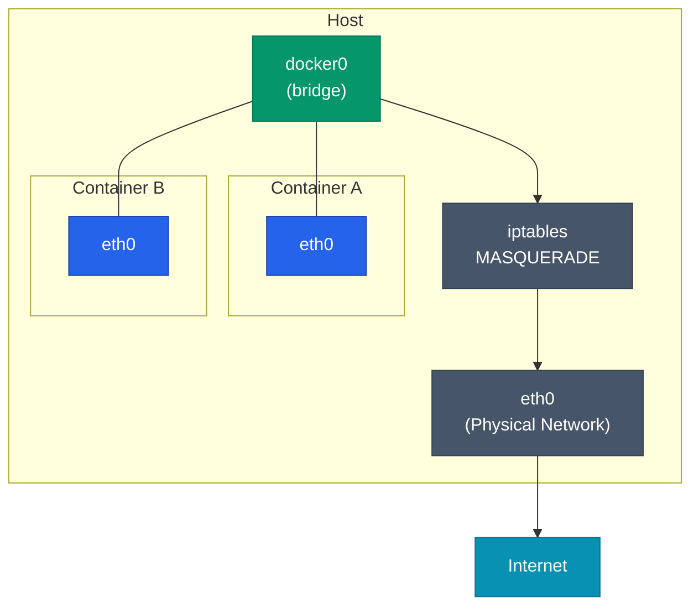
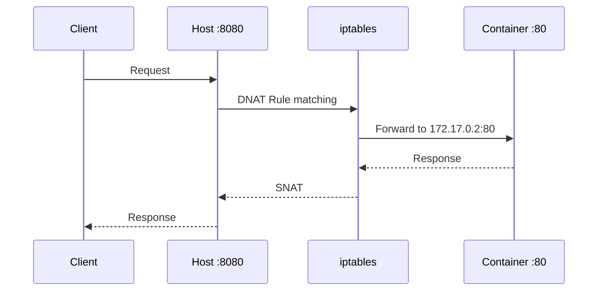
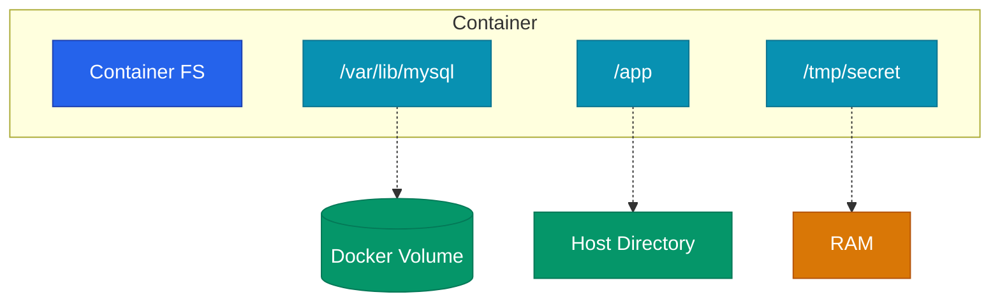

컨테이너를 하나 띄우는 것보다 중요한 것은 컨테이너 간의 통신과 **데이터 영속성**을 관리하는 일입니다. 이 글에서는 Docker가 제공하는 네 가지 네트워크 모드와 볼륨 설계의 핵심 내용을 정리해요.

## 네트워크 드라이버 모드

Docker는 컨테이너의 네트워크 연결 방식을 **드라이버**를 통해 결정합니다.

| 드라이버 | 범위 | 전형적 용도 |
|---|---|---|
| bridge | 단일 호스트 | 개발 환경 및 일반적인 컨테이너 구성 |
| host | 호스트 네트워크 공유 | 높은 네트워크 성능이 필요할 때 |
| none | 네트워크 미사용 | 격리된 배치 작업 |
| overlay | 멀티 호스트 | Docker Swarm 등 클러스터 환경 |

### Bridge 모드 구조

가장 널리 쓰이는 기본 방식입니다. Docker가 호스트에 `docker0` 가상 브릿지를 생성하고 컨테이너들을 여기에 연결합니다.



외부 인터넷으로 나갈 때는 NAT를 거치고, 외부에서 들어올 때는 포트 매핑을 통해 호스트의 포트를 컨테이너로 전달해요.

### 사용자 정의 브릿지의 이점

기본 브릿지보다 **사용자 정의 브릿지**를 사용하는 것이 권장됩니다.

| 항목 | 기본 bridge | 사용자 정의 bridge |
|---|---|---|
| 이름 해석 | IP로만 통신 가능 | 컨테이너 이름으로 DNS 해석 가능 |
| 네트워크 격리 | 모든 컨테이너가 한 공간 공유 | 서비스 단위별 논리적 격리 가능 |
| 설정 유연성 | 제한적인 설정 | 상세 네트워크 옵션 제어 가능 |

```bash
docker network create app-net
docker run -d --network app-net --name db postgres
docker run -d --network app-net --name api my-api
# api는 db:5432 주소로 즉시 접근할 수 있습니다.
```

### Host 모드의 특징

`--network host`를 사용하면 컨테이너가 호스트의 네트워크 스택을 그대로 사용합니다. 네트워크 처리량이 중요한 서비스에 유리하지만 포트 충돌 위험이 있고 격리 수준이 낮아집니다.

<div class="callout why">
  <div class="callout-title">데스크탑 환경에서의 주의사항</div>
  Docker Desktop(macOS/Windows)에서는 실제 호스트가 아닌 VM 내부의 Linux 호스트 네트워크를 의미해요. 따라서 호스트 OS 네트워크에 직접 붙지 않으므로 <b>브릿지 모드</b>를 사용하는 것이 이식성 면에서 유리합니다.
</div>

## 포트 매핑 메커니즘

포트 매핑(`-p 8080:80`)은 내부적으로 iptables에 DNAT 규칙을 생성합니다.



## 데이터 영속화를 위한 볼륨

컨테이너의 파일시스템은 **휘발성**입니다. 데이터를 영구히 보존하려면 외부 스토리지를 연결해야 합니다.

### 스토리지 마운트 방식

| 방식 | 위치 | 주체 | 특징 |
|---|---|---|---|
| Volume | Docker 전용 영역 | Docker | 프로덕션 기본 방식, 성능 우수 |
| Bind mount | 호스트 임의 경로 | 사용자 | 소스 코드 동기화 등 개발용 |
| tmpfs | 호스트 메모리 | OS | 민감 정보 임시 저장 |



**개발은 bind mount, 운영은 volume**을 선택하는 것이 표준적인 흐름입니다.

## Docker Compose 활용

실무에서는 네트워크와 볼륨을 `docker-compose.yml`에 선언하여 관리합니다.

```yaml
services:
  db:
    image: postgres:16
    volumes:
      - dbdata:/var/lib/postgresql/data
    networks: [backend]

  api:
    build: .
    volumes:
      - ./src:/app/src  # 개발 시 코드 실시간 반영
    networks: [backend, frontend]

volumes:
  dbdata:

networks:
  backend:
  frontend:
```

DB는 백엔드 네트워크에만 두어 외부 노출을 차단하고, 데이터는 **명명된 볼륨**(Named Volume)으로 관리하여 안정성을 확보해요.

## 정리

- **브릿지 네트워크**가 기본이며 사용자 정의 브릿지로 DNS를 활용합니다.
- 호스트 모드는 성능이 중요할 때만 제한적으로 사용합니다.
- 데이터는 반드시 **볼륨**으로 분리하여 관리해야 합니다.
- **Docker Compose**를 통해 인프라 구성을 코드로 관리합니다.

다음 글에서는 컨테이너를 안전하게 보호하는 **보안과 이미지 하드닝** 기법을 정리해요.
