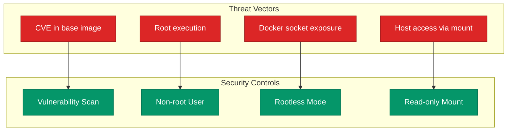

컨테이너가 격리된 환경이라는 점이 완벽한 보안을 보장하지는 않습니다. 기본 설정의 컨테이너는 대개 **루트 권한**으로 실행되며, 관리되지 않은 베이스 이미지는 수많은 취약점을 포함할 수 있어요. 프로덕션 수준의 보안을 위해 컨테이너의 공격 표면을 줄이는 핵심 기법들을 정리해요.

## 보안 계층 구조

컨테이너 보안은 크게 세 가지 계층으로 구분하여 대응할 수 있습니다.

| 계층 | 주요 위협 | 대응 방안 |
|---|---|---|
| 이미지 | 라이브러리 취약점 | 취약점 스캔 및 최소 베이스 이미지 사용 |
| 런타임 | 컨테이너 탈출 및 권한 상승 | 비-루트 사용자 실행 및 기능(Capability) 제한 |
| 호스트 | 데몬 권한 및 소켓 노출 | Rootless 모드 및 읽기 전용 마운트 |



## 비-루트 사용자 실행

Dockerfile에서 별도 설정이 없으면 컨테이너는 **UID 0**(root)으로 실행됩니다. 이는 보안상 매우 위험하므로 전용 사용자를 생성하여 사용해야 합니다.

```dockerfile
FROM node:20-alpine
RUN addgroup -S app && adduser -S app -G app
WORKDIR /app
COPY --chown=app:app . .
USER app
CMD ["node", "server.js"]
```

`USER` 지시어를 통해 실행 권한을 낮추는 것만으로도 대다수의 런타임 공격 시도를 무력화할 수 있어요.

## 이미지 취약점 스캔

이미지 빌드 시점에 알려진 취약점(CVE)이 있는지 확인하는 과정이 필요합니다. **Trivy** 같은 도구를 CI 파이프라인에 통합하는 것이 권장됩니다.

```bash
trivy image --severity HIGH,CRITICAL my-app:latest
```

| 도구 | 특징 |
|---|---|
| Trivy | 패키지 및 언어 의존성 스캔에 탁월함 |
| Grype | 속도가 빠르고 SBOM 연동이 용이함 |
| Snyk | 상세한 수정 가이드를 제공함 |

발견된 취약점 중 **Critical** 등급은 즉시 배포를 차단하는 정책이 필요합니다.

## 런타임 권한 최소화

컨테이너에 부여된 불필요한 Linux 커널 기능(Capability)을 제거합니다. 대부분의 웹 애플리케이션은 기본 권한이 거의 필요하지 않아요.

```bash
docker run --cap-drop=ALL --cap-add=NET_BIND_SERVICE \
  --read-only --tmpfs /tmp \
  my-app
```

`--read-only` 옵션은 컨테이너 파일시스템에 대한 쓰기 시도를 원천 차단하여 악성 스크립트가 설치되는 것을 막아줍니다.

## Docker Socket 보호

`/var/run/docker.sock` 파일을 컨테이너 내부에 마운트하는 것은 지양해야 합니다. 소켓 권한이 노출되면 컨테이너가 호스트 전체를 제어할 수 있는 권한을 얻게 됩니다. 빌드 작업이 필요하다면 **Kaniko**나 **BuildKit** 같은 대안을 고려하세요.

<div class="callout why">
  <div class="callout-title">보안의 기본은 최소 권한입니다</div>
  "작동하니까 괜찮다"는 생각보다 "최소한의 권한만으로 작동하는가"를 먼저 고민해야 해요. 비-루트 실행과 읽기 전용 설정은 운영 난이도를 조금 높이지만, 시스템 안정성 면에서는 훨씬 큰 이득을 줍니다.
</div>

## 이미지 서명 및 검증

배포되는 이미지의 무결성을 보장하기 위해 **Cosign** 등을 사용한 서명 체계를 도입합니다. 클러스터는 서명된 이미지만 실행하도록 강제하여 변조된 이미지의 유입을 막을 수 있습니다.

## 체크리스트

- [ ] 이미지 태그에 고정 버전 사용
- [ ] Dockerfile 내 `USER` 지시어 포함
- [ ] CI 단계에서 취약점 스캔 수행
- [ ] 불필요한 Capability 제거
- [ ] 민감한 호스트 경로 마운트 금지

## 정리

- 보안의 핵심은 **비-루트 사용자** 전환과 공격 표면 최소화에 있습니다.
- 이미지 스캔은 선택이 아닌 필수 과정입니다.
- **읽기 전용** 설정을 통해 런타임 변조 가능성을 차단합니다.
- 이미지 서명으로 배포 파이프라인의 신뢰를 구축합니다.

다음 시리즈에서는 이 컨테이너들을 대규모로 관리하는 **Kubernetes**의 운영 원리와 구조를 다뤄요.
