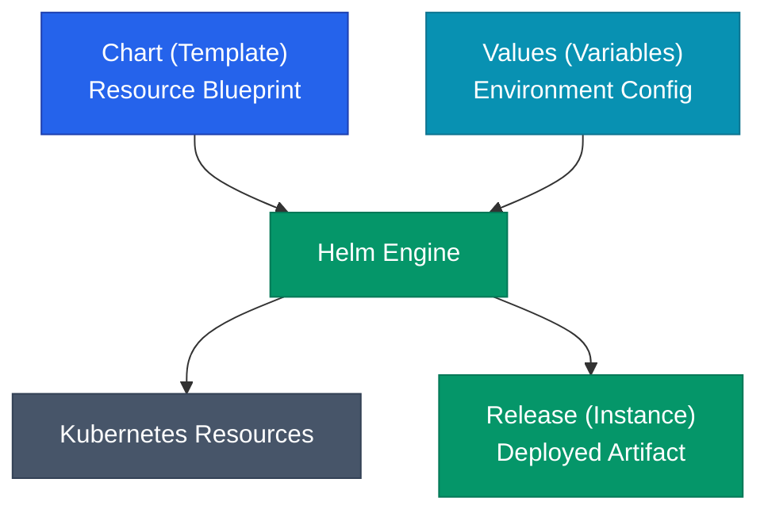



여러 환경(dev, prod 등)에 Kubernetes 리소스를 배포하다 보면 YAML 파일의 유사한 내용이 반복되는 문제를 겪게 됩니다. Helm은 이를 **템플릿 엔진**과 패키징 시스템으로 해결하여 효율적인 매니페스트 관리를 가능하게 합니다.

## Helm 도입의 이유

단순히 YAML 파일을 복제하여 관리하면 다음과 같은 한계에 직면합니다.

| 문제 | 상세 |
|---|---|
| 환경별 값 관리 | 환경마다 다른 설정을 수동으로 수정할 때 발생하는 실수 |
| 리소스 파편화 | Deployment, Service 등 연관된 리소스가 흩어져 관리됨 |
| 버전 관리 | 배포 이력을 추적하거나 이전 상태로 롤백하기 어려움 |

Helm은 **차트**(Chart)라는 단위로 리소스를 묶어 이 문제를 해결합니다.

## 핵심 개념



- **Chart**: 재사용 가능한 매니페스트 템플릿의 집합입니다.
- **Values**: 템플릿에 주입될 실제 설정값입니다.
- **Release**: 특정 설정값으로 클러스터에 설치된 차트의 인스턴스입니다.

## 차트 구조

```
my-chart/
├── Chart.yaml          # 메타데이터 (이름, 버전 등)
├── values.yaml         # 기본 설정값
├── templates/          # 매니페스트 템플릿
│   ├── deployment.yaml
│   ├── _helpers.tpl    # 공통 함수 정의
│   └── NOTES.txt       # 배포 후 안내 문구
└── .helmignore
```

`Chart.yaml`에서는 차트 버전과 앱 버전을 분리하여 관리하는 것이 중요합니다. 인프라 구조 변경 시에는 차트 버전을, 소스 코드 변경 시에는 앱 버전을 갱신해요.

## 템플릿 엔진 활용

Helm은 Go의 `text/template` 문법을 사용합니다. 템플릿을 통해 환경에 따라 달라지는 값을 유연하게 주입합니다.

```yaml
# templates/deployment.yaml
apiVersion: apps/v1
kind: Deployment
metadata:
  name: {{ include "my-app.fullname" . }}
spec:
  replicas: {{ .Values.replicaCount }}
  template:
    spec:
      containers:
      - name: app
        image: "{{ .Values.image.repository }}:{{ .Values.image.tag }}"
```

주요 사용 구문:
- `{{ .Values.key }}`: values 파일의 값을 참조
- `{{- ... }}`: 앞뒤 공백 및 개행 제거
- `| nindent 4`: 특정 깊이만큼 들여쓰기 조정

## 설정값 오버라이드 체계

동일한 차트라도 배포 시점에 환경별 설정 파일을 덮어써서 사용할 수 있습니다.

| 우선순위 | 소스 | 비고 |
|---|---|---|
| 1 (최저) | `values.yaml` | 차트 내 기본값 |
| 2 | `-f custom-values.yaml` | 환경별 외부 설정 파일 |
| 3 (최고) | `--set key=value` | CLI에서 직접 전달 |

CI/CD 파이프라인에서는 보통 `--set`을 사용하여 빌드된 이미지 태그를 동적으로 주입합니다.

## 배포 및 이력 관리

Helm은 단순한 설치 도구를 넘어 배포 이력을 관리하는 **패키지 매니저**입니다.

```bash
helm upgrade --install my-app ./my-chart -f values-prod.yaml
helm history my-app
helm rollback my-app 1
```

모든 배포 기록은 클러스터 내의 Secret에 저장되므로 별도의 데이터베이스 없이도 안정적인 롤백이 가능해요.

<div class="callout why">
  <div class="callout-title">최종 상태의 기록</div>
  Helm은 렌더링된 전체 매니페스트를 통째로 보관합니다. 이전 리비전으로 롤백한다는 것은 당시의 매니페스트 상태를 그대로 재적용하는 것을 의미해요. 이력 관리를 위해 <code>--history-max</code> 옵션으로 보관 개수를 조절하는 것이 운영상 유리합니다.
</div>

## 정리

- **Chart**는 템플릿, **Values**는 변수, **Release**는 설치 결과물입니다.
- 템플릿 기능을 통해 환경 간의 매니페스트 중복을 제거합니다.
- 배포 이력을 추적하여 쉽고 안전한 **롤백**을 지원합니다.
- `upgrade --install` 명령으로 배포 과정을 자동화합니다.

다음 글에서는 차트를 더 효율적으로 설계하기 위한 **재사용 패턴과 라이브러리 차트** 구성을 정리해요.


