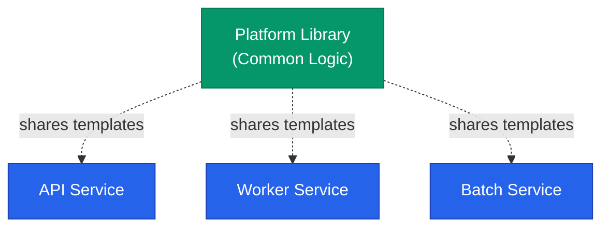



서비스 규모가 커지면 여러 애플리케이션이 거의 동일한 형태의 Kubernetes 리소스를 필요로 하게 됩니다. 이때 각 서비스마다 독립적인 차트를 유지하는 것은 중복 관리를 유발합니다. Helm의 고급 기능을 활용하여 **재사용성**을 극대화하는 설계 패턴을 정리합니다.

## 재사용 전략 비교

| 전략 | 주요 용도 | 특징 |
|---|---|---|
| Library Chart | 공통 템플릿 함수 정의 | DRY 원칙 실현, 렌더링되지 않음 |
| Subchart | 복합 서비스 구성 | 여러 차트를 계층적으로 묶어 관리 |
| Common Values | 설정 공유 | 파일 병합을 통한 환경 관리 |

## Library Chart 활용

Library Chart는 직접 배포되지 않고 다른 차트에 **템플릿 함수**를 제공하는 역할을 합니다.



`Chart.yaml`에서 `type: library`를 선언하면 해당 차트는 템플릿 정의 전용으로 동작하며 직접적인 리소스 생성을 하지 않습니다. 이를 통해 Deployment나 Service의 공통 구조를 한 곳에서 관리할 수 있습니다.

## Values 스키마 검증

`values.yaml`의 구조를 강제하기 위해 **JSON Schema**를 도입할 수 있습니다. `values.schema.json` 파일을 작성하면 배포 전 데이터 타입을 자동으로 검증합니다.

```json
{
  "type": "object",
  "required": ["image", "replicaCount"],
  "properties": {
    "replicaCount": { "type": "integer", "minimum": 1 },
    "image": {
      "type": "object",
      "required": ["tag"],
      "properties": { "tag": { "type": "string" } }
    }
  }
}
```

잘못된 값이 입력되면 `helm install` 시점에 오류를 발생시켜 실수를 방지합니다.

## 계층적 설정 구조

환경이 복잡해질수록 설정 파일을 논리적으로 분리하는 것이 유리합니다.

- **Base**: 모든 환경 공통 설정
- **Env**: 운영, 개발 등 환경별 차이
- **Region**: 가용 영역별 특수 설정

여러 파일을 `-f` 옵션으로 순서대로 적용하면 최종 설정이 병합됩니다. 이때 나중에 입력된 파일이 더 높은 우선순위를 가집니다.

<div class="callout why">
  <div class="callout-title">Secret 관리의 원칙</div>
  설정 파일에 민감 정보를 포함해서는 안 됩니다. 비밀값은 <b>External Secrets</b>나 <b>Sealed Secrets</b> 같은 전용 도구를 통해 외부에서 주입하거나 클러스터 내에서 암호화하여 관리해야 합니다.
</div>

## 주의해야 할 설계 함정

### 컨텍스트 범위 오류
`range` 문 내에서 상위 컨텍스트의 값을 참조할 때는 `$` 기호를 사용하여 루트에서 시작하는 경로를 지정해야 합니다. 그렇지 않으면 루프의 로컬 범위 내에서만 값을 찾게 되어 렌더링 오류가 발생합니다.

### 데이터 타입 불일치
YAML에서 숫자가 문자열로 처리되지 않도록 주의해야 합니다. 특히 포트 번호나 타임아웃 값은 `| int` 파이프를 사용하여 명시적으로 형변환을 해주는 것이 안전합니다.

## 테스트 및 검증

차트 또한 코드처럼 지속적인 검증이 필요합니다.

| 단계 | 도구 | 검증 내용 |
|---|---|---|
| Lint | `helm lint` | 구조 및 문법 오류 |
| Template | `helm template` | 렌더링된 YAML 결과 확인 |
| 스키마 | `kubeconform` | Kubernetes API 규격 준수 여부 |

## 정리

- **Library Chart**로 공통 로직을 통합하여 관리 비용을 줄입니다.
- **JSON Schema**를 활용하여 설정값의 안정성을 확보합니다.
- 설정 파일의 계층화를 통해 환경 간 차이를 명확히 구분합니다.
- 자동화된 검증 도구를 파이프라인에 통합하여 품질을 유지합니다.

다음 글에서는 완성된 차트를 저장하고 팀원들과 공유하는 **배포 파이프라인** 구성을 정리합니다.


