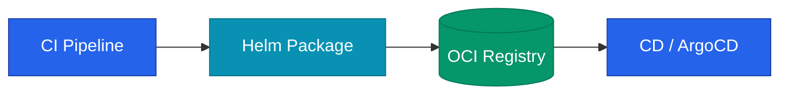

설계된 차트를 실제 환경에 적용하기 위해서는 효율적인 공유와 배포 체계가 필요합니다. Helm 차트를 패키징하고 저장소에 등록하여 다른 팀이나 클러스터에서 안정적으로 활용할 수 있게 만드는 전체 워크플로우를 정리해요.

## 차트 저장소 관리 방식

차트를 보관하는 방식은 기술적 성숙도와 요구사항에 따라 달라집니다.

| 방식 | 특징 | 비고 |
|---|---|---|
| OCI Registry | 이미지 레지스트리(ECR, GHCR) 사용 | 현재 가장 권장되는 표준 방식 |
| ChartMuseum | 전용 서버 운영 | API 기반 관리 용이 |
| HTTP Server | 정적 파일 서비스 | 단순한 구성, GitHub Pages 등 활용 |

**OCI**(Open Container Initiative) 방식은 컨테이너 이미지와 동일한 인프라를 사용할 수 있어 운영 효율성이 매우 높습니다.



## OCI 레지스트리 활용

별도의 차트 저장소 서버를 구축하지 않고 기존 이미지 레지스트리를 활용합니다. 권한 관리와 보안 정책을 이미지와 일원화할 수 있다는 장점이 있습니다.

```bash
# 차트 패키징 및 로그인
helm package ./my-chart
helm registry login ghcr.io

# 레지스트리 푸시
helm push my-chart-1.0.0.tgz oci://ghcr.io/org/charts
```

사용 시에는 `oci://` 프로토콜을 명시하여 차트를 가져옵니다.

## 버전 관리 전략

Helm 차트는 **SemVer**(Semantic Versioning)를 엄격히 준수해야 합니다.

- **Major**: `values.yaml` 구조가 변경되어 호환성이 깨질 때
- **Minor**: 기능이 추가되거나 템플릿이 개선되었을 때
- **Patch**: 단순한 버그 수정이나 설정 보완 시

`appVersion`은 실제 애플리케이션의 버전을 나타내며 차트 버전과 독립적으로 관리합니다.

## CI/CD 파이프라인 통합

차트의 생명주기를 자동화하기 위해 다음과 같은 단계로 파이프라인을 구성합니다.

1. **검증**: `lint` 및 스키마 체크를 통해 구조적 결함 확인
2. **패키징**: 차트 메타데이터를 기반으로 압축 파일 생성
3. **서명**: **Cosign** 등을 사용하여 이미지 무결성 보장
4. **배포**: 레지스트리 업로드 및 ArgoCD 알림

<div class="callout why">
  <div class="callout-title">서명의 중요성</div>
  이미지와 마찬가지로 차트에도 서명을 추가하여 공급망 보안을 강화해야 합니다. 클러스터 배포 시 서명이 검증된 차트만 실행하도록 설정함으로써 인프라의 신뢰도를 높일 수 있습니다.
</div>

## 소비자 관점의 업데이트 관리

차트 사용자는 버전 범위를 지정하여 안정적인 업데이트를 보장받아야 합니다. **ArgoCD**에서는 특정 마이너 버전 내의 최신 패치를 자동으로 따라가도록 설정할 수 있습니다.

또한 **Renovate**와 같은 도구를 사용하면 새로운 차트 버전이 출시되었을 때 자동으로 PR을 생성하여 업데이트 과정을 체계화할 수 있습니다.

## 정리

- **OCI Registry**를 차트 저장소의 표준으로 채택하여 운영 효율을 높입니다.
- **SemVer** 원칙에 따라 차트 버전을 엄격히 관리합니다.
- 배포 파이프라인 전 과정에 자동화된 **검증**과 **서명**을 추가합니다.
- 버전 핀닝과 자동 업데이트 도구를 통해 클러스터 상태를 안정적으로 유지합니다.

차트는 단순히 YAML의 묶음이 아닌 인프라의 품질을 결정하는 핵심 자산입니다. 이를 코드처럼 관리하고 검증하는 문화를 구축하는 것이 중요합니다.
