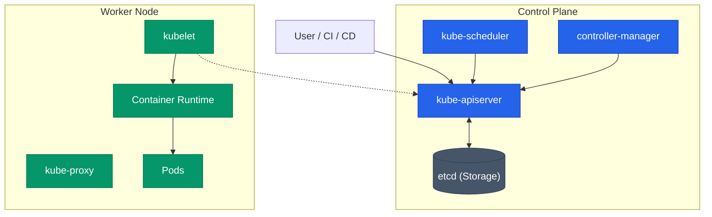

수많은 컨테이너를 여러 대의 서버에 분산 배치하고, 장애 시 자동으로 복구하며, 무중단 배포를 실현하기 위해서는 정교한 관리 체계가 필요합니다. Kubernetes는 이러한 복잡한 문제를 **선언적** 방식으로 해결하는 오케스트레이션 도구입니다

## 아키텍처 구조: Control Plane과 Data Plane

Kubernetes 클러스터는 역할을 기준으로 관리 계층과 실행 계층으로 나뉩니다

| 영역 | 역할 | 주요 컴포넌트 |
|---|---|---|
| Control Plane | 클러스터의 상태 관리 및 의사 결정 | API 서버, 스케줄러, 컨트롤러 매니저, etcd |
| Data Plane | 실제 컨테이너 워크로드 실행 | kubelet, kube-proxy, 컨테이너 런타임 |

## 제어 영역 핵심 컴포넌트

### kube-apiserver
모든 통신의 **중앙 접점**입니다. 사용자 요청이나 내부 컴포넌트의 신호를 받아 유효성을 검증하고 그 결과를 저장소에 반영합니다. 상태 변경의 유일한 경로이며 수평 확장이 가능합니다

### etcd
클러스터의 **모든 데이터**가 보관되는 분산 키-값 저장소입니다. Raft 알고리즘을 통해 일관성을 유지하며, 이 데이터가 유실되면 클러스터 복구가 불가능해지므로 철저한 백업과 HA 구성이 필수입니다

### kube-scheduler
생성된 Pod를 어떤 노드에 배치할지 결정합니다. 리소스 여유 공간, 선호도(Affinity), 제약 조건 등을 종합적으로 고려하여 최적의 위치를 할당합니다

### controller-manager
시스템의 실제 상태를 사용자가 정의한 **상태**로 맞추기 위해 끊임없이 대조하고 행동하는 루프를 실행합니다. 노드 장애 감지나 배포 개수 유지 등이 여기서 처리됩니다

## 실행 영역 핵심 컴포넌트

### kubelet
각 노드의 대리인입니다. API 서버와 통신하며 자신에게 할당된 Pod의 상태를 관리하고, 컨테이너가 정상적으로 작동하도록 런타임을 제어합니다

### kube-proxy
네트워크 규칙을 관리하여 Pod 간 통신이나 외부 트래픽이 적절한 대상으로 전달되도록 돕습니다. 주로 **iptables**나 IPVS를 활용하여 서비스 추상화를 구현합니다

## 선언적 동작: Reconcile 루프

Kubernetes는 "어떻게 해라"라는 명령이 아닌 "이 상태로 유지해라"라는 **선언**을 기반으로 움직입니다

1. 사용자가 원하는 상태를 API 서버에 등록합니다
2. 컨트롤러가 현재 상태와 비교합니다
3. 차이가 발견되면 이를 해소하기 위한 행동을 즉시 수행합니다

이러한 지속적인 동기화 과정 덕분에 시스템은 장애 상황에서도 스스로 복구되는 **자가 치유**(Self-healing) 능력을 갖게 됩니다

  
Pod라는 최소 단위

  Kubernetes는 컨테이너를 직접 다루지 않고 <b>Pod</b>라는 단위로 감쌉니다. Pod는 하나 이상의 컨테이너가 네트워크와 스토리지를 공유하는 논리적 묶음입니다. 이는 로그 수집기나 프록시처럼 함께 동작해야 하는 보조 컨테이너를 효율적으로 관리하기 위한 설계입니다

## 정리

- Kubernetes는 **선언적** API와 Reconcile 루프를 통해 클러스터를 관리합니다
- **Control Plane**은 의사 결정을, **Data Plane**은 워크로드 실행을 담당합니다
- **etcd**는 시스템의 유일한 진실 공급원(SSOT)으로 매우 중요합니다
- 모든 컴포넌트는 유기적으로 맞물려 시스템을 안정적인 상태로 유지합니다

다음 글에서는 이 플랫폼 위에서 실제 서비스를 구성하는 다양한 **워크로드 오브젝트**들을 정리합니다
