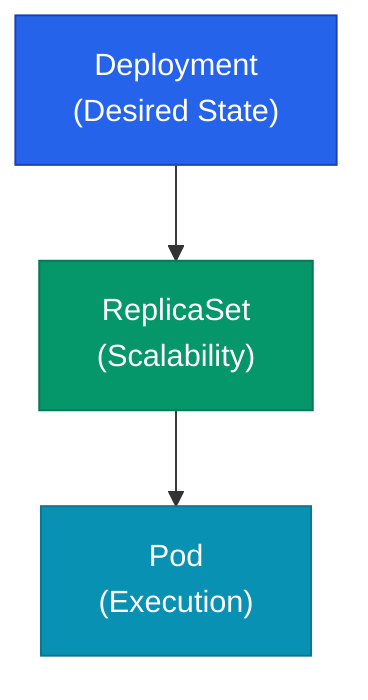

Kubernetes에서 컨테이너를 실행할 때 가장 중요한 것은 애플리케이션의 성격에 맞는 **워크로드 오브젝트**를 선택하는 것입니다. Pod는 컨테이너 실행의 최소 단위일 뿐, 실제 운영 환경에서의 복제, 업데이트, 영속성 보장은 상위 오브젝트들이 담당합니다.

## 워크로드 계층 구조

Pod는 수명이 짧고 스스로 복구할 능력이 없습니다. 따라서 상위 관리자가 Pod를 감싸서 상태를 유지하게 됩니다.

## 주요 워크로드 오브젝트 비교

| 오브젝트 | 성격 | 특징 | 전형적 사례 |
|---|---|---|---|
| Deployment | Stateless | 롤링 업데이트 및 롤백 지원 | 웹 서버, API 애플리케이션 |
| StatefulSet | Stateful | 고유 식별자 및 개별 스토리지 보장 | 데이터베이스, 분산 큐 |
| DaemonSet | Node-bound | 모든(혹은 특정) 노드당 1개 실행 | 로그 수집기, 모니터링 에이전트 |
| Job / CronJob | Batch | 작업 완료 후 종료 | 배치 처리, 정기 백업 |

## Deployment: 무중단 운영의 핵심

가장 보편적으로 사용되는 오브젝트입니다. 업데이트 시 **RollingUpdate** 전략을 사용하여 트래픽 단절 없이 새 버전을 배포할 수 있습니다. `maxSurge`와 `maxUnavailable` 옵션을 통해 배포 중 가용 자원 범위를 세밀하게 조정합니다.

## StatefulSet: 순서와 정체성 보장

Pod가 서로 대체 불가능한 경우에 사용합니다. Pod 이름에 번호가 부여되며(`app-0`, `app-1`), 삭제 후 재생성되어도 동일한 이름을 유지합니다. 특히 각 Pod마다 독립적인 **영구 볼륨**(PVC)을 연결할 수 있어 데이터 일관성이 중요한 서비스에 적합합니다.

  
Headless Service와의 관계

  StatefulSet은 각 Pod에 직접 접근할 수 있는 개별 DNS 주소가 필요합니다. 이를 위해 가상 IP가 없는 <b>Headless Service</b>를 연결하여 Pod 간의 명확한 통신 경로를 확보해야 합니다.

## DaemonSet: 인프라 관리의 도구

클러스터에 새 노드가 추가되면 자동으로 Pod를 배치합니다. 주로 노드 자체의 리소스를 모니터링하거나 로그를 중앙으로 전송하는 등 인프라 성격의 작업을 수행할 때 활용합니다.

## Job과 CronJob: 완료되는 작업

애플리케이션과 달리 한 번의 실행으로 목적을 달성하는 워크로드입니다.
- **Job**: 배치 작업이 성공적으로 완료될 때까지 실행을 보장합니다.
- **CronJob**: 정의된 시간에 맞춰 주기적으로 Job을 생성합니다.

## 상태 확인과 자동 복구

워크로드가 정상인지 판단하기 위해 반드시 **Probe**를 설정해야 합니다.

- **Liveness**: 컨테이너가 살아있는지 확인합니다. (실패 시 재시작)
- **Readiness**: 트래픽을 받을 준비가 되었는지 확인합니다. (실패 시 서비스 제외)
- **Startup**: 앱 초기화 완료 여부를 확인합니다. (완료 전까지 위 두 검사 유예)

## 정리

- **Deployment**는 상태가 없는 일반적인 애플리케이션 배포에 최적입니다.
- **StatefulSet**은 고유한 이름과 데이터 영속성이 필요한 서비스에 사용합니다.
- **DaemonSet**은 노드 단위의 관리를 위한 에이전트 실행에 적합합니다.
- 모든 워크로드에 적절한 **Probe**를 설정하는 것이 운영 안정성의 핵심입니다.

다음 글에서는 이 Pod들이 서로 연결되고 외부로 노출되는 방식인 **네트워킹** 구조를 정리합니다.
