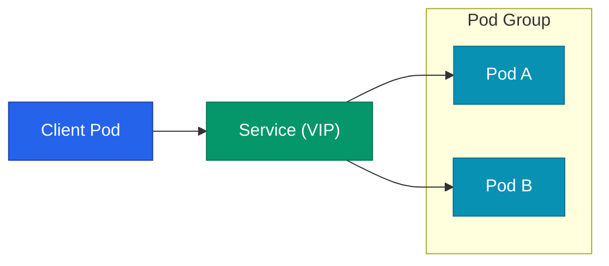
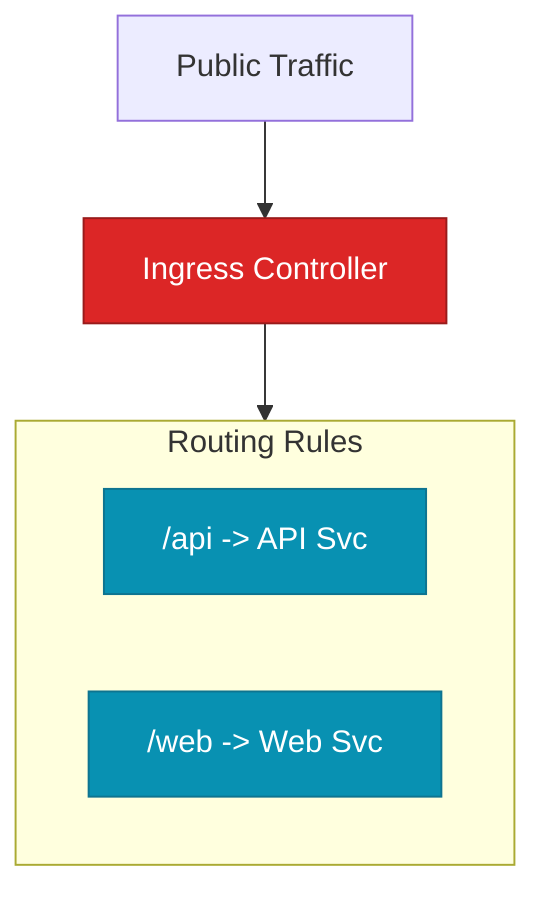

Kubernetes 환경에서는 Pod의 IP가 고정되지 않고 수시로 변합니다. 이러한 동적인 환경에서 안정적인 통신 경로를 확보하고, 트래픽을 외부로 노출하며, 보안 경계를 구축하는 방식은 서비스 운영의 핵심입니다.

## 서비스 추상화: Service

Service는 Pod의 집합에 대한 **안정적인 진입점**을 제공합니다. 라벨 셀렉터를 통해 대상 Pod를 식별하며, Pod가 교체되어 IP가 바뀌어도 클라이언트는 동일한 주소로 요청을 보낼 수 있습니다.

### 서비스 타입별 용도

| 타입 | 접근 범위 | 주요 특징 |
|---|---|---|
| ClusterIP | 내부 전용 | 클러스터 내 다른 Pod 간 통신 (기본값) |
| NodePort | 외부 접근 가능 | 모든 노드의 특정 포트를 통해 접근 |
| LoadBalancer | 외부 노출 | 클라우드 제공업체의 로드밸런서와 연동 |
| ExternalName | 외부 서비스 연결 | 외부 DNS 이름을 내부 CNAME으로 매핑 |

## 외부 트래픽 관리: Ingress

L4 기반의 로드밸런싱을 넘어 HTTP/HTTPS 경로 기반의 라우팅이 필요할 때 **Ingress**를 사용합니다. 하나의 IP로 여러 서비스를 호스트 이름이나 경로에 따라 나누어 전달할 수 있습니다.

실제 처리는 NGINX나 AWS ALB 같은 **Ingress Controller**가 담당합니다. SSL/TLS 인증서 터미네이션도 여기서 처리하여 관리를 단일화합니다.

## 보안 경계: NetworkPolicy

기본적으로 클러스터 내 모든 Pod는 서로 통신이 가능합니다. 하지만 보안을 위해서는 필요한 경로만 허용하는 **화이트리스트** 방식이 필수적입니다.

- **Ingress**: 들어오는 트래픽 제한
- **Egress**: 나가는 트래픽 제한

라벨 기반으로 정책을 정의하여 특정 네임스페이스나 Pod 간의 통신만 허용함으로써 횡적 이동 공격을 방어할 수 있습니다.

  
CNI의 역할

  NetworkPolicy는 실제 네트워크를 구현하는 <b>CNI(Container Network Interface)</b> 플러그인이 이를 지원해야 작동합니다. Calico나 Cilium 같은 플러그인은 이 정책을 기반으로 iptables나 eBPF 규칙을 생성하여 통신을 차단합니다.

## 이름 해석: CoreDNS

Kubernetes는 내부적으로 **DNS**를 활용하여 서비스를 찾습니다. `my-service.my-namespace.svc.cluster.local`과 같은 표준 형식을 통해 서비스 IP를 알지 못해도 이름만으로 통신할 수 있는 환경을 제공합니다.

## 정리

- **Service**는 Pod의 동적인 IP 문제를 해결하는 안정적인 진입점입니다.
- **Ingress**는 L7 계층의 복잡한 라우팅과 SSL 관리를 담당합니다.
- **NetworkPolicy**를 통해 세밀한 보안 경계를 구축합니다.
- 클러스터 내 모든 통신은 **DNS** 이름을 기반으로 이루어지는 것을 권장합니다.

다음 글에서는 워크로드를 안정적으로 운영하기 위한 **리소스 관리와 오토스케일링** 기법을 정리합니다.
