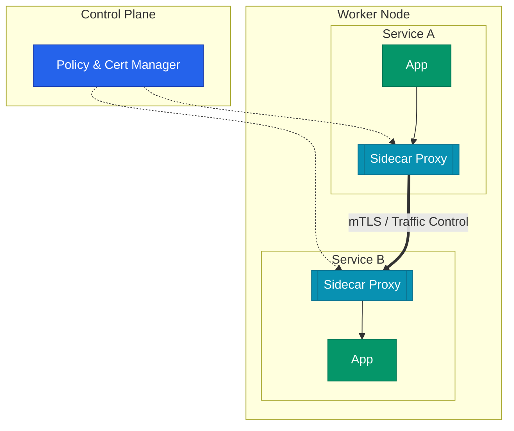

마이크로서비스 아키텍처에서 서비스 간의 통신이 복잡해짐에 따라 재시도, 타임아웃, 보안, 관측성 등의 기능을 애플리케이션 외부에서 처리하려는 요구가 커졌습니다. **Service Mesh**는 이러한 네트워크 제어 로직을 인프라 계층으로 분리하여 비즈니스 로직에만 집중할 수 있게 돕는 아키텍처 패턴입니다.

## 사이드카 패턴의 도입

이전에는 서비스 간 통신 제어를 위해 특정 언어의 라이브러리를 사용해야 했습니다. Service Mesh는 이를 애플리케이션 옆에 붙는 **사이드카** 프록시로 해결합니다.

| 구분 | 라이브러리 방식 | Service Mesh 방식 |
|---|---|---|
| 언어 의존성 | 특정 언어에 종속됨 | 모든 언어 지원 (Polyglot) |
| 운영 편의성 | 앱 재빌드 및 배포 필요 | 프록시 설정 변경만으로 적용 |
| 책임 분리 | 개발자가 로직 직접 구현 | 인프라 레벨에서 일괄 관리 |

## Control Plane과 Data Plane 구조

Service Mesh는 정책을 정의하는 중앙 제어부와 실제 트래픽을 처리하는 프록시 계층으로 나뉩니다.

- **Control Plane**: 라우팅 규칙과 인증 정책을 각 프록시에 배포합니다.
- **Data Plane**: 사이드카 프록시가 실제 트래픽을 가로채고 정책을 집행합니다.

## 주요 솔루션 비교: Istio와 Linkerd

현재 가장 널리 쓰이는 두 솔루션은 서로 지향하는 바가 다릅니다.

| 특징 | Istio | Linkerd |
|---|---|---|
| 프록시 | Envoy (C++) | Linkerd-proxy (Rust) |
| 기능 범위 | 광범위하고 풍부함 | 필수 기능에 집중 |
| 복잡도 | 높은 학습 곡선 | 설치 및 운영이 매우 단순함 |
| 리소스 사용 | 상대적으로 무거움 | 극도로 가볍고 빠름 |

복잡한 요구사항과 세밀한 확장이 필요하다면 **Istio**를, 빠르고 가벼운 도입을 원한다면 **Linkerd**를 선택하는 것이 일반적입니다.

## 사이드카의 작동 원리

Pod가 생성될 때 초기화 컨테이너가 노드의 네트워크 설정(iptables)을 조작합니다. 이를 통해 애플리케이션의 인바운드와 아웃바운드 트래픽이 별도의 코드 수정 없이 자동으로 **프록시**를 거치게 됩니다.

  
추상화의 이점

  개발자는 목적지 서비스의 주소로만 요청을 보내면 됩니다. 실제 그 요청이 암호화되는지, 실패 시 몇 번 재시도할지, 어느 버전의 인스턴스로 전달될지는 서비스 메시가 보이지 않는 곳에서 처리해요.

## 정리

- Service Mesh는 **네트워크 제어**를 인프라 계층으로 추상화합니다.
- **사이드카** 프록시를 통해 애플리케이션 코드 변경 없이 기능을 추가합니다.
- **Istio**와 **Linkerd** 중 환경에 맞는 솔루션을 선택하여 구축합니다.
- 통신 암호화, 가시성 확보, 트래픽 제어가 주된 목적입니다.

다음 글에서는 Service Mesh를 통해 구현하는 정교한 **트래픽 관리와 라우팅** 정책을 정리해요.
