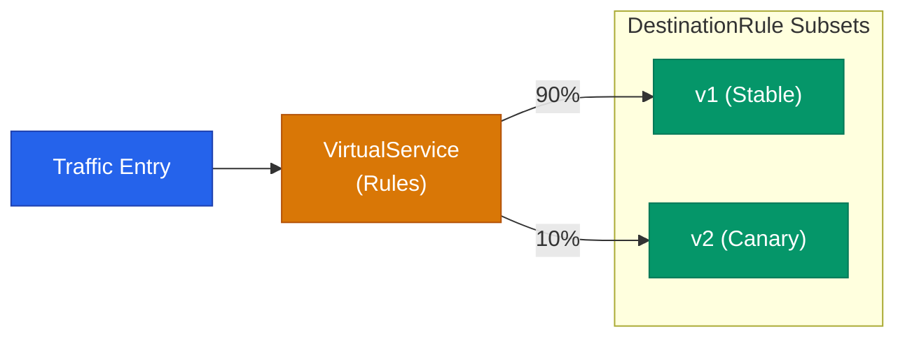

Service Mesh를 사용하는 가장 강력한 이유 중 하나는 트래픽의 흐름을 코드 수정 없이 세밀하게 조정할 수 있다는 점입니다. 특히 Istio는 **VirtualService**와 **DestinationRule**이라는 두 가지 핵심 리소스를 사용하여 복잡한 라우팅 요구사항을 선언적으로 해결합니다

## 라우팅 설계의 두 축

- **VirtualService**: 요청이 들어올 때 어떤 목적지로 보낼지 결정하는 **라우팅 규칙**입니다
- **DestinationRule**: 목적지에 도달한 트래픽을 처리하는 **방법과 정책**을 정의합니다

## 카나리 배포 패턴

새 버전을 출시할 때 일부 트래픽만 흘려보내 성능과 안정성을 검증하는 방식입니다

1. **DestinationRule**에서 라벨을 기반으로 서비스의 버전을 나눕니다
2. **VirtualService**에서 각 버전별 가중치(weight)를 설정합니다

이를 통해 Pod의 개수 비율에 의존하지 않고 실제 트래픽의 비율을 정확하게 제어할 수 있습니다

## 회복성 강화: 재시도와 타임아웃

네트워크 지연이나 일시적인 오류 상황에서 시스템의 안정성을 높이는 기법입니다

- **Timeout**: 응답이 일정 시간 내에 오지 않으면 요청을 중단하여 자원 점유를 방지합니다
- **Retry**: 실패한 요청을 자동으로 재시도하여 일시적 장애를 극복합니다

이러한 정책은 VirtualService 내에 간단한 선언만으로 적용되며, 애플리케이션은 재시도 로직을 직접 구현할 필요가 없습니다

## 서킷 브레이커 (Circuit Breaker)

특정 서비스에 장애가 발생했을 때 트래픽을 즉시 차단하여 시스템 전체로 장애가 확산되는 것을 막습니다. DestinationRule에서 설정하며, 연속된 에러 발생 횟수나 지연 시간을 기준으로 동작합니다

  
장애 주입 테스트

  작성한 회복성 정책이 제대로 동작하는지 확인하기 위해 고의로 에러를 발생시키는 <b>Fault Injection</b>을 사용할 수 있습니다. 특정 트래픽에 응답 지연이나 HTTP 오류를 인위적으로 섞어 시스템의 견고함을 테스트합니다

## 헤더 기반 라우팅

사용자의 등급이나 특정 헤더 값을 기준으로 라우팅 경로를 바꿀 수 있습니다. 예를 들어 "베타 테스터" 헤더를 가진 요청만 실험적인 버전으로 보내는 등의 시나리오가 가능합니다

## 정리

- **VirtualService**로 요청의 경로를 결정하고 **DestinationRule**로 세부 정책을 관리합니다
- **가중치 기반 라우팅**으로 안전한 카나리 배포를 실현합니다
- **재시도, 타임아웃, 서킷 브레이커**를 통해 시스템의 내결함성을 높입니다
- 인프라 레벨에서 트래픽을 제어하여 비즈니스 로직의 복잡성을 줄입니다

다음 글에서는 사이드카 프록시가 제공하는 강력한 보안 기능인 **자동 mTLS와 관측성** 활용법을 정리합니다
