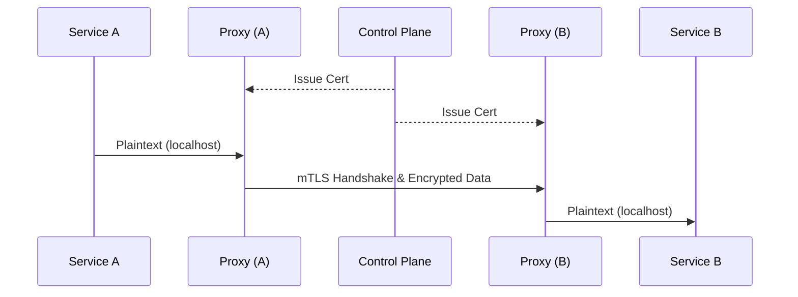

마이크로서비스 환경에서 수많은 서비스 간 통신의 보안을 확보하고 흐름을 파악하는 것은 매우 어려운 과제입니다. Service Mesh는 사이드카 프록시를 활용하여 **보안 암호화**와 **통신 가시성**을 애플리케이션 코드 수정 없이 자동으로 제공합니다

## 자동 mTLS (Mutual TLS)

mTLS는 클라이언트와 서버가 서로의 신원을 확인하는 양방향 인증 방식입니다. Service Mesh는 이를 인프라 레벨에서 자동화하여 네트워크 구간의 모든 트래픽을 암호화합니다

1. **인증서 관리**: 제어 영역(Control Plane)이 각 프록시에 인증서를 자동으로 발급하고 갱신합니다
2. **투명한 암호화**: 앱은 평문으로 통신하지만 프록시 구간에서 자동으로 암호화 및 복호화가 이루어집니다
3. **신원 기반 보안**: IP가 아닌 서비스의 고유 식별자를 기반으로 통신을 허용하거나 차단합니다

## 세밀한 접근 제어 (RBAC)

mTLS가 적용된 후에는 **AuthorizationPolicy**를 통해 "누가 어떤 경로로 접근할 수 있는지" 정의합니다. 예를 들어 "주문 서비스는 결제 서비스의 특정 API만 호출할 수 있다"는 규칙을 L7 계층에서 선언적으로 관리할 수 있습니다

## 관측성: 메트릭과 분산 추적

사이드카 프록시는 모든 트래픽의 통로이므로 통신과 관련된 모든 지표를 수집하기에 가장 좋은 지점입니다

| 요소 | 역할 | 도구 연동 |
|---|---|---|
| Metrics | 요청 수, 에러율, 응답 시간 등 수집 | Prometheus, Grafana |
| Distributed Tracing | 서비스 간 호출 경로 및 지연 시간 추적 | Jaeger, Tempo |
| Access Logs | 모든 HTTP 요청의 상세 로그 기록 | ELK, Loki |

사이드카가 자동으로 표준화된 데이터를 생성하므로, 개발자는 별도의 로깅 코드 없이도 대시보드에서 시스템의 건강 상태를 한눈에 파악할 수 있습니다

  
성능과 보안의 트레이드오프

  강력한 보안과 가시성을 얻는 대신, 프록시를 거치며 발생하는 약간의 <b>네트워크 지연</b>과 사이드카 컨테이너가 차지하는 <b>리소스 오버헤드</b>를 감당해야 합니다. 시스템의 규모와 중요도에 따라 최적의 설정값을 찾는 과정이 필요합니다

## 보안 정책 모드 전환

처음부터 모든 통신을 차단하면 서비스 장애가 발생할 수 있습니다
- **PERMISSIVE**: 평문과 mTLS 통신을 모두 허용하여 안정적으로 전환을 준비합니다
- **STRICT**: 오직 mTLS 통신만 허용하여 보안을 극대화합니다

## 정리

- **mTLS** 자동화를 통해 구간 암호화와 서비스 신원 증명을 구현합니다
- **인가 정책**을 통해 서비스 간의 통신 권한을 세밀하게 제어합니다
- 프록시에서 생성되는 풍부한 **텔레메트리**로 시스템 가시성을 확보합니다
- 보안과 운영 효율을 위해 인프라 레벨의 보안 모델을 구축합니다

이로써 Service Mesh의 핵심적인 보안과 관측성 통합 방식을 살펴보았습니다. 서비스 메시를 통해 더욱 견고하고 투명한 클러스터 환경을 구축해 보십시오
