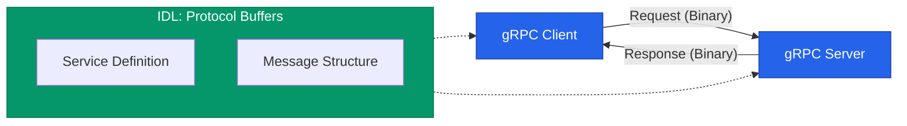

시스템 간의 대화 방식인 API를 설계할 때, 어떤 프로토콜을 선택하느냐는 개발 생산성과 성능에 큰 영향을 미칩니다. 오랫동안 표준으로 자리 잡은 **REST**부터, 유연함의 대명사인 **GraphQL**, 그리고 고성능 통신을 위한 **gRPC**까지 각 기술의 특징과 선택 기준을 정리해요.

## 3대 API 스타일 한눈에 보기

| 특징 | REST | GraphQL | gRPC |
|---|---|---|---|
| **기반 프로토콜** | HTTP/1.1 (주로) | HTTP/1.1 | HTTP/2 |
| **데이터 형식** | JSON, XML | JSON | Protocol Buffers (Binary) |
| **통신 방식** | Stateless, 리소스 중심 | Query 중심 | RPC, Streaming |
| **강점** | 보편성, 캐싱 용이 | 클라이언트 맞춤 데이터 | 압도적 성능, 타입 안전 |

## REST: 자원 중심의 표준 (Representational State Transfer)

HTTP 메서드(GET, POST, PUT, DELETE)를 통해 리소스를 조작하는 방식입니다.

- **장점**: 별도의 라이브러리 없이도 어디서나 사용 가능하며, 브라우저와 프록시 서버의 캐싱 인프라를 그대로 활용할 수 있습니다.
- **단점**: 필요한 데이터보다 너무 많이 가져오거나(Overfetching), 너무 적게 가져와서 여러 번 호출해야 하는(Underfetching) 문제가 발생하기 쉽습니다.

## GraphQL: 필요한 것만 골라 담기

클라이언트가 서버에 "어떤 데이터가 필요한지" 쿼리로 요청하는 방식입니다.

- **장점**: 클라이언트가 스키마를 보고 필요한 필드만 요청하므로 데이터 전송량을 최소화할 수 있습니다. 프론트엔드 변화에 서버가 매번 대응할 필요가 없습니다.
- **단점**: 서버측 캐싱 구현이 복잡하며, 무거운 쿼리가 들어올 경우 서버 부하를 예측하기 어렵습니다.

## gRPC: 성능과 타입 안전성

구글에서 개발한 고성능 RPC(Remote Procedure Call) 프레임워크입니다.

- **장점**: **Protocol Buffers**를 사용하여 데이터를 이진(Binary)으로 압축하므로 속도가 매우 빠릅니다. 엄격한 타입 체크가 가능하며, 양방향 스트리밍을 지원합니다.
- **단점**: 사람이 읽기 어려운 형식이며, 브라우저에서 직접 호출하기 위해 별도의 프록시(gRPC-Web)가 필요할 수 있습니다.

  
핵심 인사이트: 상황에 맞는 기술 선택

  공개용 외부 API라면 보편적인 <b>REST</b>를, 요구사항이 자주 변하는 모바일/웹 클라이언트 대상이라면 <b>GraphQL</b>을, 마이크로서비스 간의 내부 통신(Internal)이나 고성능이 필수라면 <b>gRPC</b>를 선택하는 것이 현대적인 설계의 정석입니다.

## 정리

- **REST**는 보편성과 단순함이 가장 큰 무기입니다.
- **GraphQL**은 복잡한 데이터 관계를 가진 프론트엔드 친화적인 도구입니다.
- **gRPC**는 속도와 타입 안전성이 중요한 백엔드 간 통신에 최적입니다.
- 기술의 우열보다 **누가 이 API를 사용하느냐**를 먼저 고민하세요.

다음 글에서는 API의 생명주기를 관리하는 **버전닝과 호환성 유지** 전략에 대해 알아봐요.
