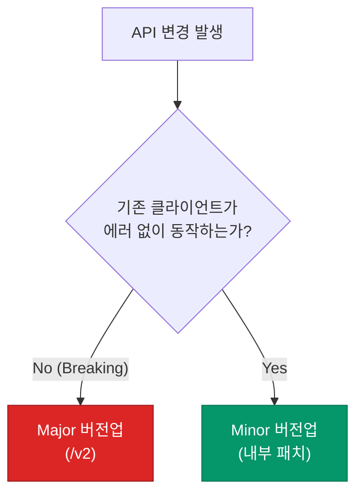

API를 한 번 배포하고 나면, 이를 사용하는 클라이언트와의 **약속**(Contract)이 맺어집니다. 서버 코드를 수정했을 때 기존 클라이언트가 에러 없이 잘 작동할지 보장하는 것은 백엔드 개발자의 숙명입니다. 변화와 호환성 사이의 균형을 잡는 API 버전닝 전략을 정리해요.

## 3가지 버전닝 전략

| 방식 | 예시 | 특징 |
|---|---|---|
| **URL Path** | `/v1/users` | 가장 직관적이고 명시적임, 브라우저에서 확인 쉬움 |
| **Custom Header** | `X-API-Version: 2` | URL을 깔끔하게 유지할 수 있음, CDN 캐싱 설정 시 주의 필요 |
| **Media Type** | `Accept: application/vnd.app.v1+json` | REST의 리소스 중심 철학에 가장 부합하지만 구현이 복잡함 |

실무에서는 가시성과 관리 편의성 때문에 **URL Path** 방식을 가장 선호합니다.

## 무엇이 Breaking Change인가?

기존 클라이언트의 동작을 멈추게 하는 변화를 **Breaking Change**라고 하며, 이때 반드시 메이저 버전을 올려야 합니다.

- **Breaking**: 필드 삭제, 필드 이름 변경, 필드 타입 변경, 필수 파라미터 추가
- **Non-breaking**: 새로운 필드 추가, 선택적(Optional) 파라미터 추가

## 안전한 작별: Deprecation 프로세스

기존 버전을 즉시 삭제하면 장애로 이어집니다. 점진적인 폐기 과정이 필요합니다.

1. **Deprecation 공지**: `Warning` 헤더나 문서를 통해 해당 버전이 조만간 사라질 것임을 알립니다.
2. **Sunset 기한 설정**: 실제 종료 날짜를 명시합니다. (보통 6개월~1년)
3. **모니터링**: 해당 버전을 여전히 호출하는 클라이언트가 있는지 트래픽을 감시합니다.
4. **폐기**: 공지된 날짜에 트래픽을 차단합니다.

  
핵심 인사이트: 유연한 파서 (Tolerant Reader)

  클라이언트를 설계할 때, "내가 모르는 필드가 들어오면 무시한다"는 원칙(Tolerant Reader 패턴)을 지키면 서버가 새로운 필드를 추가해도 에러가 발생하지 않습니다. 호환성은 서버뿐만 아니라 클라이언트의 협력이 필요한 공동의 목표입니다.

## 정리

- API 버전닝은 클라이언트의 고통을 최소화하기 위한 **배려**입니다.
- **Breaking Change**가 발생할 때만 새로운 메이저 버전을 제공합니다.
- 점진적인 **폐기 정책**(Deprecation)을 통해 안전하게 기술 부채를 정리합니다.
- 유연한 데이터 처리를 통해 하위 호환성 유지 비용을 낮춥니다.

다음 글에서는 API의 문을 지키는 **인증·인가와 문서화 자동화**에 대해 알아봐요.
