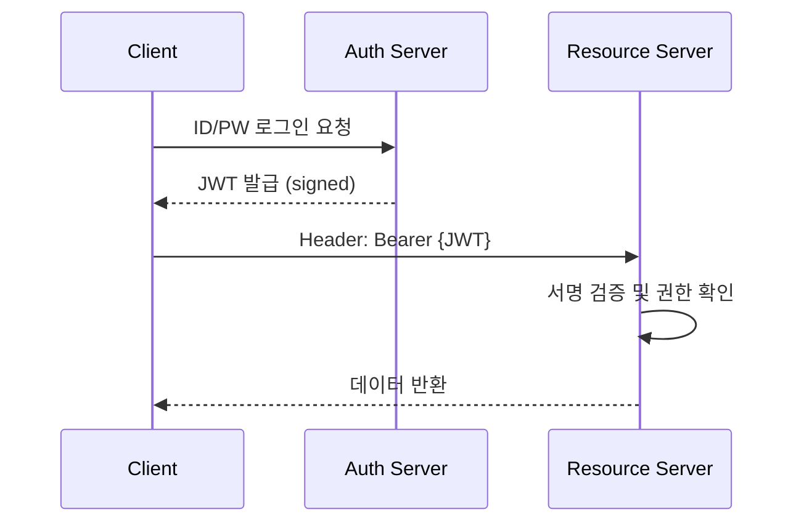

API를 완성했다면 이제 두 가지 숙제가 남습니다. 하나는 **누구에게 접근을 허용할 것인가**(Security)이고, 다른 하나는 **사용법을 어떻게 알릴 것인가**(Documentation)입니다. 안전한 통신을 위한 JWT와 표준화된 문서 형식인 OpenAPI를 정리해요

## 인증(Authentication) vs 인가(Authorization)

보안의 기본은 두 개념을 명확히 구분하는 것에서 시작합니다

- **인증**: "너는 누구니?" (신원 확인 — 로그인)
- **인가**: "너는 이 작업을 할 권한이 있니?" (권한 부여 — 관리자 여부)

## JWT (JSON Web Token) 아키텍처

현대적인 분산 시스템과 MSA에서 가장 선호되는 인증 방식입니다. 서버가 상태를 저장하지 않는(Stateless) 방식이라 확장이 자유롭습니다

- **장점**: 별도의 세션 DB 조회가 필요 없어 속도가 빠릅니다
- **주의**: 한 번 발급된 토큰은 만료 전까지 취소가 어려우므로 만료 시간(TTL)을 짧게 잡고 **Refresh Token**을 혼합해서 사용해야 합니다

## 문서화 자동화: OpenAPI (Swagger)

API 문서를 수동으로 작성하면 코드가 바뀔 때마다 문서가 비동기화되는 문제가 생깁니다. **OpenAPI Specification**(OAS)은 코드를 기반으로 문서를 자동 생성하고 직접 테스트할 수 있는 UI를 제공합니다

| 기능 | 설명 |
|---|---|
| **Discovery** | 사용 가능한 엔드포인트와 파라미터를 한눈에 파악 |
| **Interactive** | 웹 UI에서 즉시 API 호출 테스트 가능 (Try it out) |
| **Mocking** | 서버 구현 전에도 명세만으로 클라이언트 개발 시작 가능 |

  
핵심 인사이트: API Design-first

  코드부터 짜고 문서를 만드는 방식보다, <b>OpenAPI 명세를 먼저 설계</b>하고 팀 간 합의한 뒤 개발을 시작하는 방식(Design-first)을 권장합니다. 이는 프론트엔드와 백엔드가 병렬로 작업할 수 있게 하며, 인터페이스 불일치로 인한 삽질을 획기적으로 줄여줍니다

## 보안을 위한 API Linter

문서화만큼 중요한 것이 일관성입니다. `Spectral` 같은 API Linter를 사용하면 "모든 URL은 kebab-case를 써야 한다", "에러 응답은 공통 형식을 따라야 한다"와 같은 규칙을 강제할 수 있습니다

## 정리

- **JWT**는 상태 비저장 방식의 효율적인 인증 수단입니다
- **OAuth2** 흐름을 통해 외부 서비스와의 안전한 연동을 구현합니다
- **OpenAPI**는 살아있는 문서를 제공하여 협업 효율을 극대화합니다
- 문서는 코드가 아닌 **제품**의 일부라는 인식이 중요합니다

API Design 시리즈를 통해 스타일 선택부터 호환성, 보안, 문서화까지 훑어보았습니다. 잘 설계된 API는 그 자체로 시스템의 얼굴이자 강력한 자산이 됩니다
