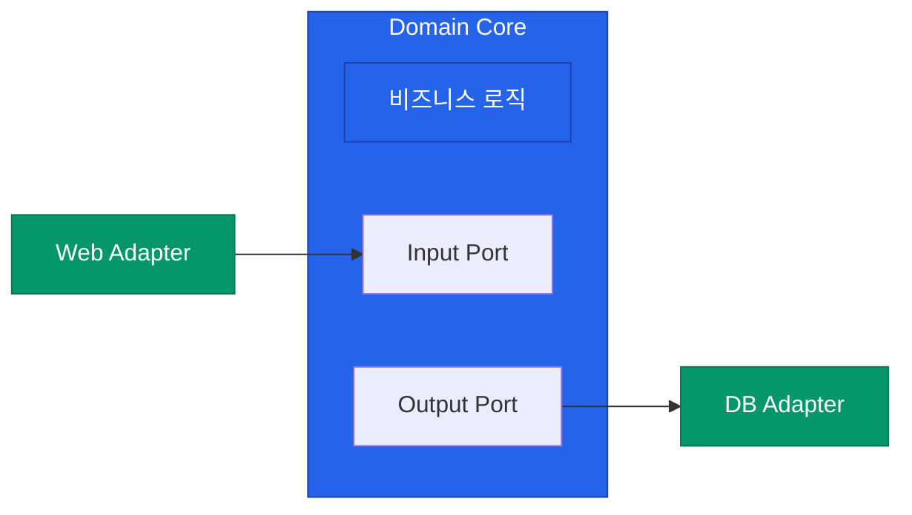

좋은 백엔드 코드는 단순히 기능을 잘 수행하는 것을 넘어, 변화에 유연하게 대응할 수 있어야 합니다. 시스템이 커질수록 "어디에 코드를 둘 것인가"에 대한 규칙, 즉 아키텍처의 중요성이 커집니다. 대표적인 세 가지 아키텍처 스타일이 비즈니스 로직과 기술적 세부 사항을 어떻게 분리하는지 정리해요

## 계층형 아키텍처 (Layered Architecture)

가장 직관적이고 널리 쓰이는 방식입니다. 책임을 수평적으로 나누어 아래 계층으로만 의존하게 만듭니다

| 계층 | 역할 | 비고 |
|---|---|---|
| **Presentation** | 사용자 인터페이스 및 API 엔드포인트 | Controller |
| **Business** | 비즈니스 로직 처리 | Service |
| **Data Access** | 데이터베이스 접근 및 영속성 처리 | Repository |

- **장점**: 단순하고 학습 곡선이 낮습니다
- **단점**: 비즈니스 로직이 데이터베이스 구조(엔티티)에 강하게 결합되기 쉽습니다. 영속성 계층이 바뀌면 도메인 로직도 영향을 받습니다

## 헥사고날 아키텍처 (Hexagonal Architecture)

**포트와 어댑터**(Ports and Adapters) 패턴이라고도 불립니다. 비즈니스 로직(Core)을 중심에 두고, 외부 시스템(DB, API, UI)을 어댑터를 통해 연결합니다

- **핵심**: 코어는 포트(인터페이스)만 정의하고, 실제 기술적 구현은 외부의 어댑터가 담당합니다
- **장점**: 비즈니스 로직을 외부 환경(DB 종류, 프레임워크 변경 등)으로부터 완벽하게 격리하여 테스트와 교체가 쉽습니다

## 클린 아키텍처 (Clean Architecture)

로버트 C. 마틴이 제안한 방식으로, 의존성의 방향이 항상 안쪽(도메인)으로 향해야 한다는 원칙을 강조합니다

1. **Entities**: 가장 순수한 비즈니스 규칙 (POJO)
2. **Use Cases**: 애플리케이션 특화 비즈니스 로직
3. **Interface Adapters**: 데이터 변환 (Controller, Presenter)
4. **Frameworks & Drivers**: 가장 바깥쪽 세부 사항 (Database, Web)

  
핵심 인사이트: 의존성 역전(DIP)

  좋은 아키텍처의 핵심은 <b>"비즈니스 로직이 세부 기술(DB, 프레임워크)을 몰라야 한다"</b>는 것입니다. 인터페이스를 통해 의존성 방향을 뒤집으면(Dependency Inversion), 기술이 변해도 비즈니스의 가치는 보호받을 수 있습니다

## 어떤 아키텍처를 선택해야 할까?

| 스타일 | 적합한 상황 |
|---|---|
| **Layered** | 소규모 프로젝트, 단순한 CRUD가 대부분인 서비스 |
| **Hexagonal** | 비즈니스 로직이 복잡하고 외부 연동이 많은 시스템 |
| **Clean** | 대규모 시스템, 장기적인 유지보수와 테스트가 매우 중요한 프로젝트 |

무조건 복잡한 아키텍처가 좋은 것은 아닙니다. 현재 팀의 규모와 도메인의 복잡도를 고려하여 **적정 수준의 설계**를 선택하는 안목이 필요합니다

## 정리

- **계층형**은 빠르고 단순하지만 결합도가 높아질 위험이 있습니다
- **헥사고날**은 포트와 어댑터를 통해 외부 환경과의 결합을 끊어냅니다
- **클린 아키텍처**는 도메인 중심의 의존성 방향을 극단적으로 강조합니다
- 아키텍처의 목표는 기술적 세부 사항으로부터 **비즈니스 가치를 격리**하는 것입니다

다음 글에서는 백엔드의 성능을 결정짓는 **동시성과 성능 처리** 방식에 대해 알아봐요
