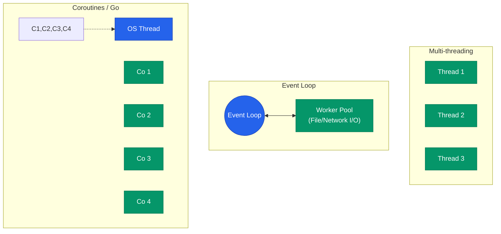

사용자의 요청이 몰릴 때 서버가 얼마나 많은 요청을 동시에 처리할 수 있는가는 서비스의 품질을 결정하는 핵심 지표입니다. 단순히 서버의 사양을 높이는 것보다, 프로그래밍 언어와 프레임워크가 **동시성**(Concurrency)을 어떤 방식으로 다루는지 이해하는 것이 훨씬 중요합니다

## 세 가지 동시성 모델

동시성을 구현하는 방식은 크게 세 가지로 나뉩니다

| 모델 | 대표 언어 | 작동 방식 |
|---|---|---|
| **Multi-threading** | Java, C++ | 요청마다 실제 OS 스레드를 할당하여 병렬 처리 |
| **Event Loop** | Node.js, Python | 단일 스레드에서 비동기 I/O를 활용해 여러 요청을 번갈아 처리 |
| **Coroutines** | Go, Kotlin | 수만 개의 '가상 스레드'를 OS 스레드 위에서 효율적으로 스케줄링 |

## 모델별 처리 구조

1. **Multi-threading**: 직관적이지만 스레드 생성 비용과 컨텍스트 스위칭 오버헤드가 큽니다
2. **Event Loop**: I/O가 많은 작업에 효율적이지만, CPU 연산이 많은 작업이 끼어들면 루프 전체가 멈추는 병목이 발생합니다
3. **Coroutines**: 스레드보다 훨씬 가벼운 단위로 동시성을 지원하여, 적은 자원으로 수많은 연결을 처리할 수 있습니다

## 백프레셔(Backpressure)와 차단(Blocking)

성능을 높이기 위해 가장 경계해야 할 것은 **Blocking I/O**입니다

- **Blocking**: DB 응답을 기다리는 동안 스레드가 아무것도 하지 못하고 멈춰 있는 상태입니다
- **Non-blocking**: 응답을 기다리는 대신 다른 작업을 먼저 수행하고, 데이터가 준비되면 알림을 받아 처리하는 방식입니다

  
핵심 인사이트: 워크로드에 맞는 선택

  복잡한 수치 계산이나 이미지 처리가 많다면 **Multi-threading**이 유리하고, 채팅이나 API 중계처럼 I/O가 대부분이라면 **Event Loop**나 **Coroutines**가 압도적으로 유리합니다. 우리 서비스의 병목이 어디에 있는지를 먼저 파악하세요

## 정리

- **동시성**은 여러 작업을 동시에 "진행"하는 능력이며, 물리적인 병렬 처리와는 다른 개념입니다
- **스레드** 방식은 구현이 쉽지만 자원 소모가 크고, **이벤트 루프**는 비동기 처리의 효율이 극대화됩니다
- **코루틴**은 경량화된 동시성 제어를 통해 현대적인 고성능 서버의 표준으로 자리 잡고 있습니다
- 모든 성능 튜닝의 시작은 **Blocking 구간**을 찾아내고 비동기로 전환하는 것에서 시작합니다

다음 글에서는 서버의 부하를 획기적으로 줄여주는 **캐싱 전략과 메시지 큐** 활용법에 대해 알아봐요
