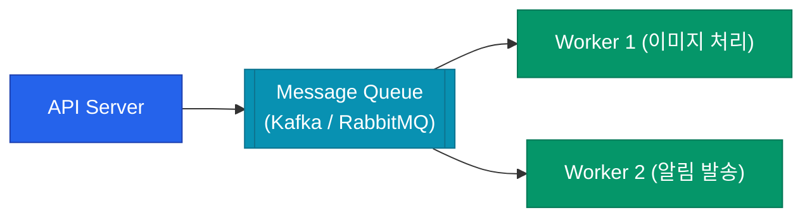

데이터베이스 성능을 아무리 튜닝해도 급증하는 트래픽을 감당하기엔 한계가 있습니다. 이때 백엔드의 응답 속도를 높이고 시스템 부하를 획기적으로 낮춰주는 두 가지 핵심 도구가 **캐시**(Cache)와 **메시지 큐**(Message Queue)입니다.

## 캐싱 전략 (Caching Patterns)

캐시는 자주 사용하는 데이터를 메모리(Redis, Memcached)에 저장하여 빠르게 응답하는 기술입니다.

| 전략 | 설명 | 특징 |
|---|---|---|
| **Cache-aside** | 앱이 먼저 캐시 확인, 없으면 DB에서 가져와 캐시 저장 | 가장 보편적, 캐시 장애 시 DB로 직접 접근 가능 |
| **Write-through** | 데이터를 쓸 때 DB와 캐시에 동시에 기록 | 데이터 일관성 보장, 쓰기 속도 약간 느림 |
| **Write-behind** | 캐시에 먼저 쓰고 DB 기록은 나중에 비동기로 처리 | 쓰기 성능 극대화, 일시적 유실 위험 존재 |

## 캐시 사용 시 주의할 점

1. **Cache Stampede**: 캐시 만료 순간 수많은 요청이 동시에 DB로 몰리는 현상입니다. 만료 시간을 무작위로 분산(Jitter)시켜 방지합니다.
2. **Eviction Policy**: 메모리가 가득 찼을 때 어떤 데이터를 지울지 결정해야 합니다. (예: LRU - 가장 오래 안 쓴 데이터 삭제)

## 메시지 큐: 비동기 처리와 디커플링

모든 작업을 요청 즉시 처리할 필요는 없습니다. **메시지 큐**를 사용하면 무거운 작업을 뒤로 미루고 시스템 간의 결합도를 낮출 수 있습니다.

- **Kafka**: 대규모 로그 처리 및 스트리밍에 적합하며, 데이터를 디스크에 저장하여 재처리가 가능합니다.
- **RabbitMQ**: 정교한 라우팅 규칙이 필요한 엔터프라이즈 환경에 적합합니다.

  
핵심 인사이트: 장애 전파 방지

  메시지 큐는 시스템의 <b>완충 지대</b> 역할을 합니다. 알림 서버가 일시적으로 죽더라도 API 서버는 큐에 메시지를 쌓아두고 계속 요청을 받을 수 있습니다. 알림 서버가 복구되면 큐에서 메시지를 가져와 순차적으로 처리하면 됩니다.

## 정리

- **캐시**는 조회 성능을 높이고 DB 부하를 직접적으로 줄입니다.
- 서비스 특성에 맞는 **캐시 전략**을 선택하여 데이터 일관성과 성능의 균형을 맞춥니다.
- **메시지 큐**는 무거운 작업을 비동기로 분리하여 서버의 응답 속도를 개선합니다.
- 분산 시스템에서 메시지 큐는 **시스템 간 결합도를 낮추는** 핵심 인프라입니다.

Backend 시리즈를 통해 아키텍처 스타일부터 동시성 제어, 부하 분산 전략까지 살펴보았습니다. 탄탄한 백엔드는 단순히 코드를 잘 짜는 것을 넘어, 적재적소에 알맞은 기술을 배치하는 설계 역량에서 나옵니다.
