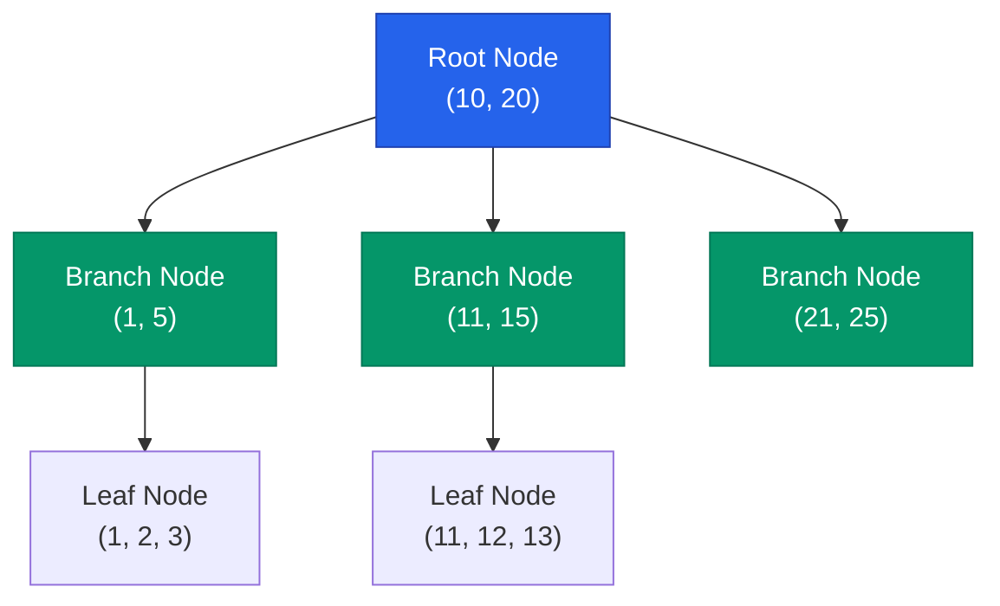

데이터베이스 성능 튜닝의 80%는 **인덱스**(Index) 설계에서 결정됩니다. 인덱스는 책의 색인과 같아서, 방대한 데이터 속에서 원하는 정보를 빠르게 찾을 수 있게 돕습니다. 하지만 인덱스를 너무 많이 만들면 오히려 쓰기 성능이 떨어지는 부작용이 있죠. 관계형 DB의 핵심인 B-Tree 인덱스의 작동 원리와 실행 계획을 읽는 법을 정리해요.

## B-Tree 인덱스의 구조

대부분의 관계형 DB(MySQL, PostgreSQL 등)는 **B-Tree**(Balanced Tree) 자료구조를 인덱스에 사용합니다.

- **Root/Branch Node**: 하위 노드로 가기 위한 가이드 역할을 합니다.
- **Leaf Node**: 실제 데이터의 위치(주소) 또는 데이터 자체를 담고 있으며, 리프 노드끼리는 연결 리스트로 이어져 있어 범위 검색(Range Scan)에 유리합니다.

## 클러스터형 vs 비클러스터형 인덱스

| 구분 | 클러스터형 (Clustered) | 비클러스터형 (Secondary) |
|---|---|---|
| **저장 방식** | 실제 데이터 행이 인덱스 순서로 저장됨 | 데이터의 주소값(또는 PK)만 가짐 |
| **개수** | 테이블당 단 1개 (보통 PK) | 여러 개 생성 가능 |
| **비유** | 사전 (단어 자체가 정렬됨) | 책의 뒷면 색인 (페이지 번호만 있음) |

## 실행 계획(EXPLAIN) 읽는 법

쿼리가 느리다면 가장 먼저 `EXPLAIN` 명령어를 통해 DB가 어떻게 데이터를 찾는지 확인해야 합니다.

- **Index Seek**: 인덱스를 사용하여 특정 위치로 바로 찾아가는 효율적인 방식입니다.
- **Index Scan**: 인덱스 전체를 훑는 방식입니다. 테이블 전체를 읽는(Full Table Scan) 것보다는 낫지만 데이터가 많으면 느려집니다.

  
핵심 인사이트: 커버링 인덱스 (Covering Index)

  인덱스만 보고 쿼리 결과를 바로 반환할 수 있다면, 실제 데이터 블록을 읽으러 가는 디스크 I/O를 생략할 수 있습니다. 이를 <b>커버링 인덱스</b>라고 하며, 조회 성능을 극대화하는 가장 강력한 기법 중 하나입니다.

## 정리

- **인덱스**는 조회를 빠르게 하지만, CUD(추가/수정/삭제) 시 오버헤드가 발생합니다.
- **B-Tree** 구조는 균형 잡힌 트리로 일정한 검색 성능을 보장합니다.
- **실행 계획**을 통해 인덱스가 의도대로 작동하는지 확인하는 습관이 중요합니다.
- 불필요한 인덱스는 과감히 제거하고, 자주 쓰이는 검색 조건에 맞게 인덱스를 설계하세요.

다음 글에서는 데이터의 정합성을 보장하는 **트랜잭션과 격리 수준**에 대해 알아봐요.
