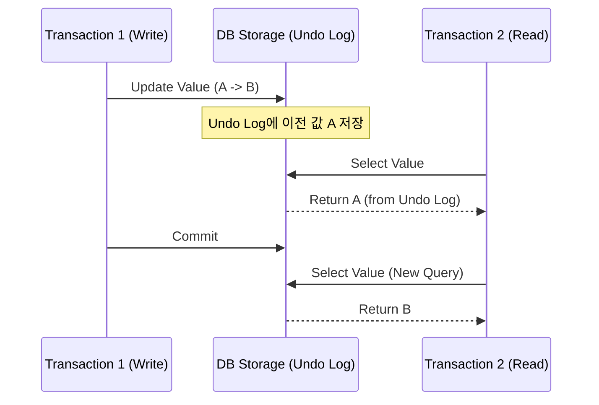

데이터베이스에서 **트랜잭션**(Transaction)은 여러 작업을 하나로 묶어 처리하는 최소 단위입니다. "계좌 이체" 상황에서 한쪽에서 돈이 빠져나갔는데 반대쪽에 입금이 안 된다면 큰일이죠. 트랜잭션은 이러한 상황을 방지하고 데이터의 무결성을 지킵니다

## 트랜잭션의 4가지 성질 (ACID)

모든 트랜잭션은 다음 네 가지 성질을 만족해야 합니다

1. **Atomicity (원자성)**: 전부 성공하거나, 전부 실패해야 합니다. (All or Nothing)
2. **Consistency (일관성)**: 완료 후 데이터는 미리 정의된 규칙을 준수해야 합니다
3. **Isolation (격리성)**: 동시에 실행되는 트랜잭션들이 서로 영향을 주지 않아야 합니다
4. **Durability (영속성)**: 성공한 결과는 시스템 장애가 발생해도 보존되어야 합니다

## 격리 수준 (Isolation Levels)

여러 트랜잭션이 동시에 접근할 때, 성능과 데이터 정합성 사이의 균형을 맞추기 위해 격리 수준을 설정합니다

| 수준 | Dirty Read | Non-repeatable Read | Phantom Read |
|---|---|---|---|
| **READ UNCOMMITTED** | 발생 | 발생 | 발생 |
| **READ COMMITTED** | - | 발생 | 발생 |
| **REPEATABLE READ** | - | - | 발생 |
| **SERIALIZABLE** | - | - | - |

- **READ COMMITTED**: 커밋된 데이터만 읽습니다. 가장 많이 쓰이는 기본 설정 중 하나입니다
- **REPEATABLE READ**: 한 트랜잭션 안에서 같은 데이터를 반복 읽어도 결과가 같습니다. (MySQL 기본값)
- **SERIALIZABLE**: 가장 엄격하지만 성능이 매우 떨어집니다

## 동시성 제어의 마법: MVCC

조회할 때마다 락(Lock)을 걸면 성능이 심각하게 저하됩니다. 현대적인 DB는 **MVCC**(Multi-Version Concurrency Control)를 통해 이 문제를 해결합니다

MVCC 덕분에 **읽기 작업이 쓰기 작업을 기다리지 않고**, 특정 시점의 스냅샷을 읽어 동시 처리 성능을 극대화할 수 있습니다

  
핵심 인사이트: 격리 수준은 트레이드오프입니다

  격리 수준을 높이면 데이터는 정확해지지만 동시 처리량이 줄어듭니다. 일반적인 비즈니스 애플리케이션에서는 <b>READ COMMITTED</b>나 <b>REPEATABLE READ</b> 수준에서 앱 로직(비관적/낙관적 락)으로 정합성을 보완하는 것이 효율적입니다

## 정리

- **ACID** 원칙을 통해 데이터베이스의 신뢰성을 확보합니다
- 서비스의 요구사항에 맞는 **격리 수준**을 선택하는 지혜가 필요합니다
- **MVCC**는 락 없이 높은 동시성을 제공하는 핵심 기술입니다
- 정합성이 극도로 중요한 금융 서비스 등에서는 **Serializable**에 가까운 설계를 고민해야 합니다

다음 글에서는 고정된 스키마를 벗어난 유연한 저장소, **NoSQL 유형별 선택** 가이드를 다뤄요
