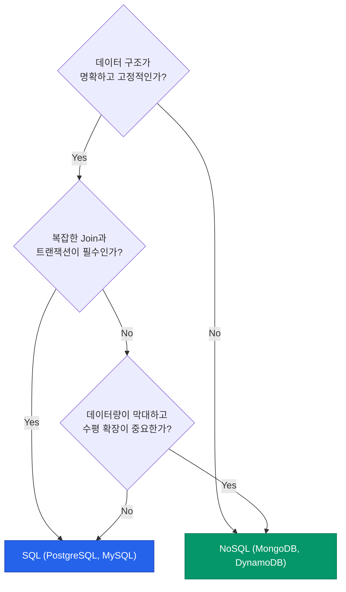

RDBMS는 매우 강력하지만, 수평적 확장(Scaling Out)과 유연한 데이터 구조를 다루기에는 한계가 있습니다. 이러한 배경에서 등장한 것이 **NoSQL**입니다. NoSQL은 단순히 "SQL이 없다"는 뜻이 아니라, "비관계형 저장소"를 포괄적으로 일컫습니다. 데이터의 성격에 따라 어떤 NoSQL을 선택해야 할지 정리해요

## NoSQL의 기초 이론: CAP 정리

분산 시스템인 NoSQL을 이해하려면 **CAP 정리**를 먼저 알아야 합니다. 세 가지 중 두 가지만 완벽하게 만족할 수 있다는 이론입니다

- **Consistency (일관성)**: 모든 노드에서 같은 시점에 같은 데이터를 봐야 합니다
- **Availability (가용성)**: 일부 노드가 죽어도 응답할 수 있어야 합니다
- **Partition Tolerance (분할 내성)**: 노드 간 연결이 끊겨도 시스템이 동작해야 합니다

현실의 분산 시스템은 네트워크 장애가 언제든 생길 수 있으므로 **P(분할 내성)**를 기본으로 깔고, **C(일관성)**와 **A(가용성)** 중 무엇을 중시할지 선택하게 됩니다

## 4가지 NoSQL 유형

| 유형 | 특징 | 대표 도구 | 적합한 사례 |
|---|---|---|---|
| **Key-Value** | 단순한 Key-Value 쌍 저장 | Redis, DynamoDB | 캐시, 세션, 간단한 설정값 |
| **Document** | JSON 형태의 자유로운 데이터 저장 | MongoDB, CouchDB | 웹 서비스, 로그, 스키마 변화가 잦은 앱 |
| **Wide-Column** | 행마다 다른 컬럼을 가질 수 있는 구조 | Cassandra, HBase | 대규모 시계열 데이터, 센서 데이터 |
| **Graph** | 데이터 간의 관계(Node, Edge)를 저장 | Neo4j, JanusGraph | 소셜 네트워크, 추천 엔진, 사기 탐지 |

## SQL vs NoSQL 선택 기준

  
핵심 인사이트: 폴리글랏 퍼시스턴스 (Polyglot Persistence)

  하나의 데이터베이스로 모든 것을 해결하려 하지 마세요. 사용자 프로필은 <b>MongoDB</b>에, 핵심 주문 정보는 <b>PostgreSQL</b>에, 최근 본 상품 목록은 <b>Redis</b>에 담는 식으로 각 서비스 특성에 맞는 최적의 저장소를 혼합해서 사용하는 것이 현대적인 아키텍처의 정석입니다

## 정리

- **CAP 정리**를 통해 우리 서비스가 일관성과 가용성 중 무엇을 우선할지 결정합니다
- 데이터 모델링 방식(문서, 관계, 그래프 등)에 따라 적합한 NoSQL 유형을 고릅니다
- **NoSQL**은 유연함과 확장성을 주지만, 정교한 트랜잭션 관리는 직접 챙겨야 할 때가 많습니다
- SQL과 NoSQL은 경쟁 관계가 아닌 상호 보완 관계입니다

다음 글에서는 단일 DB의 한계를 넘어 거대 시스템으로 확장하는 **복제와 샤딩 전략**을 다뤄요
