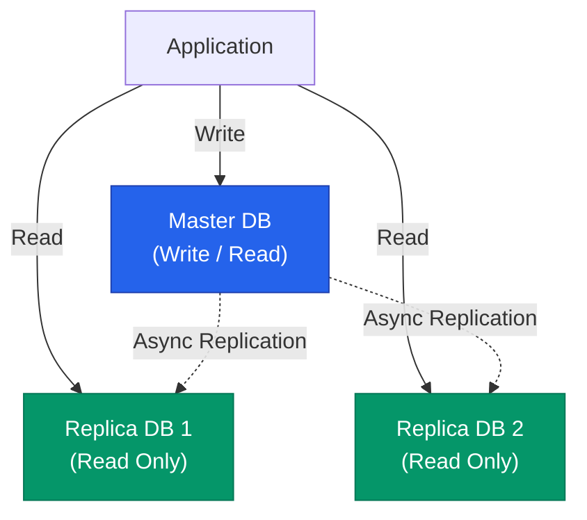

데이터베이스 성능이 한계에 도달했을 때 서버의 사양을 높이는 **Scale-up**은 가장 쉽지만, 비용이 기하급수적으로 늘어나고 물리적인 한계가 존재합니다. 결국 우리는 여러 대의 서버로 부하를 나누는 **Scale-out**을 고민하게 됩니다. 읽기 부하를 해결하는 '복제'와 쓰기 부하를 해결하는 '샤딩' 전략을 정리해요

## 읽기 확장: 복제 (Replication)

대부분의 웹 서비스는 쓰기보다 읽기 비중이 훨씬 높습니다. 하나의 **Source(Master)** 서버에서 쓰기를 처리하고, 여러 대의 **Replica(Slave)** 서버로 데이터를 복제하여 읽기 요청을 분산합니다

- **장점**: 조회 성능이 비약적으로 향상되며, 마스터 서버 장애 시 복제본을 마스터로 승격시켜 가용성을 높일 수 있습니다
- **주의점**: 복제 지연(Replication Lag)으로 인해 마스터에는 반영된 데이터가 복제본에서는 잠시 안 보일 수 있습니다

## 쓰기 확장: 샤딩 (Sharding)

복제만으로는 해결할 수 없는 '쓰기 부하'와 '방대한 데이터 용량'을 해결하기 위해 데이터를 쪼개어 여러 서버에 나누어 저장합니다

| 방식 | 설명 | 특징 |
|---|---|---|
| **Vertical Partitioning** | 테이블의 컬럼을 기준으로 쪼갬 | 한 행의 크기가 클 때 유리함 |
| **Horizontal Partitioning (Sharding)** | 행(Row)을 기준으로 쪼개어 서버 분산 | 데이터 개수가 너무 많을 때 필수적임 |

### 샤딩 키(Sharding Key) 선택이 전부입니다

데이터를 어느 서버로 보낼지 결정하는 기준이 샤딩 키입니다

- **Hash Sharding**: 키 값을 해시 함수에 돌려 서버를 결정합니다. 데이터가 균등하게 배분되지만, 서버 추가/삭제 시 데이터 재배치가 어렵습니다
- **Range Sharding**: 날짜나 숫자 범위를 기준으로 나눕니다. 특정 서버에 부하가 몰릴 수(Hotspot) 있는 위험이 있습니다

  
핵심 인사이트: 분산 DB의 복잡성

  샤딩을 도입하면 시스템의 복잡성이 수십 배 증가합니다. 여러 서버에 흩어진 데이터를 조인(Join)하거나 트랜잭션을 묶는 것이 극도로 어려워지기 때문입니다. 따라서 <b>샤딩은 가급적 최후의 수단</b>으로 고려해야 하며, 도입 전 데이터 모델링을 단순화하는 과정이 선행되어야 합니다

## 파티셔닝 (Partitioning)

샤딩이 물리적으로 서버를 나누는 것이라면, 파티셔닝은 하나의 서버 안에서 데이터를 논리적으로 나누는 것입니다

- **장점**: 대량의 데이터를 조회할 때 필요한 파티션만 읽으므로(Partition Pruning) 성능이 좋아지고 인덱스 크기도 작게 유지할 수 있습니다
- **사례**: 날짜별 로그 테이블 파티셔닝 등

## 정리

- **복제(Replication)**는 읽기 성능과 고가용성을 위해 필수입니다
- **샤딩(Sharding)**은 쓰기 성능과 대용량 데이터 처리를 위한 최종 병기입니다
- **샤딩 키**를 잘못 선택하면 데이터 불균형으로 인해 특정 서버만 죽는 장애가 발생할 수 있습니다
- 확장성 설계는 항상 애플리케이션 계층의 복잡도와 트레이드오프 관계에 있음을 기억하세요

Database 시리즈를 통해 인덱스부터 트랜잭션, NoSQL, 그리고 확장 전략까지 살펴보았습니다. 데이터는 애플리케이션의 핵심 자산이며, 저장소를 어떻게 설계하느냐가 시스템의 수명을 결정합니다
