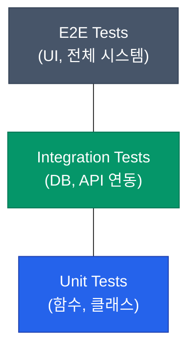

테스트를 작성하는 목적은 "이 코드가 의도대로 작동하는가"를 확인하고, 앞으로의 변경에도 시스템이 무너지지 않을 것이라는 **확신**을 얻기 위함입니다. 하지만 모든 코드를 100% 테스트하려는 시도는 때로 생산성을 해치기도 합니다. 효율적인 테스트 전략을 세우기 위한 고전적인 피라미드 모델과 현대적인 해석을 정리해요

## 고전적 모델: 테스트 피라미드

가장 오랫동안 사랑받은 모델로, 테스트의 양과 비용을 기준으로 삼각형 구조를 만듭니다

- **Unit (단위 테스트)**: 가장 빠르고 저렴합니다. 작고 독립적인 기능을 테스트하며, 피라미드의 기반을 이룹니다
- **Integration (통합 테스트)**: 여러 컴포넌트나 외부 시스템(DB 등)과의 상호작용을 확인합니다
- **E2E (End-to-End)**: 실제 사용자의 관점에서 시스템 전체 흐름을 테스트합니다. 가장 강력하지만 느리고 깨지기 쉽습니다

## 현대적 대안: 테스트 트로피 (Testing Trophy)

최근에는 단위 테스트보다 **통합 테스트**의 비중을 높이는 '트로피' 모델이 주목받고 있습니다

| 모델 | 강조점 | 이유 |
|---|---|---|
| **피라미드** | 단위 테스트 극대화 | 빠른 피드백과 코드 품질 유지 |
| **트로피** | 통합 테스트 중심 | 실제 비즈니스 가치는 여러 모듈이 합쳐졌을 때 나오기 때문 |

통합 테스트는 단위 테스트보다는 조금 느리지만, 실제 시스템이 돌아가는 방식과 훨씬 유사한 환경에서 버그를 잡아낼 수 있다는 장점이 있습니다

## 테스트의 3대 요소와 트레이드오프

어떤 테스트를 더 많이 짤지 결정할 때는 세 가지 축을 고려해야 합니다

1. **속도(Speed)**: 테스트 실행 속도가 빨라야 개발 흐름이 끊기지 않습니다. (Unit > E2E)
2. **신뢰성(Reliability)**: 테스트 통과가 실제 서비스 정상 작동을 보장해야 합니다. (E2E > Unit)
3. **비용(Cost)**: 테스트 작성과 유지보수에 드는 시간과 인프라 비용입니다. (Unit > E2E)

  
핵심 인사이트: "Unit"의 정의보다 "가치"에 집중하세요

  단위 테스트를 짤 때 "클래스 하나만 테스트해야 하는가, 아니면 연관된 몇 개를 합쳐도 되는가"에 대한 논쟁이 많습니다. 중요한 것은 <b>테스트가 구현 세부 사항이 아닌 행동(Behavior)을 검증하고 있는가</b>입니다. 내부 코드를 리팩토링했다고 깨지는 테스트는 좋은 테스트가 아닙니다

## 정리

- **테스트 피라미드**는 테스트의 비용과 속도 균형을 잡는 기본 가이드입니다
- **테스트 트로피** 모델을 통해 비즈니스 로직의 결합을 검증하는 통합 테스트의 중요성을 인식하세요
- 모든 레이어의 테스트는 각자의 역할이 있으며, 하나로 다른 하나를 완전히 대체할 수 없습니다
- 테스트의 목적은 **자신감 있는 배포**임을 잊지 마세요

다음 글에서는 실제 인프라 의존성을 포함한 테스트를 안정적으로 만드는 **통합 및 E2E 테스트 도구** 활용법을 알아봐요
