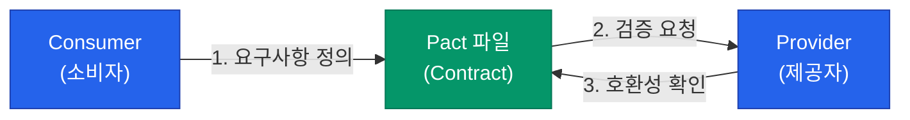

마이크로서비스 아키텍처(MSA)에서는 수십 개의 서비스가 그물처럼 얽혀 통신합니다. 개별 서비스가 잘 작동하더라도, 서로 간의 약속이 깨지면 시스템 전체가 마비됩니다. 또한 기능적으로 완벽하더라도 실제 트래픽을 견디지 못한다면 무용지물이죠. 서비스 간 신뢰를 보장하는 **계약 테스트**와 한계를 측정하는 **성능 테스트**를 정리해요

## 계약 테스트: 끊어지지 않는 약속

**계약 테스트**(Contract Testing)는 서비스 간의 API 규약이 서로 일치하는지 확인하는 과정입니다

- **Consumer (소비자)**: API를 사용하는 쪽 (예: 프론트엔드, 호출 서비스)
- **Provider (제공자)**: API를 제공하는 쪽 (예: 백엔드 API 서버)

### Consumer-driven Contract (Pact)
소비자가 "나는 이런 데이터 형식이 필요해"라고 요구사항을 정의(Pact 파일 생성)하면, 제공자가 자신의 API가 그 요구를 충족하는지 검증하는 방식입니다

통합 테스트보다 훨씬 가볍고 빠르게 서비스 간의 정합성을 맞출 수 있습니다

## 성능 테스트: 시스템의 한계 측정

서비스가 출시되기 전, 예상 트래픽을 견딜 수 있는지 미리 확인해야 합니다

| 유형 | 목적 | 특징 |
|---|---|---|
| **Load Test** | 정상 트래픽 상황의 안정성 | 기대하는 부하 수준을 지속적으로 유지 |
| **Stress Test** | 시스템이 무너지는 한계점 탐색 | 부하를 점진적으로 높여 실패 지점 확인 |
| **Spike Test** | 갑작스러운 트래픽 폭주 대응 | 짧은 시간에 트래픽을 급격히 투입 |

### 현대적인 도구: k6와 Gatling
- **k6**: JavaScript(ES6)로 시나리오를 작성할 수 있어 개발자 접근성이 매우 좋고, CLI 기반으로 CI 파이프라인 통합이 쉽습니다
- **Gatling**: Scala 기반으로 매우 높은 동시성 테스트를 지원하며, 상세한 리포팅 기능을 제공합니다

  
핵심 인사이트: 분산 모놀리스 방지

  계약 테스트 없이 E2E 테스트에만 의존하면, 서비스 하나를 고칠 때마다 모든 관련 서비스를 함께 띄워 테스트해야 하는 <b>분산 모놀리스</b>의 늪에 빠지게 됩니다. 계약 테스트를 통해 각 서비스의 배포 독립성을 확보하세요

## 정리

- **계약 테스트**는 API 변경으로 인한 사이드 이펙트를 배포 전에 잡아내는 가장 효율적인 방법입니다
- **Pact**와 같은 도구로 소비자와 제공자 간의 의사소통 비용을 줄이세요
- **성능 테스트**는 감(Guess)이 아닌 수치(Metric)로 시스템의 가용성을 증명하는 과정입니다
- 지속적인 성능 측정을 통해 코드 변경이 성능에 미치는 영향을 추적하세요

Testing 시리즈를 통해 피라미드 전략부터 실무 도구, 그리고 계약/성능 테스트까지 살펴보았습니다. 테스트는 개발 속도를 늦추는 장애물이 아니라, 더 빠르게 더 멀리 가기 위한 안전벨트임을 기억하세요
