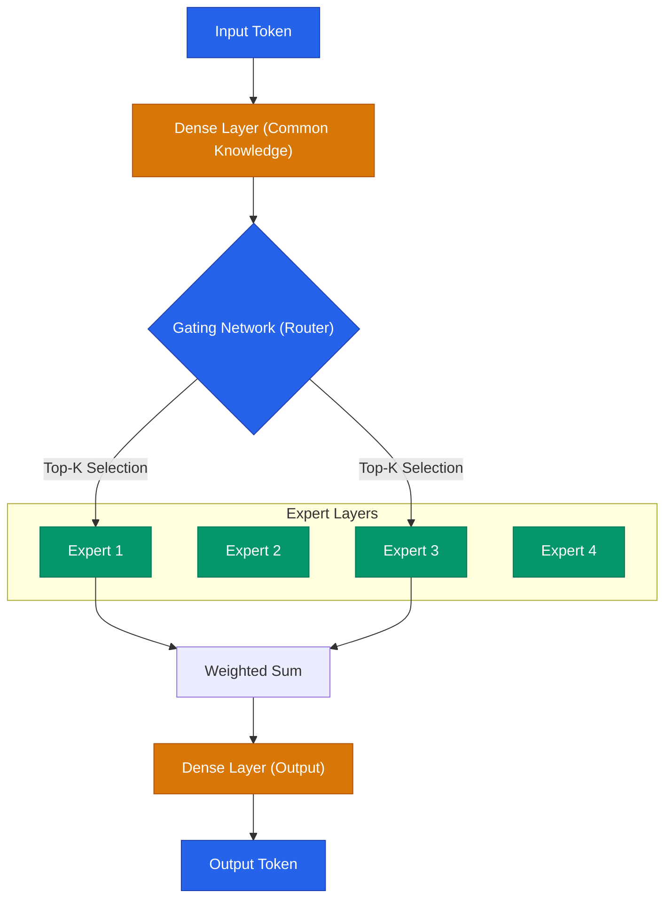

모델의 크기가 커질수록 성능은 좋아지지만, 실제 서비스에 적용하기 위한 추론 비용과 지연 시간은 기하급수적으로 늘어납니다. NVIDIA가 최근 공개한 **Nemotron 3 Nano Omni**는 30B(300억 개) 파라미터 모델임에도 불구하고, 실제 연산에는 3B 수준의 자원만 사용하는 **Hybrid MoE(Mixture of Experts)** 아키텍처를 통해 이 문제를 해결했습니다

## Hybrid MoE: 필요한 것만 골라 쓰는 지능형 구조

MoE는 모델 전체를 돌리는 대신, 입력값에 가장 적합한 일부 전문가(Expert) 레이어만 활성화하여 연산 효율을 높이는 기법입니다. Nemotron 3 Nano Omni는 여기서 한발 더 나아가 'Hybrid' 방식을 채택했습니다

| 특징 | 설명 | 비고 |
| --- | --- | --- |
| **전체 파라미터** | 30B (300억 개) | 모델이 가진 총 지식의 양 |
| **활성 파라미터** | 3B (30억 개) | 실제 한 토큰을 생성할 때 쓰이는 연산량 |
| **구조** | 30B-A3B Hybrid MoE | Dense 레이어와 MoE 레이어의 최적 조합 |
| **컨텍스트 윈도우** | 256K | 방대한 양의 문맥 동시 처리 가능 |

이 구조 덕분에 비슷한 체급의 오픈 멀티모달 모델 대비 **약 9배 높은 처리량(Throughput)**을 보여줍니다

## 30B-A3B 아키텍처의 시각화

Hybrid MoE는 모든 레이어를 MoE로 구성하는 대신, 공통 지식을 담당하는 Dense 레이어와 특정 도메인에 특화된 MoE 레이어를 혼합하여 설계합니다

라우터가 입력값에 따라 가장 적합한 'Expert 1'과 'Expert 3'만 깨워서 연산하기 때문에, 모델의 전체 크기(30B)에 비해 추론 속도는 3B 모델급으로 빨라집니다

## Omni: 비전·음성·언어의 완전한 통합

Nemotron 3 Nano Omni의 또 다른 혁신은 **멀티모달 통합 방식**에 있습니다. 기존에는 텍스트 모델 앞에 비전 인코더를 붙이는 '어댑터' 방식을 주로 썼지만, Omni는 처음부터 모든 모달리티를 동시에 이해하도록 학습되었습니다

- **텍스트(Language)**: 복잡한 추론과 문맥 이해
- **이미지/비디오(Vision)**: 시각적 데이터의 실시간 분석
- **오디오(Speech)**: 전사(Transcription) 과정 없는 네이티브 음성 인식 및 생성

이러한 통합은 오디오의 감정선이나 시각적 뉘앙스를 텍스트로 변환하는 과정에서 발생하는 정보 손실을 최소화합니다

## 개발자가 주목해야 할 포인트

Nemotron 3 Nano Omni는 단순한 연구용 모델이 아니라, **실전 배포**를 위해 설계되었습니다

1. **엣지(Edge) 배포 가능성**: 활성 파라미터가 3B 수준이므로, 고성능 워크스테이션이 아닌 일반적인 엣지 디바이스나 모바일 환경에서도 준수한 속도로 동작할 수 있습니다
2. **256K 대용량 컨텍스트**: 긴 문서나 여러 장의 이미지를 한꺼번에 프롬프트로 넣어도 문맥을 놓치지 않습니다
3. **오픈 에코시스템**: Hugging Face와 NVIDIA build 엔진을 통해 즉시 테스트하고 기존 서비스에 이식할 수 있습니다

  
핵심 인사이트: 거대 모델의 다이어트

  이제 성능을 위해 무조건 모델을 키우는 시대는 지났습니다. <b>"얼마나 효율적으로 모델의 일부만 활용할 것인가"</b>라는 MoE 최적화 기술이 모델 경쟁력의 핵심이 될 것입니다

## 정리

- NVIDIA Nemotron 3 Nano Omni는 30B 모델의 성능을 3B의 비용으로 제공합니다
- **Hybrid MoE** 아키텍처를 통해 처리량을 기존 대비 9배 개선했습니다
- 비전, 음성, 언어를 단일 모델로 처리하는 진정한 **Omni 멀티모달**을 구현했습니다

다음 글에서는 AI 서비스의 또 다른 축인 **보안**을 다룹니다. Anthropic이 공개한 Claude Security가 어떻게 코드 취약점을 자동으로 찾아내고 패치하는지 분석합니다
