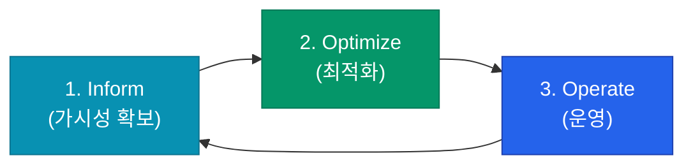

클라우드를 사용하다 보면 "쓰는 만큼 낸다"는 장점이 때로는 예상을 뛰어넘는 고지서라는 부메랑으로 돌아오기도 합니다. 인프라 비용은 더 이상 재무팀만의 고민이 아니며, 엔지니어가 비즈니스 가치 대비 얼마나 효율적으로 자원을 쓰고 있는지 판단해야 하는 시대가 되었습니다. **FinOps**(Cloud Financial Management)는 클라우드 비용의 책임과 문화를 정의하는 프레임워크입니다

## FinOps의 3단계 생애주기

FinOps는 일회성 비용 절감이 아닌, 지속적인 순환 과정입니다

1. **Inform (알리기)**: 비용이 어디서 발생하는지 투명하게 시각화합니다. 정확한 배분을 위해 태깅(Tagging) 전략이 필수적입니다
2. **Optimize (최적화)**: 낭비되는 자원을 찾고 예약 인스턴스(RI)나 권장 사이즈(Rightsizing)를 적용하여 비용 효율을 높입니다
3. **Operate (운영)**: 비즈니스 목표와 비용을 연동하여, 비용 효율적인 문화를 조직 내에 정착시킵니다

## 가시성의 핵심: 태깅(Tagging) 전략

비용을 부서별, 프로젝트별로 나누어 보기 위해서는 리소스에 태그를 붙이는 것이 가장 기본입니다

| 태그 키 | 예시 값 | 용도 |
|---|---|---|
| `CostCenter` | `marketing`, `platform-eng` | 비용 청구 부서 식별 |
| `Project` | `user-api`, `data-warehouse` | 특정 프로젝트 비용 추적 |
| `Environment` | `production`, `staging`, `dev` | 환경별 비용 차이 분석 |
| `Owner` | `joon@example.com` | 관리 책임자 명시 |

자동화 도구를 사용하여 태그가 없는 리소스 생성을 차단하거나, 생성 시 자동으로 태그를 부여하는 정책을 권장합니다

## Showback vs Chargeback

가시화된 비용 데이터를 조직에 어떻게 전달할지에 대한 모델입니다

- **Showback**: "당신의 팀이 이번 달에 이만큼의 비용을 썼습니다"라고 **데이터만 보여주는** 방식입니다. 책임감을 부여하는 첫 단계입니다
- **Chargeback**: 실제 해당 부서의 **예산에서 인프라 비용을 차감**하는 방식입니다. 가장 강력한 동기부여가 되지만, 정교한 비용 배분 로직이 필요합니다

  
핵심 인사이트: 비용은 아끼는 것이 아니라 '관리'하는 것

  FinOps의 목표는 단순히 돈을 적게 쓰는 것이 아닙니다. <b>"우리가 100만 원을 써서 그 이상의 비즈니스 가치를 창출하고 있는가?"</b>를 판단하는 것입니다. 가장 저렴한 인스턴스를 쓰는 것보다, 매출 성장을 위해 고성능 인스턴스를 효율적으로 쓰는 것이 더 나은 결정일 수 있습니다

## 정리

- **FinOps**는 재무, 엔지니어링, 비즈니스 팀이 협업하여 클라우드 가치를 극대화하는 문화입니다
- **Inform → Optimize → Operate** 순환 과정을 통해 지속적으로 관리합니다
- 정교한 **태깅 전략**은 모든 비용 분석의 출발점입니다
- **Showback** 모델을 통해 조직 내에 비용에 대한 인식을 심어주는 것부터 시작하세요

다음 글에서는 실제 인프라 자원을 줄이는 **컴퓨트·스토리지 최적화** 기법에 대해 구체적으로 알아봐요
